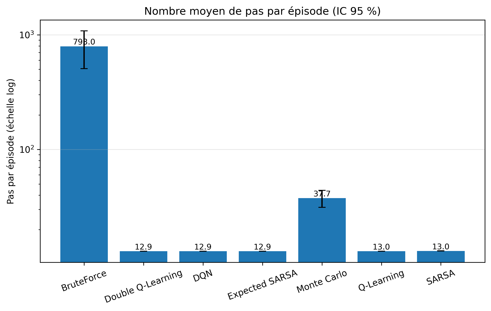

# Taxi Driver — Reinforcement Learning for Taxi-v3


> Model-free reinforcement learning agents solving the Gymnasium Taxi-v3 environment — seven algorithms from a brute-force baseline to DQN, benchmarked with a full statistical protocol. Epitech T-AIA-902 project.

## Table of Contents

- [About](#about)
- [Features](#features)
- [Getting Started](#getting-started)
- [Usage](#usage)
- [Results](#results)
- [Project Structure](#project-structure)
- [Algorithms](#algorithms)
- [Tech Stack](#tech-stack)
- [Documentation](#documentation)
- [Contributing](#contributing)
- [Team](#team)
- [References](#references)
- [License](#license)

## About

Taxi Driver solves the classic **Taxi-v3** discrete control problem from Gymnasium using optimized model-free episodic reinforcement learning algorithms. The taxi must navigate a 5x5 grid to pick up a passenger at one of 4 locations and drop them off at the correct destination.

**Environment details:**
- **State space:** 500 discrete states (25 taxi positions x 5 passenger locations x 4 destinations)
- **Action space:** 6 actions (North, South, East, West, Pickup, Dropoff)
- **Rewards:** +20 for successful dropoff, -1 per step, -10 for illegal pickup/dropoff

The project implements seven algorithms, compares them under a pre-registered experimental protocol ([docs/PROTOCOLE.md](docs/PROTOCOLE.md)), and shows that every tuned TD learner reaches the optimal policy (mean test reward 8.05 = R\*, ~13 steps per trip) while the brute-force baseline averages ≈ -770 reward and rarely finishes at all.

## Features

**Algorithms (7)**
- **BruteForce** — uniform random baseline
- **Q-Learning**, **SARSA**, **Expected SARSA**, **Double Q-Learning** — tabular TD control
- **Monte Carlo (first-visit)** — tabular episodic control
- **DQN** — PyTorch MLP with experience replay, soft target updates and Double-DQN targets (enabled by default)

**Exploration strategies**
- ε-greedy with exponential or linear decay (optionally parameterised as a fraction of the training horizon via `--decay-frac`)
- Boltzmann (softmax) with temperature decay
- UCB (upper confidence bound)

**Reward shaping** (`--reward-shaping`)
- `potential` — potential-based shaping (Ng et al., 1999), preserves the optimal policy
- `naive_distance` — naive distance bonus (kept as a counter-example)
- `step_penalty` — extra per-step penalty
- Reported metrics always use the **native** reward, even when shaping is active

**Subject execution modes**
- **user mode** — interactive: prompts for the agent, its hyperparameters and the train/test episode counts, then trains and evaluates
- **time-limited mode** — loads the optimized configuration (`configs/optimized.yaml`) and trains within a wall-clock budget (`--time`, default 60 s) with early stopping

**Extensions**
- **Multi-passenger environment** (`--env multi`) — 2 passengers, 14,400 states (25 x 6² x 4²), with route-optimality analysis
- **TrackMania 2020 deep-RL extension** — SAC via Stable-Baselines3 + `tmrl`, **trained and evaluated on the real game**: 9/10 laps completed in greedy evaluation, best lap 61.15 s after 750k real-time steps (see [docs/TRACKMANIA.md](docs/TRACKMANIA.md))

**Benchmarking & analysis**
- Experiment campaign **E0–E7** (822 runs, ~4h30–5h30 on 6 cores), resumable and idempotent
- Statistical pipeline: Welch t-test / Mann-Whitney U, Holm correction per hypothesis family, effect sizes (Hedges g, Cliff's δ)
- Figure generation (learning curves, boxplots, grid heatmaps, Q-value heatmap, episode GIF) from raw results — no re-runs needed
- 241 unit/integration tests (slow training tests behind a pytest marker), CI via GitHub Actions

## Getting Started

### Prerequisites

- Python 3.10–3.12
- [Poetry](https://python-poetry.org/)

### Installation

```bash
git clone https://github.com/T-AIA-902-Taxi-Driver/Taxi-Driver.git
cd Taxi-Driver
poetry install                  # core project
poetry install -E trackmania    # optional: + SB3, TensorBoard, rich for the TrackMania extension
```

> **Note on the Gymnasium pin:** `gymnasium` is pinned to `>=1.0,<1.3` because Taxi-v3 was removed in gymnasium 1.3.0 (replaced by Taxi-v4, which is identical with default parameters). The subject mandates Taxi-v3, hence the pin.

### Quick validation

```bash
poetry run taxi-driver train --non-interactive --agent q_learning \
    --train-episodes 2000 --test-episodes 20
```

## Usage

All commands are shown as `python -m src.main …`, which works in any environment with the dependencies installed. Inside the Poetry environment, the `taxi-driver` console script is equivalent (`poetry run taxi-driver …`).

### User mode (interactive)

```bash
python -m src.main train
```

Prompts for the agent, its hyperparameters (alpha, gamma, exploration strategy and its parameters), then the training and test episode counts (a subject requirement — both are entered at launch), prints a configuration recap and asks for confirmation. It then trains, saves the model to `models/`, evaluates greedily on a fixed set of test episodes and replays a few episodes in the terminal.

### Non-interactive (flags)

Any prompt can be replaced by a flag; `--non-interactive` suppresses all prompts (missing values fall back to `configs/default.yaml`):

```bash
python -m src.main train --non-interactive --agent q_learning \
    --train-episodes 10000 --test-episodes 100 \
    --alpha 0.3 --gamma 0.95 --save models/my_q_learning.npz
```

### Time-limited mode

```bash
python -m src.main train --mode time-limited --time 60
```

Loads `configs/optimized.yaml` (the grid-search winner), caps training at 90 % of the wall-clock budget and stops early once the rolling mean training reward reaches 8.0, then evaluates on 100 episodes. In interactive use it only prompts for the maximum training episodes and the test episodes; add `--non-interactive` to skip the prompts.

### Evaluate and replay a saved model

Trained models for all six learners ship in `models/final/`:

```bash
python -m src.main eval --model models/final/q_learning.npz --test-episodes 100
python -m src.main play --model models/final/q_learning.npz --episodes 3 --delay 0.2
```

### Compare agents head-to-head

```bash
python -m src.main compare --agents brute_force,q_learning,sarsa \
    --train-episodes 15000 --n-seeds 5 --workers 6
```

Trains each agent on `--n-seeds` seeds, evaluates all of them on the **same** fixed evaluation episodes, and prints a summary table plus Holm-corrected pairwise tests.

### Hyperparameter sweep

```bash
python -m src.main benchmark --sweep-config configs/benchmark_sweep.yaml --workers 6
```

Runs the YAML-defined grid (the default file mirrors block E1a: 5 alpha x 4 gamma x 10 seeds = 200 runs) and ranks configurations by mean test reward. `--write-optimized` promotes the winning configuration to `configs/optimized.yaml`.

### Full campaign, figures and statistics

```bash
python scripts/run_campaign.py --dry-run          # lists the 822 runs of blocks E0-E7
python scripts/run_campaign.py                    # full campaign, ~4h30-5h30 on 6 cores
python scripts/run_campaign.py --blocks e0,e2     # selected blocks only (resumable)
python scripts/make_figures.py                    # figures F1-F12 from results/ (no re-runs)
python scripts/run_stats.py                       # hypothesis tests H1-H9, one CSV per family
```

Blocks E0–E6 run in parallel; E7 re-runs the head-to-head configurations sequentially and is the only legitimate source of timing/memory measurements. `make_figures.py` and `run_stats.py` read only `results/raw/` + `results/aggregated/` and skip missing blocks, so they work on partial campaigns (`--figures f1,f3,f5`, `--families h1,h2`).

### TrackMania extension

```bash
poetry install -E trackmania
python scripts/check_trackmania_setup.py --steps 400          # validate the game setup
python scripts/train_trackmania.py --config configs/trackmania.yaml --timesteps 500000 --seed 42
python scripts/train_trackmania.py --resume --timesteps 250000  # continue a run
python scripts/eval_trackmania.py --episodes 10               # greedy eval + lap detection
```

Must run on the Windows machine hosting TrackMania 2020, OpenPlanet and `tmrl` (the scripts exit with actionable instructions when a game-machine dependency is missing). Setup, track, reward and troubleshooting details: [docs/TRACKMANIA.md](docs/TRACKMANIA.md).

**Executed campaign (750k steps, SAC on LIDAR):** the agent **completes the `tmrl-test` track in 9/10 deterministic evaluation episodes, best lap 61.15 s** (tmrl's reference policy: ~45.5 s). Learning curves F13/F14 in `results/figures/`, episode log and evaluation report in `results/trackmania/`, final model in `models/final/sac_trackmania_final.zip`.

### Main `train` flags

Defaults come from `configs/default.yaml`; CLI flags take precedence (`defaults < --config file < flags`).

| Flag | Description | Default |
|------|-------------|---------|
| `--mode` | `user` / `time-limited` | `user` |
| `--agent` | `brute_force`, `q_learning`, `sarsa`, `expected_sarsa`, `double_q_learning`, `monte_carlo`, `dqn` | `q_learning` |
| `--env` | `taxi` (Taxi-v3) / `multi` (2-passenger extension) | `taxi` |
| `--config` | YAML configuration file | mode-dependent |
| `--time` | Wall-clock training budget in seconds (time-limited mode) | `60` |
| `--train-episodes` | Number of training episodes | `10000` |
| `--test-episodes` | Number of evaluation episodes | `100` |
| `--alpha` | Learning rate | `0.1` |
| `--gamma` | Discount factor | `0.99` |
| `--exploration` | `epsilon_greedy` / `boltzmann` / `ucb` | `epsilon_greedy` |
| `--epsilon`, `--epsilon-min` | Initial / floor exploration rate | `1.0` / `0.01` |
| `--epsilon-decay`, `--decay-type` | Per-episode decay, `exp` or `linear` | `0.9995`, `exp` |
| `--decay-frac` | ε reaches ε_min at this fraction of the horizon (overrides `--epsilon-decay`) | unset |
| `--temperature` | Boltzmann temperature | `1.0` |
| `--ucb-c` | UCB exploration constant | `2.0` |
| `--reward-shaping` | `none` / `potential` / `naive_distance` / `step_penalty` | `none` |
| `--lr`, `--device` | DQN learning rate, `auto`/`cpu`/`cuda` | `0.001`, `auto` |
| `--save` | Model output path (`.npz` tabular / `.pt` DQN) | timestamped in `models/` |
| `--show-episodes` | Episodes replayed after evaluation | `3` |
| `--seed` | Random seed | `42` |
| `--non-interactive` | Never prompt (CI-friendly) | off |

## Results

Headline numbers from the benchmark campaign (10 seeds per configuration, greedy evaluation on the **same** fixed 100 episodes for every agent; protocol in [docs/PROTOCOLE.md](docs/PROTOCOLE.md)):

- **Optimal reference:** R\* = **8.05** mean reward, computed by value iteration on the exact Taxi-v3 model — used purely as a measuring instrument; all agents remain model-free.
- **Head-to-head (block E2):** Q-Learning, Expected SARSA, Double Q-Learning and DQN all reach **8.05 mean test reward** (SARSA: 7.97), **~12.95 steps** per trip and **100 % success**. The brute-force baseline averages **≈ -770 reward** (~196 steps under the 200-step cap, < 5 % success).
- **Time-limited mode:** with a 30 s budget, training stops early (rolling mean reward ≥ 8.0) after **14.2 s** and still scores **8.05 mean reward, 100 % success** on the 100-episode test set.
- **Grid search (E1a, 5 alpha x 4 gamma):** 15/20 configurations reach the optimal policy; ties broken by convergence speed give **alpha = 0.30, gamma = 0.95** (~980 episodes to threshold), promoted to `configs/optimized.yaml`.
- **Monte Carlo** does not converge within the 15,000-episode budget on **any** of its 10 runs (censored), confirming hypothesis H8.

| | |
|---|---|
|  |  |


Full analysis: [docs/RAPPORT.md](docs/RAPPORT.md) (report, in French), all figures in [results/figures/](results/figures/), aggregated data and statistics in `results/aggregated/`.

## Project Structure

```
Taxi-Driver/
├── src/
│   ├── main.py                    # CLI entry point (python -m src.main / taxi-driver)
│   ├── config.py                  # Config dataclass: defaults < YAML < CLI
│   ├── agents/
│   │   ├── base_agent.py          # Abstract agent interface
│   │   ├── tabular_agent.py       # Shared Q-table logic
│   │   ├── brute_force_agent.py   # Random baseline
│   │   ├── q_learning_agent.py    # Q-Learning
│   │   ├── sarsa_agent.py         # SARSA
│   │   ├── expected_sarsa_agent.py
│   │   ├── double_q_learning_agent.py
│   │   ├── monte_carlo_agent.py   # First-visit Monte Carlo
│   │   ├── exploration.py         # ε-greedy (exp/linear), Boltzmann, UCB
│   │   └── dqn/                   # DQN agent, Q-network, replay buffer
│   ├── environments/
│   │   ├── taxi_wrapper.py        # Gymnasium Taxi-v3 wrapper
│   │   ├── multi_passenger_env.py # 2-passenger extension (14,400 states)
│   │   ├── route_analysis.py      # Route-optimality analysis (multi)
│   │   └── trackmania_wrapper.py  # TrackMania/tmrl wrapper (extension)
│   ├── training/                  # Trainer + callbacks (logging, early stop, time budget)
│   ├── evaluation/                # Evaluator + metrics (fixed-seed eval episodes)
│   ├── benchmarking/              # Sweeps, reward shaping, stats, value iteration (R*)
│   ├── visualization/             # Plots + terminal episode replay
│   ├── cli/                       # Parser, interactive prompts, subcommands
│   └── utils/                     # Seeding helpers
├── scripts/
│   ├── run_campaign.py            # Campaign driver, blocks E0-E7 (822 runs)
│   ├── make_figures.py            # Figures F1-F14 from results/
│   ├── run_stats.py               # Hypothesis tests H1-H9
│   ├── check_trackmania_setup.py  # Game-setup validation + tmrl config templating
│   ├── train_trackmania.py        # SAC training on TrackMania (game machine only)
│   └── eval_trackmania.py         # Greedy TrackMania eval + lap detection
├── configs/
│   ├── default.yaml               # Commented reference of every field (user mode)
│   ├── optimized.yaml             # Grid-search winner (time-limited mode)
│   ├── benchmark_sweep.yaml       # E1a grid definition for `benchmark`
│   ├── trackmania.yaml            # SAC hyperparameters (tmrl-aligned)
│   └── tmrl_config.json           # Game-machine tmrl config template (secrets redacted)
├── models/final/                  # Trained models: 6 Taxi learners + TrackMania SAC
├── results/                       # aggregated/, figures/, raw/, trackmania/, r_star.json
├── tests/                         # 241 unit & integration tests
├── docs/                          # Framing, architecture, protocol, report, TrackMania
├── pyproject.toml                 # Poetry config (deps, extras, console script, tooling)
└── README.md
```

## Algorithms

### Q-Learning (off-policy TD)

```
Q(s,a) <- Q(s,a) + alpha * [r + gamma * max_a' Q(s',a') - Q(s,a)]
```

Learns the greedy policy regardless of the exploration behaviour. Fastest to converge in our campaign (~1,700 episodes to threshold at the reference configuration).

### SARSA (on-policy TD)

```
Q(s,a) <- Q(s,a) + alpha * [r + gamma * Q(s',a') - Q(s,a)]
```

where `a'` is the action **actually taken**. SARSA learns from its own exploration; Q-Learning learns as if it never explored.

### Expected SARSA

Replaces the sampled `Q(s',a')` with the expectation over the current policy, reducing update variance at a small extra compute cost per step.

### Double Q-Learning

Two Q-tables with decoupled action selection and evaluation (van Hasselt, 2010) to reduce the overestimation bias of the max operator — measured directly in the campaign (block E2/H7).

### Monte Carlo (first-visit)

Averages full-episode returns from first visits to each (s,a) pair. No bootstrapping: on Taxi-v3's long, sparsely rewarded episodes it fails to converge within 15,000 episodes (0/10 runs).

### Deep Q-Network (DQN)

PyTorch MLP over one-hot states with experience replay, soft target-network updates (Polyak τ) and **Double-DQN targets** (enabled by default). Included to quantify the cost of function approximation on a small discrete MDP: it matches the tabular agents' final policy (8.05) but needs far more compute (hypothesis H6).

### SAC — TrackMania extension

For TrackMania 2020 (via `tmrl`), the environment is real-time and single-instance, so every transition is expensive: off-policy **SAC** (Stable-Baselines3) is used rather than PPO for its sample efficiency, native continuous `[gas, brake, steer]` action support and entropy-driven exploration. See [docs/TRACKMANIA.md](docs/TRACKMANIA.md).

## Tech Stack

| Technology | Purpose |
|---|---|
| Python 3.10–3.12 | Core language |
| Poetry | Dependency management, `taxi-driver` console script, `trackmania` extra |
| Gymnasium (>=1.0, <1.3) | RL environment — pinned because Taxi-v3 was removed in 1.3.0 |
| NumPy | Q-tables, numerical computation |
| PyTorch | DQN network |
| pandas / SciPy | Campaign aggregation, statistical tests |
| Matplotlib / Seaborn | Figures F1–F12 |
| imageio / pygame | Episode GIF export, environment rendering |
| PyYAML / argparse | Configuration files, CLI |
| pytest / pytest-cov | 225 tests, coverage |
| ruff / black / mypy (strict) / pre-commit | Linting, formatting, typing |
| Stable-Baselines3 (optional extra) | SAC for the TrackMania extension |
| GitHub Actions | CI pipeline |

## Documentation

| Document | Description |
|---|---|
| [CADRAGE.md](docs/CADRAGE.md) | Project framing — process, user stories, metrics, risks |
| [ARCHITECTURE.md](docs/ARCHITECTURE.md) | Software architecture with Mermaid diagrams |
| [BACKLOG.md](docs/BACKLOG.md) | Product backlog with WSJF prioritization |
| [PROTOCOLE.md](docs/PROTOCOLE.md) | Experimental protocol — hypotheses H1–H9, blocks E0–E7, statistics |
| [RAPPORT.md](docs/RAPPORT.md) | Full report (French) — results, analysis, discussion |
| [TRACKMANIA.md](docs/TRACKMANIA.md) | TrackMania extension — setup, environment, SAC training |
| [CONTRIBUTING.md](CONTRIBUTING.md) | Contribution workflow and conventions |
| [CHANGELOG.md](CHANGELOG.md) | Version history |
| [Epitech-TD.pdf](docs/Epitech-TD.pdf) | Epitech project specification |

## Contributing

1. Branch from `dev` using the convention `feature/<name>` or `fix/<name>`
2. Follow [PEP 8](https://peps.python.org/pep-0008/) with type hints (`mypy --strict` on `src/`)
3. Write tests for new functionality
4. Submit a PR to `dev` — squash merge after review
5. Use conventional commits: `type(scope): description`

See [CONTRIBUTING.md](CONTRIBUTING.md) for details.

## Team

| Name | GitHub | Role |
|------|--------|------|
| Romain Bernier | [@Romain-Ber](https://github.com/Romain-Ber) | — |
| Victor Vattier | [@VictorVattierEpitech](https://github.com/VictorVattierEpitech) | — |
| Duncan Carbonnier | [@DuncanCbr](https://github.com/DuncanCbr) | — |
| Emeric Legendre | [@Macfreeze](https://github.com/Macfreeze) | — |
| Marin Chevalier | — | — |

## References

- Sutton, R. S., & Barto, A. G. (2018). *Reinforcement Learning: An Introduction* (2nd ed.). MIT Press.
- Watkins, C. J. C. H. (1989). *Learning from Delayed Rewards*. PhD thesis, Cambridge University.
- Rummery, G. A., & Niranjan, M. (1994). *On-line Q-learning using connectionist systems*. Technical Report CUED/F-INFENG/TR 166, Cambridge University.
- van Hasselt, H. (2010). Double Q-learning. *NeurIPS 23*.
- Ng, A. Y., Harada, D., & Russell, S. (1999). Policy invariance under reward transformations: theory and application to reward shaping. *ICML*.
- Mnih, V., et al. (2015). Human-level control through deep reinforcement learning. *Nature*, 518(7540), 529-533.
- Haarnoja, T., et al. (2018). Soft Actor-Critic: Off-Policy Maximum Entropy Deep Reinforcement Learning with a Stochastic Actor. *ICML*.

## License

This project is licensed under the MIT License (declared in [pyproject.toml](pyproject.toml)).

---

Built with reinforcement learning at **{Epitech}** — T-AIA-902
