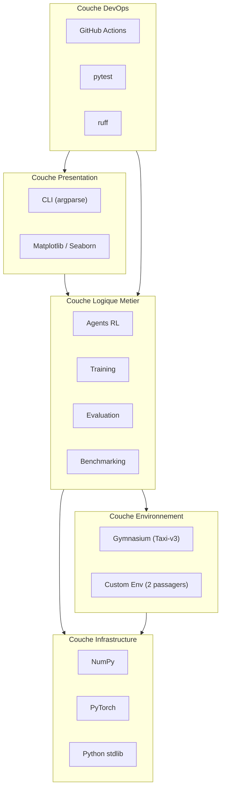
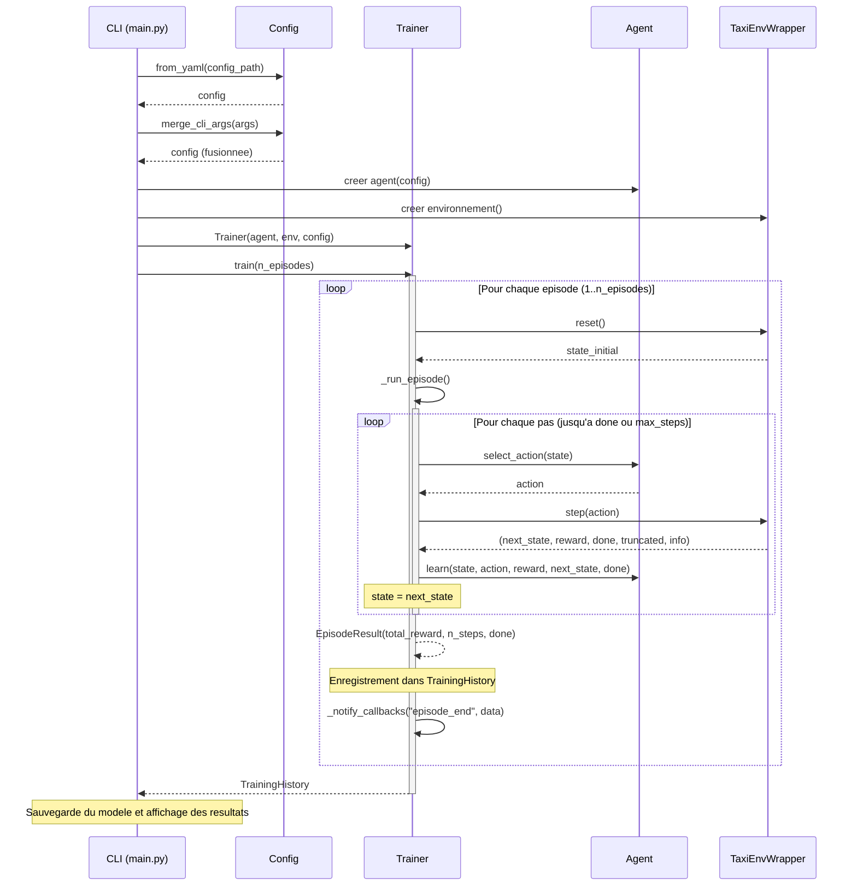
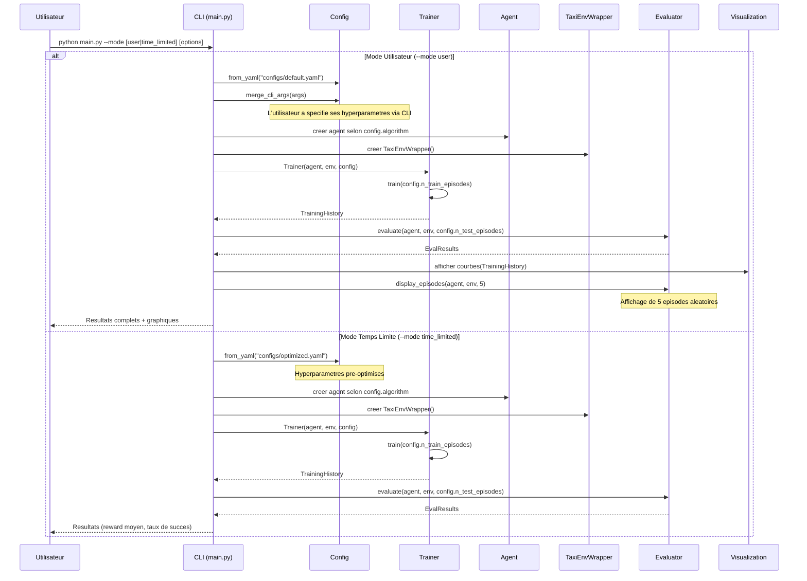
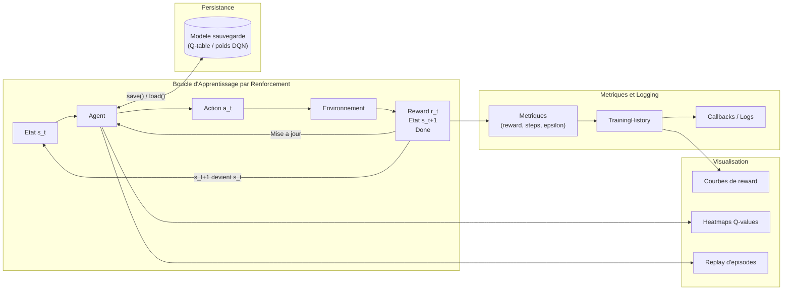
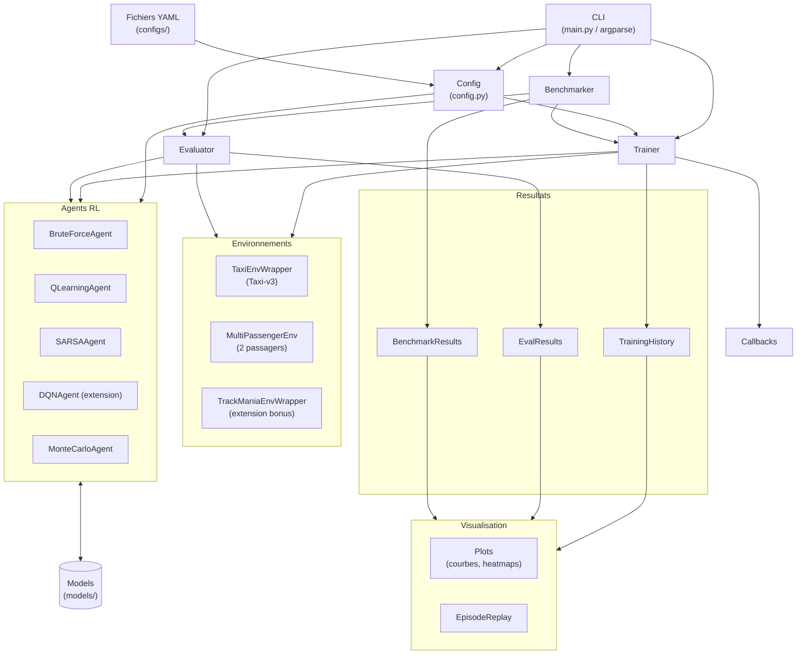

# Architecture Logicielle - Taxi Driver (T-AIA-902)

---

## 1. Vue d'Ensemble

Le projet **Taxi Driver** est un projet Epitech de la filière Intelligence Artificielle (T-AIA-902) dont l'objectif est de concevoir, entraîner et comparer plusieurs agents d'apprentissage par renforcement (RL) capables de résoudre l'environnement **Taxi-v3** de la bibliothèque Gymnasium.

L'environnement Taxi-v3 est un problème classique de RL épisodique dans lequel un taxi doit naviguer sur une grille 5x5, récupérer un passager à un emplacement donné et le déposer à sa destination. L'espace d'états est discret (500 états) et l'espace d'actions comporte 6 actions possibles (4 déplacements + ramasser + déposer).

### Objectifs principaux

- Implémenter plusieurs algorithmes de RL model-free : Brute Force, Q-Learning tabulaire, SARSA (on-policy) et Monte Carlo.
- Proposer deux modes d'exécution : un mode utilisateur permettant le réglage d'hyperparamètres et un mode optimisé à temps limité.
- Fournir un framework de benchmarking et de visualisation pour comparer les performances des agents.
- En bonus, développer un environnement personnalisé avec 2 passagers.
- En extension bonus, un agent DQN (Deep Q-Network) démontre le passage au deep RL. De plus, l'environnement **TrackMania 2020** est intégré comme extension avancée : un agent SAC (Stable-Baselines3) y est entraîné sur le jeu réel, sur un espace d'états continu (LIDAR) — voir `docs/TRACKMANIA.md` pour l'architecture détaillée et les résultats.

### Stack Technologique (résumé)

| Catégorie          | Technologies                          |
|--------------------|---------------------------------------|
| Langage            | Python 3.10+                          |
| Environnement RL   | Gymnasium (Taxi-v3)                   |
| Calcul numérique   | NumPy                                 |
| Deep Learning       | PyTorch (optionnel, extension DQN bonus) |
| Visualisation       | Matplotlib, Seaborn                   |
| Tests               | pytest                                |
| Linting / Format    | ruff                                  |
| CI/CD               | GitHub Actions                        |
| Gestion dépendances | Poetry                                |
| Configuration       | YAML, argparse, dataclasses           |

---

## 2. Stack Technologique

L'architecture du projet est organisée en cinq couches distinctes, chacune remplissant un rôle bien défini. Le diagramme ci-dessous illustre l'empilement de ces couches et leurs dépendances.



**Couche Presentation** : Interface utilisateur en ligne de commande via `argparse`, et production de graphiques via `Matplotlib` et `Seaborn` pour la visualisation des courbes d'entraînement, heatmaps de Q-values et replays d'épisodes.

**Couche Logique Metier** : Coeur du système contenant les implémentations des agents RL, le pipeline d'entraînement generique, les modules d'evaluation et de benchmarking. C'est ici que réside toute l'intelligence algorithmique.

**Couche Environnement** : Encapsulation de l'environnement Gymnasium Taxi-v3 via un wrapper standardisé, ainsi que l'environnement personnalisé multi-passagers développé comme bonus.

**Couche Infrastructure** : Bibliothèques de calcul fondamentales (NumPy pour les Q-tables, PyTorch pour les réseaux de neurones du DQN) et modules de la bibliothèque standard Python.

**Couche DevOps** : Intégration continue via GitHub Actions, tests unitaires et fonctionnels via pytest, et qualité de code via ruff (linting et formatage).

---

## 3. Structure du Répertoire

```
Taxi-Driver/
├── src/
│   ├── __init__.py
│   ├── main.py                    # Point d'entrée CLI
│   ├── config.py                  # Gestion configuration / hyperparamètres
│   ├── agents/
│   │   ├── __init__.py
│   │   ├── base_agent.py          # Classe abstraite BaseAgent
│   │   ├── brute_force_agent.py   # Agent aléatoire / brute force
│   │   ├── q_learning_agent.py    # Agent Q-Learning tabulaire
│   │   ├── sarsa_agent.py          # Agent SARSA on-policy
│   │   ├── dqn_agent.py           # Agent Deep Q-Network (extension bonus)
│   │   └── monte_carlo_agent.py   # Agent Monte Carlo (comparaison)
│   ├── environments/
│   │   ├── __init__.py
│   │   ├── taxi_wrapper.py        # Wrapper Taxi-v3 standard
│   │   ├── multi_passenger_env.py # Extension 2 passagers (bonus)
│   │   └── trackmania_wrapper.py  # Wrapper TrackMania (extension bonus deep RL)
│   ├── training/
│   │   ├── __init__.py
│   │   ├── trainer.py             # Pipeline d'entraînement générique
│   │   └── callbacks.py           # Callbacks (logging, early stopping)
│   ├── evaluation/
│   │   ├── __init__.py
│   │   ├── evaluator.py           # Évaluation d'un agent entraîné
│   │   └── metrics.py             # Calcul de métriques
│   ├── benchmarking/
│   │   ├── __init__.py
│   │   ├── benchmarker.py         # Framework de benchmarking
│   │   └── reward_shaping.py      # Fonctions de reward shaping
│   └── visualization/
│       ├── __init__.py
│       ├── plots.py               # Courbes, heatmaps
│       └── episode_replay.py      # Replay d'épisodes
├── configs/
│   ├── default.yaml
│   ├── optimized.yaml
│   └── benchmark_sweep.yaml
├── models/
├── results/
├── tests/
├── docs/
├── .github/workflows/ci.yml
├── pyproject.toml                # Configuration Poetry (dépendances, scripts, outils)
├── poetry.lock                   # Lockfile Poetry (versions exactes)
└── README.md
```

### Description des modules

**`src/main.py`** : Point d'entrée unique de l'application. Ce module gère l'analyse des arguments en ligne de commande via `argparse`, orchestre le chargement de la configuration, instancie les composants nécessaires (agent, environnement, trainer) et lance le mode d'exécution approprié (utilisateur ou temps limité).

**`src/config.py`** : Module de gestion de la configuration et des hyperparamètres. Il définit la dataclass `Config` qui centralise tous les paramètres du système, implémente la hiérarchie de chargement (défauts, fichier YAML, arguments CLI) et fournit des méthodes de validation des paramètres.

**`src/agents/base_agent.py`** : Classe abstraite `BaseAgent` servant de contrat pour tous les agents RL du projet. Elle définit l'interface commune : sélection d'action, mise à jour des connaissances, sauvegarde et chargement du modèle. Toute nouvelle implémentation d'agent doit hériter de cette classe.

**`src/agents/brute_force_agent.py`** : Agent de référence (baseline) qui sélectionne les actions de manière purement aléatoire. Sa méthode `learn()` est un no-op puisqu'aucun apprentissage n'a lieu. Il sert de point de comparaison pour valider que les autres agents apprennent effectivement.

**`src/agents/q_learning_agent.py`** : Implémentation de l'algorithme Q-Learning tabulaire avec politique epsilon-greedy et décroissance progressive de l'exploration. Maintient une Q-table (matrice NumPy 500x6) et met à jour les valeurs Q via l'équation de Bellman à chaque pas de temps.

**`src/agents/sarsa_agent.py`** : Implémentation de l'algorithme SARSA (State-Action-Reward-State-Action) on-policy avec politique epsilon-greedy et décroissance progressive de l'exploration. Contrairement au Q-Learning qui utilise max Q(s',a') pour la mise à jour (off-policy), SARSA utilise l'action a' réellement choisie par la politique courante : Q(s,a) += α[r + γ·Q(s',a') - Q(s,a)]. Cette approche on-policy rend SARSA plus conservateur et plus stable face à l'exploration, au prix d'une convergence potentiellement plus lente.

**`src/agents/dqn_agent.py`** (extension bonus) : Implémentation du Deep Q-Network utilisant un réseau de neurones PyTorch pour approximer la fonction Q. Intègre un replay buffer, un réseau cible (target network) avec mise à jour douce (soft update), et une politique epsilon-greedy décroissante.

**`src/agents/monte_carlo_agent.py`** : Agent Monte Carlo first-visit qui estime les valeurs Q à partir des retours complets d'épisodes entiers. Contrairement au Q-Learning qui met à jour à chaque pas, cet agent accumule les transitions d'un épisode puis effectue la mise à jour en fin d'épisode.

**`src/environments/taxi_wrapper.py`** : Wrapper autour de l'environnement Gymnasium Taxi-v3 qui standardise l'interface (reset, step, render) et fournit des utilitaires comme le décodage d'état (position du taxi, passager, destination). Facilite l'interchangeabilité entre l'environnement standard et l'environnement personnalisé.

**`src/environments/multi_passenger_env.py`** : Environnement personnalisé héritant de `gymnasium.Env` qui étend Taxi-v3 pour gérer deux passagers simultanément. L'espace d'états et la logique de récompenses sont adaptés pour refléter la complexité accrue du problème multi-passagers.

**`src/environments/trackmania_wrapper.py`** : (Extension bonus) Wrapper autour de l'environnement temps réel TrackMania 2020 via la bibliothèque `tmrl`, standardisant l'interface Gymnasium pour l'agent SAC (Stable-Baselines3). Aplati et normalise les observations LIDAR (vitesse + 4×19 faisceaux + 2 actions passées → `Box(-1, 1, (83,))`), valide le préréglage tmrl à la construction, gère `wait()`/`close()` du flux temps réel, les échecs transitoires d'attache de la manette virtuelle et la mise au premier plan de la fenêtre de jeu. Permet la comparaison directe entre RL tabulaire (Taxi-v3) et deep RL (TrackMania) — voir `docs/TRACKMANIA.md`.

**`src/training/trainer.py`** : Pipeline d'entraînement générique qui orchestre la boucle épisodique : pour chaque épisode, il réinitialise l'environnement, exécute la boucle pas-à-pas (action, transition, apprentissage), enregistre les métriques et gère les callbacks. Il est agnostique vis-à-vis de l'agent utilisé grâce au pattern Strategy.

**`src/training/callbacks.py`** : Système de callbacks permettant d'injecter du comportement personnalisé dans la boucle d'entraînement sans modifier le Trainer. Inclut des callbacks de logging (affichage de progression), d'early stopping (arrêt anticipé si convergence) et de sauvegarde périodique du modèle.

**`src/evaluation/evaluator.py`** : Module d'évaluation qui mesure les performances d'un agent entraîné sur un nombre configurable d'épisodes de test, sans exploration (epsilon = 0). Calcule les statistiques agrégées et fournit une fonctionnalité de replay visuel d'épisodes.

**`src/evaluation/metrics.py`** : Ensemble de fonctions pour le calcul de métriques de performance : récompense moyenne, nombre moyen de pas, taux de succès, écarts-types, et métriques dérivées. Ces métriques sont structurées dans la dataclass `EvalResults`.

**`src/benchmarking/benchmarker.py`** : Framework de benchmarking permettant de comparer systématiquement les agents entre eux et de réaliser des sweeps d'hyperparamètres. Produit des tableaux comparatifs (DataFrames) et des rapports de résultats exploitables par le module de visualisation.

**`src/benchmarking/reward_shaping.py`** : Module dédié aux fonctions de reward shaping, c'est-à-dire des transformations de la récompense originale de l'environnement pour guider plus efficacement l'apprentissage. Par exemple, accorder un bonus de proximité ou une pénalité temporelle supplémentaire.

**`src/visualization/plots.py`** : Module de visualisation produisant des graphiques Matplotlib/Seaborn : courbes de récompense cumulée au fil des épisodes, heatmaps des Q-values, comparaisons multi-agents, et distributions de performances.

**`src/visualization/episode_replay.py`** : Module de replay textuel ou graphique d'épisodes complets, permettant d'observer pas à pas le comportement d'un agent entraîné dans l'environnement. Utile pour le débogage et la démonstration.

**`configs/default.yaml`** : Fichier de configuration par défaut contenant des hyperparamètres raisonnables pour un premier entraînement. Sert de base sur laquelle les autres fichiers ou les arguments CLI viennent appliquer des surcharges.

**`configs/optimized.yaml`** : Configuration optimisée pour le mode temps limité, avec des hyperparamètres finement ajustés pour obtenir les meilleures performances dans le temps imparti.

**`configs/benchmark_sweep.yaml`** : Fichier définissant les grilles de paramètres à explorer lors d'un sweep de benchmarking (listes de valeurs pour alpha, gamma, epsilon, etc.).

---

## 4. Diagramme de Classes

```mermaid
classDiagram
    class BaseAgent {
        <<abstract>>
        +name: str
        +action_space_n: int
        +select_action(state: int) int*
        +learn(state: int, action: int, reward: float, next_state: int, done: bool)*
        +save(path: str)*
        +load(path: str)*
        +reset()*
    }

    class BruteForceAgent {
        +name: str
        +select_action(state: int) int
        +learn(state: int, action: int, reward: float, next_state: int, done: bool)
        +save(path: str)
        +load(path: str)
        +reset()
    }

    class QLearningAgent {
        +name: str
        +q_table: ndarray
        +alpha: float
        +gamma: float
        +epsilon: float
        +epsilon_decay: float
        +epsilon_min: float
        +select_action(state: int) int
        +learn(state: int, action: int, reward: float, next_state: int, done: bool)
        +save(path: str)
        +load(path: str)
        +reset()
        -_epsilon_greedy(state: int) int
    }

    class SARSAAgent {
        +name: str
        +q_table: ndarray
        +alpha: float
        +gamma: float
        +epsilon: float
        +epsilon_decay: float
        +epsilon_min: float
        +next_action: int
        +select_action(state: int) int
        +learn(state: int, action: int, reward: float, next_state: int, done: bool)
        +save(path: str)
        +load(path: str)
        +reset()
        -_epsilon_greedy(state: int) int
    }

    class DQNAgent["DQNAgent (extension bonus)"] {
        +name: str
        +policy_net: QNetwork
        +target_net: QNetwork
        +replay_buffer: ReplayBuffer
        +optimizer: Optimizer
        +batch_size: int
        +gamma: float
        +epsilon: float
        +epsilon_decay: float
        +epsilon_min: float
        +tau: float
        +select_action(state: int) int
        +learn(state: int, action: int, reward: float, next_state: int, done: bool)
        +save(path: str)
        +load(path: str)
        +reset()
        +update_target()
    }

    class MonteCarloAgent {
        +name: str
        +gamma: float
        +epsilon: float
        +epsilon_decay: float
        +epsilon_min: float
        +returns_sum: dict
        +returns_count: dict
        +episode_memory: list
        +select_action(state: int) int
        +learn(state: int, action: int, reward: float, next_state: int, done: bool)
        +save(path: str)
        +load(path: str)
        +reset()
    }

    class ReplayBuffer {
        +capacity: int
        +buffer: deque
        +push(transition: tuple)
        +sample(batch_size: int) list
        +__len__() int
    }

    class QNetwork {
        +fc1: Linear
        +fc2: Linear
        +fc3: Linear
        +forward(state: Tensor) Tensor
    }

    class TaxiEnvWrapper {
        +env: gymnasium.Env
        +action_space: Space
        +observation_space: Space
        +reset() tuple
        +step(action: int) tuple
        +render()
        +decode_state(state: int) tuple
        +close()
    }

    class MultiPassengerEnv {
        +n_passengers: int
        +locations: list
        +grid_size: int
        +action_space: Space
        +observation_space: Space
        +reset(seed: int) tuple
        +step(action: int) tuple
        +render()
        -_compute_reward(action: int) float
    }

    class TrackManiaEnvWrapper {
        +env: gymnasium.Env
        +observation_type: str
        +lidar_resolution: int
        +action_space: Space
        +observation_space: Space
        +reset(seed: int) tuple
        +step(action: ndarray) tuple
        +render()
        +close()
    }

    class Config {
        <<dataclass>>
        +algorithm: str
        +alpha: float
        +gamma: float
        +epsilon: float
        +epsilon_decay: float
        +epsilon_min: float
        +batch_size: int
        +hidden_size: int
        +target_update: int
        +tau: float
        +n_train_episodes: int
        +n_test_episodes: int
        +max_steps_per_episode: int
        +mode: str
        +seed: int
        +model_path: str
        +results_dir: str
        +from_yaml(path: str) Config$
        +merge_cli_args(args: Namespace) Config
    }

    class Trainer {
        +agent: BaseAgent
        +env: TaxiEnvWrapper
        +config: Config
        +callbacks: list
        +train(n_episodes: int) TrainingHistory
        -_run_episode() EpisodeResult
        -_notify_callbacks(event: str, data: dict)
    }

    class TrainingHistory {
        <<dataclass>>
        +rewards: list
        +steps: list
        +epsilons: list
        +losses: list
    }

    class EpisodeResult {
        <<dataclass>>
        +total_reward: float
        +n_steps: int
        +done: bool
    }

    class Evaluator {
        +evaluate(agent: BaseAgent, env: TaxiEnvWrapper, n_episodes: int) EvalResults
        +display_episodes(agent: BaseAgent, env: TaxiEnvWrapper, n_episodes: int)
    }

    class EvalResults {
        <<dataclass>>
        +mean_reward: float
        +mean_steps: float
        +success_rate: float
        +std_reward: float
        +std_steps: float
    }

    class Benchmarker {
        +run_sweep(agent_class: type, param_grid: dict, env: TaxiEnvWrapper) list
        +compare_agents(agents: list, env: TaxiEnvWrapper, n_episodes: int) DataFrame
        +generate_report(results: list, output_dir: str)
    }

    BaseAgent <|-- BruteForceAgent
    BaseAgent <|-- QLearningAgent
    BaseAgent <|-- SARSAAgent
    BaseAgent <|-- DQNAgent
    BaseAgent <|-- MonteCarloAgent

    DQNAgent *-- ReplayBuffer : contient
    DQNAgent *-- QNetwork : policy_net
    DQNAgent *-- QNetwork : target_net

    Trainer o-- BaseAgent : utilise
    Trainer o-- TaxiEnvWrapper : utilise
    Trainer o-- Config : utilise
    Trainer ..> TrainingHistory : produit
    Trainer ..> EpisodeResult : produit

    Evaluator ..> BaseAgent : evalue
    Evaluator ..> TaxiEnvWrapper : utilise
    Evaluator ..> EvalResults : produit

    Benchmarker ..> Trainer : orchestre
    Benchmarker ..> Evaluator : utilise

    MultiPassengerEnv --|> gymnasium.Env : herite

    TaxiEnvWrapper o-- gymnasium.Env : encapsule
    TrackManiaEnvWrapper o-- gymnasium.Env : encapsule
```



### Description des relations

- **Heritage** : `BruteForceAgent`, `QLearningAgent`, `SARSAAgent`, `DQNAgent` et `MonteCarloAgent` heritent de `BaseAgent`, garantissant une interface commune pour le polymorphisme.
- **Composition** : `DQNAgent` possede un `ReplayBuffer` et deux instances de `QNetwork` (reseau de politique et reseau cible).
- **Association** : `Trainer` utilise un `BaseAgent`, un `TaxiEnvWrapper` et un `Config` pour orchestrer l'entrainement.
- **Dependance** : `Evaluator` et `Benchmarker` dependent respectivement des agents/environnements et du Trainer/Evaluator pour produire leurs resultats.

---

## 5. Diagramme de Sequence : Boucle d'Entrainement



### Explication du flux

1. **Chargement de la configuration** : Le CLI charge la configuration depuis un fichier YAML puis fusionne les eventuels arguments passes en ligne de commande.
2. **Instanciation** : L'agent et l'environnement sont crees selon la configuration. Le Trainer recoit ces trois composants.
3. **Boucle episodique** : Pour chaque episode, l'environnement est reinitialise. Le Trainer execute la boucle pas-a-pas via `_run_episode()`.
4. **Boucle interne** : A chaque pas de temps, l'agent selectionne une action, l'environnement la traite et retourne la transition, puis l'agent met a jour ses connaissances.
5. **Callbacks** : En fin d'episode, les callbacks sont notifies (logging, early stopping, sauvegarde periodique).
6. **Retour** : Le `TrainingHistory` complet est retourne au CLI pour sauvegarde et visualisation.

---

## 6. Diagramme de Sequence : Modes d'Execution



### Differences entre les modes

| Aspect                    | Mode Utilisateur              | Mode Temps Limite            |
|---------------------------|-------------------------------|------------------------------|
| Configuration             | Defauts + arguments CLI       | `optimized.yaml` fixe        |
| Hyperparametres           | Modifiables par l'utilisateur | Pre-optimises                |
| Visualisation             | Courbes + replay d'episodes  | Resultats textuels minimaux  |
| Objectif                  | Exploration et experimentation| Performance maximale rapide  |
| Nombre d'episodes affiche | 5 episodes aleatoires         | Aucun replay                 |

---

## 7. Flux de Donnees RL



### Description du flux

1. **Observation** : A chaque pas de temps, l'agent observe l'etat courant `s_t` de l'environnement.
2. **Decision** : L'agent selectionne une action `a_t` selon sa politique (epsilon-greedy pour Q-Learning/DQN, aleatoire pour BruteForce, etc.).
3. **Interaction** : L'action est executee dans l'environnement, qui retourne la recompense `r_t`, le nouvel etat `s_{t+1}` et un indicateur de fin d'episode `done`.
4. **Apprentissage** : L'agent met a jour ses connaissances internes (Q-table, poids du reseau, etc.) a partir de la transition observee.
5. **Enregistrement** : Les metriques de chaque pas et de chaque episode sont enregistrees dans le `TrainingHistory` et transmises aux callbacks.
6. **Persistance** : Le modele peut etre sauvegarde et charge a tout moment via les methodes `save()` et `load()`.
7. **Visualisation** : Les donnees accumulees alimentent les modules de visualisation pour produire courbes, heatmaps et replays.

---

## 8. Interaction des Composants



### Flux d'interaction principal

Le **CLI** est le point d'entree : il charge la **Config** (depuis les fichiers YAML et les arguments), puis instancie et orchestre les composants principaux. Le **Trainer** recoit un agent et un environnement, execute la boucle d'entrainement et produit un **TrainingHistory**. L'**Evaluator** mesure les performances post-entrainement et produit des **EvalResults**. Le **Benchmarker** coordonne plusieurs cycles Trainer/Evaluator pour comparer les agents ou explorer les hyperparametres, produisant des **BenchmarkResults**. Tous les resultats convergent vers le module de **Visualisation** pour la production de graphiques. Les modeles entraines sont persistes dans le repertoire `models/` et peuvent etre recharges ulterieurement.

---

## 9. Gestion de Configuration

### Hierarchie de configuration

La configuration suit un systeme de surcharge a trois niveaux, du moins prioritaire au plus prioritaire :

```
Valeurs par defaut (dans Config) < Fichier YAML < Arguments CLI
```

1. **Valeurs par defaut** : Chaque champ de la dataclass `Config` possede une valeur par defaut raisonnable.
2. **Fichier YAML** : Un fichier YAML (specifie par `--config`) surcharge les valeurs par defaut.
3. **Arguments CLI** : Les arguments passes en ligne de commande (`--alpha 0.2`, `--epsilon 0.5`, etc.) ont la priorite maximale.

### Champs de la dataclass Config

| Champ                   | Type    | Defaut        | Description                                        |
|-------------------------|---------|---------------|----------------------------------------------------|
| `algorithm`             | `str`   | `"q_learning"`| Algorithme a utiliser (brute_force, q_learning, sarsa, monte_carlo, dqn) |
| `alpha`                 | `float` | `0.1`         | Taux d'apprentissage (learning rate)               |
| `gamma`                 | `float` | `0.99`        | Facteur de discount                                |
| `epsilon`               | `float` | `1.0`         | Taux d'exploration initial                         |
| `epsilon_decay`         | `float` | `0.9995`      | Facteur de decroissance de epsilon                 |
| `epsilon_min`           | `float` | `0.01`        | Valeur minimale de epsilon                         |
| `batch_size`            | `int`   | `64`          | Taille de batch pour le DQN                        |
| `hidden_size`           | `int`   | `128`         | Taille des couches cachees du reseau DQN           |
| `target_update`         | `int`   | `10`          | Frequence de mise a jour du reseau cible (en episodes) |
| `tau`                   | `float` | `0.005`       | Coefficient de soft update du reseau cible         |
| `n_train_episodes`      | `int`   | `10000`       | Nombre d'episodes d'entrainement                   |
| `n_test_episodes`       | `int`   | `100`         | Nombre d'episodes d'evaluation                     |
| `max_steps_per_episode` | `int`   | `200`         | Nombre maximum de pas par episode                  |
| `mode`                  | `str`   | `"user"`      | Mode d'execution (user, time_limited)              |
| `seed`                  | `int`   | `42`          | Graine aleatoire pour reproductibilite             |
| `model_path`            | `str`   | `"models/"`   | Repertoire de sauvegarde des modeles               |
| `results_dir`           | `str`   | `"results/"`  | Repertoire de sauvegarde des resultats             |
| `reward_shaping`        | `bool`  | `False`       | Activer le reward shaping                          |
| `early_stopping`        | `bool`  | `False`       | Arret anticipe (opt-in : doit rester desactive pendant les benchmarks — arreter certains algorithmes plus tot que d'autres biaise les metriques de convergence ; le mode time-limited l'active explicitement) |
| `patience`              | `int`   | `500`         | Nombre d'episodes sans amelioration avant arret    |

### Description des fichiers YAML

**`configs/default.yaml`** : Configuration de base utilisee en mode utilisateur. Contient des valeurs equilibrees entre exploration et exploitation, un nombre moderé d'episodes d'entrainement (10 000) et toutes les fonctionnalites activees (logging, visualisation). Ce fichier est concu pour permettre a l'utilisateur d'experimenter en surchargeant facilement les parametres via CLI.

```yaml
# Extrait de default.yaml
algorithm: q_learning
alpha: 0.1
gamma: 0.99
epsilon: 1.0
epsilon_decay: 0.9995
epsilon_min: 0.01
n_train_episodes: 10000
n_test_episodes: 100
mode: user
seed: 42
```

**`configs/optimized.yaml`** : Configuration optimisee pour le mode temps limite. Les hyperparametres ont ete ajustes par recherche systematique pour maximiser les performances (taux de succes, reward moyen) dans le temps imparti. Le nombre d'episodes est calibre pour converger rapidement sans depasser la limite de temps.

```yaml
# Extrait de optimized.yaml
algorithm: q_learning
alpha: 0.15
gamma: 0.99
epsilon: 1.0
epsilon_decay: 0.9998
epsilon_min: 0.005
n_train_episodes: 50000
n_test_episodes: 100
mode: time_limited
seed: 42
early_stopping: true   # opt-in : uniquement pour le mode time-limited
patience: 1000
```

**`configs/benchmark_sweep.yaml`** : Fichier definissant les grilles de parametres pour le benchmarking. Chaque parametre est associe a une liste de valeurs a tester. Le `Benchmarker` genere automatiquement le produit cartesien de ces listes pour explorer l'espace des hyperparametres.

```yaml
# Extrait de benchmark_sweep.yaml
algorithms:
  - q_learning
  - dqn
  - monte_carlo
sweep:
  alpha: [0.05, 0.1, 0.15, 0.2]
  gamma: [0.9, 0.95, 0.99]
  epsilon_decay: [0.999, 0.9995, 0.9999]
n_train_episodes: 20000
n_test_episodes: 100
n_seeds: 10   # protocole §6.5 du cadrage : 10 seeds par configuration
```

---

## 10. Patterns de Conception

### 10.1 Pattern Strategy (Strategie)

Le pattern Strategy est au coeur de l'architecture des agents. La classe abstraite `BaseAgent` definit un contrat commun (`select_action`, `learn`, `save`, `load`, `reset`) que chaque implementation concrete remplit differemment. Le `Trainer` et l'`Evaluator` manipulent uniquement des references `BaseAgent`, sans connaitre l'implementation sous-jacente. Cela permet d'ajouter un nouvel agent sans modifier aucun code existant : il suffit de creer une nouvelle classe heritant de `BaseAgent`.

```python
# Utilisation du pattern Strategy
agent: BaseAgent = QLearningAgent(config)  # ou DQNAgent(config), etc.
trainer = Trainer(agent, env, config)
trainer.train(n_episodes)
```

### 10.2 Pattern Template Method (Methode Patron)

Le `Trainer` definit le squelette de la boucle d'entrainement dans sa methode `train()`, qui appelle `_run_episode()` pour chaque episode. Le comportement specifique de chaque pas de temps est delegue a l'agent via `select_action()` et `learn()`. Ainsi, la structure globale de l'entrainement est fixe et reexploitable, tandis que la logique d'apprentissage varie selon l'agent.

```python
# Squelette dans Trainer._run_episode()
def _run_episode(self) -> EpisodeResult:
    state, _ = self.env.reset()
    total_reward = 0
    for step in range(self.config.max_steps_per_episode):
        action = self.agent.select_action(state)       # --> varie selon l'agent
        next_state, reward, done, _, _ = self.env.step(action)
        self.agent.learn(state, action, reward, next_state, done)  # --> varie selon l'agent
        state = next_state
        total_reward += reward
        if done:
            break
    return EpisodeResult(total_reward, step + 1, done)
```

### 10.3 Pattern Observer / Callback

Le systeme de callbacks permet d'attacher du comportement supplementaire a la boucle d'entrainement sans modifier la classe `Trainer`. Chaque callback implemente une interface avec des methodes comme `on_episode_end`, `on_training_start`, `on_training_end`. Le Trainer notifie tous les callbacks enregistres aux moments cles. Ce pattern facilite l'ajout de fonctionnalites transverses comme le logging, l'early stopping ou la sauvegarde periodique.

```python
# Exemple de callbacks
class LoggingCallback:
    def on_episode_end(self, episode: int, result: EpisodeResult):
        if episode % 1000 == 0:
            print(f"Episode {episode}: reward={result.total_reward}")

class EarlyStoppingCallback:
    def __init__(self, patience: int):
        self.patience = patience
        self.best_reward = float('-inf')
        self.counter = 0

    def on_episode_end(self, episode: int, result: EpisodeResult):
        if result.total_reward > self.best_reward:
            self.best_reward = result.total_reward
            self.counter = 0
        else:
            self.counter += 1
        if self.counter >= self.patience:
            raise StopTraining("Early stopping triggered")
```

### 10.4 Pattern Factory (Fabrique)

La creation des agents est centralisee via une fonction factory qui instancie le bon type d'agent a partir d'une chaine de caracteres (le nom de l'algorithme dans la configuration). Cela decouple le CLI de la connaissance des classes concretes d'agents et facilite l'ajout de nouveaux algorithmes.

```python
# Factory d'agents
AGENT_REGISTRY = {
    "brute_force": BruteForceAgent,
    "q_learning": QLearningAgent,
    "sarsa": SARSAAgent,
    "monte_carlo": MonteCarloAgent,
    "dqn": DQNAgent,  # extension bonus
}

def create_agent(config: Config) -> BaseAgent:
    agent_class = AGENT_REGISTRY[config.algorithm]
    return agent_class(config)
```

### 10.5 Pattern Dataclass (Donnees structurees)

Les structures de donnees du projet utilisent systematiquement les `dataclasses` Python pour garantir la clarte, l'immutabilite (quand necessaire) et la serialisation. Les trois dataclasses principales sont :

- **`Config`** : Centralise tous les hyperparametres et parametres d'execution. Fournit des methodes de chargement et de fusion.
- **`TrainingHistory`** : Accumule les metriques d'entrainement episode par episode (recompenses, nombre de pas, valeurs d'epsilon, pertes).
- **`EvalResults`** : Encapsule les resultats agrégés d'une evaluation (moyennes, ecarts-types, taux de succes).

Ce pattern evite la proliferation de dictionnaires non types et facilite l'autocompletion, la validation et la documentation du code.

---

## Synthese

L'architecture du projet Taxi Driver repose sur une separation claire des responsabilites et un usage judicieux des patterns de conception pour garantir la modularite, l'extensibilite et la testabilite. Les cinq couches (Presentation, Logique Metier, Environnement, Infrastructure, DevOps) communiquent via des interfaces bien definies. L'ajout d'un nouvel agent, d'un nouvel environnement ou d'une nouvelle metrique peut se faire sans modification du code existant, conformement au principe ouvert/ferme (Open/Closed Principle).
