# Backlog Produit — Projet Taxi Driver

> **Module** : T-AIA-902 — Apprentissage par Renforcement
> **Environnement** : Taxi-v3 (Gymnasium)
> **Dernière mise à jour** : 2026-03-12

---

## Méthodologie de Priorisation : WSJF

Ce backlog utilise la méthode **Weighted Shortest Job First (WSJF)** issue du framework SAFe pour prioriser les tâches. Le score WSJF est calculé comme suit :

```
WSJF = (Business Value + Time Criticality + Risk Reduction) / Job Size
```

Chaque composante est évaluée sur une échelle de **1 à 5** :

| Composante | Description | Échelle |
|---|---|---|
| **Business Value (BV)** | Valeur métier / impact sur le livrable final | 1 (faible) → 5 (critique) |
| **Time Criticality (TC)** | Urgence temporelle, coût du retard | 1 (peut attendre) → 5 (bloquant immédiat) |
| **Risk Reduction / Opportunity Enablement (RR)** | Réduction de risque technique ou déblocage d'opportunités | 1 (aucun impact) → 5 (débloque tout) |
| **Job Size (Size)** | Effort de développement estimé | 1 (quelques heures) → 5 (plusieurs jours) |

### Niveaux de priorité

| Tier | Label | Plage WSJF | Signification |
|---|---|---|---|
| **P0** | Critique | WSJF ≥ 10 | À implémenter en priorité absolue |
| **P1** | Haute | 6 ≤ WSJF < 10 | Nécessaire pour le livrable, haute priorité |
| **P2** | Moyenne | 3 ≤ WSJF < 6 | Important mais non bloquant à court terme |
| **P3** | Basse | WSJF < 3 | Bonus ou améliorations optionnelles |

---

## Tableau Récapitulatif

Toutes les tâches triées par WSJF décroissant :

| ID | Titre | WSJF | Tier | Epic |
|---|---|---|---|---|
| T-2.1.1 | TaxiEnvWrapper basique | 15.0 | P0 | Environnements |
| T-3.1.1 | Classe abstraite BaseAgent | 15.0 | P0 | Agents RL |
| T-3.1.2 | Implémentation BruteForceAgent | 14.0 | P0 | Agents RL |
| T-6.1.3 | Mode time-limited | 13.0 | P0 | Interface CLI |
| T-3.5.2 | Comparaison SARSA vs Q-Learning | 13.0 | P0 | Agents RL |
| T-1.1.1 | Structure du répertoire | 12.0 | P0 | Infrastructure |
| T-1.1.2 | Setup Poetry | 11.0 | P0 | Infrastructure |
| T-4.2.2 | Affichage d'épisodes aléatoires | 11.0 | P0 | Pipeline |
| T-6.1.4 | Choix nombre épisodes | 11.0 | P0 | Interface CLI |
| T-7.1.1 | Courbe d'apprentissage | 11.0 | P0 | Visualisation |
| T-1.1.4 | Fichier de configuration par défaut | 10.0 | P0 | Infrastructure |
| T-4.1.2 | TrainingHistory dataclass | 10.0 | P0 | Pipeline |
| T-1.1.3 | Configuration .gitignore | 9.0 | P1 | Infrastructure |
| T-2.1.2 | Décodage d'état decode_state() | 9.0 | P1 | Environnements |
| T-3.2.2 | Epsilon decay configurable | 9.0 | P1 | Agents RL |
| T-3.2.3 | Sauvegarde/chargement Q-table | 9.0 | P1 | Agents RL |
| T-7.1.2 | Courbe steps par épisode | 9.0 | P1 | Visualisation |
| T-8.1.1 | README.md complet | 9.0 | P1 | Documentation |
| T-1.2.3 | Pre-commit hooks | 8.0 | P1 | Infrastructure |
| T-3.1.3 | Tests unitaires agents de base | 8.0 | P1 | Agents RL |
| T-8.1.4 | Rapport scientifique avec hypothèses | 8.0 | P1 | Documentation |
| T-3.4.2 | Comparaison MC vs Q-Learning | 8.0 | P1 | Agents RL |
| T-4.2.3 | Métriques détaillées | 8.0 | P1 | Pipeline |
| T-7.1.5 | Episode replay textuel | 8.0 | P1 | Visualisation |
| T-3.2.1 | Q-Learning basique | 7.5 | P1 | Agents RL |
| T-3.5.1 | SARSA basique | 7.5 | P1 | Agents RL |
| T-4.1.1 | Classe Trainer générique | 7.0 | P1 | Pipeline |
| T-4.2.1 | Classe Evaluator | 7.0 | P1 | Pipeline |
| T-5.1.4 | Export résultats | 7.0 | P1 | Benchmarking |
| T-5.1.2 | Comparaison multi-agents | 6.5 | P1 | Benchmarking |
| T-6.1.2 | Mode utilisateur | 6.5 | P1 | Interface CLI |
| T-6.1.1 | Point d'entrée main.py | 6.0 | P1 | Interface CLI |
| T-1.1.5 | Classe Config | 5.5 | P2 | Infrastructure |
| T-2.2.1 | Conception espace d'états multi-passager | 5.0 | P2 | Environnements |
| T-5.1.3 | Comparaison reward shaping | 5.0 | P2 | Benchmarking |
| T-7.1.4 | Graphique comparatif multi-agents | 5.0 | P2 | Visualisation |
| T-8.1.5 | État de l'art RL tabulaire | 5.0 | P2 | Documentation |
| T-3.2.4 | Optimisation hyperparamètres Q-Learning | 4.7 | P2 | Agents RL |
| T-1.2.1 | Pipeline CI GitHub Actions | 4.5 | P2 | Infrastructure |
| T-2.1.3 | Support reward shaping | 4.5 | P2 | Environnements |
| T-5.1.1 | Sweep de paramètres | 4.3 | P2 | Benchmarking |
| T-8.1.2 | Rapport de benchmark | 4.3 | P1 | Documentation |
| T-3.4.1 | Monte Carlo first-visit | 4.0 | P2 | Agents RL |
| T-7.1.3 | Heatmap Q-values | 4.0 | P2 | Visualisation |
| T-1.2.2 | Smoke test entraînement dans CI | 3.5 | P2 | Infrastructure |
| T-4.1.3 | Callbacks | 3.5 | P2 | Pipeline |
| T-8.1.3 | Docstrings et type hints | 3.5 | P2 | Documentation |
| T-2.2.3 | Optimisation de route multi-passager | 3.3 | P2 | Environnements |
| T-2.2.2 | Implémentation MultiPassengerEnv | 2.5 | P3 | Environnements |
| T-2.3.4 | Analyse comparative Taxi-v3 vs TrackMania | 4.5 | P3 | Environnements |
| T-2.3.1 | Recherche et setup environnement TrackMania | 4.0 | P3 | Environnements |
| T-2.3.2 | Wrapper TrackMania Gymnasium | 2.7 | P3 | Environnements |
| T-2.3.3 | Entraînement deep RL sur TrackMania | 2.5 | P3 | Environnements |
| T-3.3.1 | Réseau de neurones QNetwork | 2.5 | P3 | Agents RL |
| T-3.3.4 | Sauvegarde/chargement poids DQN | 2.5 | P3 | Agents RL |
| T-3.3.2 | ReplayBuffer | 2.0 | P3 | Agents RL |
| T-3.3.3 | Entraînement DQN complet | 2.0 | P3 | Agents RL |

---

## Matrice de Dépendances

```mermaid
flowchart TD

    subgraph EPIC1["EPIC 1 : Infrastructure et Configuration"]
        T-1.1.1["T-1.1.1\nStructure du répertoire"]
        T-1.1.2["T-1.1.2\nSetup Python"]
        T-1.1.3["T-1.1.3\nConfiguration .gitignore"]
        T-1.1.4["T-1.1.4\nFichier config par défaut"]
        T-1.1.5["T-1.1.5\nClasse Config"]
        T-1.2.1["T-1.2.1\nPipeline CI"]
        T-1.2.2["T-1.2.2\nSmoke test CI"]
        T-1.2.3["T-1.2.3\nPre-commit hooks"]

        T-1.1.1 --> T-1.1.2
        T-1.1.1 --> T-1.1.4
        T-1.1.4 --> T-1.1.5
        T-1.1.2 --> T-1.2.1
        T-1.2.1 --> T-1.2.2
        T-1.1.2 --> T-1.2.3
    end

    subgraph EPIC2["EPIC 2 : Environnements"]
        T-2.1.1["T-2.1.1\nTaxiEnvWrapper basique"]
        T-2.1.2["T-2.1.2\nDécodage d'état"]
        T-2.1.3["T-2.1.3\nReward shaping"]
        T-2.2.1["T-2.2.1\nConception multi-passager"]
        T-2.2.2["T-2.2.2\nMultiPassengerEnv"]
        T-2.2.3["T-2.2.3\nOptimisation route"]

        T-2.3.1["T-2.3.1\nSetup TrackMania"]
        T-2.3.2["T-2.3.2\nWrapper TrackMania"]
        T-2.3.3["T-2.3.3\nDeep RL TrackMania"]
        T-2.3.4["T-2.3.4\nAnalyse Taxi vs TM"]

        T-2.1.1 --> T-2.1.2
        T-2.1.1 --> T-2.1.3
        T-2.1.1 --> T-2.2.1
        T-2.2.1 --> T-2.2.2
        T-2.2.2 --> T-2.2.3

        T-2.3.1 --> T-2.3.2
        T-2.3.2 --> T-2.3.3
        T-2.3.3 --> T-2.3.4
    end

    subgraph EPIC3["EPIC 3 : Agents RL"]
        T-3.1.1["T-3.1.1\nBaseAgent ABC"]
        T-3.1.2["T-3.1.2\nBruteForceAgent"]
        T-3.1.3["T-3.1.3\nTests unitaires"]
        T-3.2.1["T-3.2.1\nQ-Learning basique"]
        T-3.2.2["T-3.2.2\nEpsilon decay"]
        T-3.2.3["T-3.2.3\nSauvegarde Q-table"]
        T-3.2.4["T-3.2.4\nOptim. hyperparamètres"]
        T-3.3.1["T-3.3.1\nQNetwork"]
        T-3.3.2["T-3.3.2\nReplayBuffer"]
        T-3.3.3["T-3.3.3\nEntraînement DQN"]
        T-3.3.4["T-3.3.4\nSauvegarde DQN"]
        T-3.4.1["T-3.4.1\nMonte Carlo first-visit"]
        T-3.4.2["T-3.4.2\nComparaison MC vs QL"]
        T-3.5.1["T-3.5.1\nSARSA basique"]
        T-3.5.2["T-3.5.2\nComparaison SARSA vs QL"]

        T-3.1.1 --> T-3.1.2
        T-3.1.2 --> T-3.1.3
        T-3.1.1 --> T-3.2.1
        T-3.2.1 --> T-3.2.2
        T-3.2.1 --> T-3.2.3
        T-3.2.1 --> T-3.2.4
        T-3.1.1 --> T-3.3.1
        T-3.3.1 --> T-3.3.3
        T-3.3.2 --> T-3.3.3
        T-3.3.3 --> T-3.3.4
        T-3.1.1 --> T-3.4.1
        T-3.4.1 --> T-3.4.2
        T-3.2.1 --> T-3.4.2
        T-3.1.1 --> T-3.5.1
        T-3.5.1 --> T-3.5.2
        T-3.2.1 --> T-3.5.2
    end

    subgraph EPIC4["EPIC 4 : Pipeline d'Entraînement"]
        T-4.1.1["T-4.1.1\nTrainer générique"]
        T-4.1.2["T-4.1.2\nTrainingHistory"]
        T-4.1.3["T-4.1.3\nCallbacks"]
        T-4.2.1["T-4.2.1\nEvaluator"]
        T-4.2.2["T-4.2.2\nAffichage épisodes"]
        T-4.2.3["T-4.2.3\nMétriques détaillées"]

        T-4.1.1 --> T-4.1.2
        T-4.1.1 --> T-4.1.3
        T-4.2.1 --> T-4.2.2
        T-4.2.1 --> T-4.2.3
    end

    subgraph EPIC5["EPIC 5 : Benchmarking"]
        T-5.1.1["T-5.1.1\nSweep paramètres"]
        T-5.1.2["T-5.1.2\nComparaison multi-agents"]
        T-5.1.3["T-5.1.3\nComparaison reward shaping"]
        T-5.1.4["T-5.1.4\nExport résultats"]

        T-5.1.1 --> T-5.1.3
        T-5.1.1 --> T-5.1.4
    end

    subgraph EPIC6["EPIC 6 : Interface CLI"]
        T-6.1.1["T-6.1.1\nPoint d'entrée main.py"]
        T-6.1.2["T-6.1.2\nMode utilisateur"]
        T-6.1.3["T-6.1.3\nMode time-limited"]
        T-6.1.4["T-6.1.4\nChoix nombre épisodes"]

        T-6.1.1 --> T-6.1.2
        T-6.1.1 --> T-6.1.3
        T-6.1.1 --> T-6.1.4
    end

    subgraph EPIC7["EPIC 7 : Visualisation"]
        T-7.1.1["T-7.1.1\nCourbe apprentissage"]
        T-7.1.2["T-7.1.2\nCourbe steps/épisode"]
        T-7.1.3["T-7.1.3\nHeatmap Q-values"]
        T-7.1.4["T-7.1.4\nGraphique comparatif"]
        T-7.1.5["T-7.1.5\nEpisode replay textuel"]
    end

    subgraph EPIC8["EPIC 8 : Documentation"]
        T-8.1.1["T-8.1.1\nREADME.md"]
        T-8.1.2["T-8.1.2\nRapport benchmark"]
        T-8.1.3["T-8.1.3\nDocstrings & type hints"]
        T-8.1.4["T-8.1.4\nRapport scientifique"]
        T-8.1.5["T-8.1.5\nÉtat de l'art RL"]
    end

    %% Dépendances inter-epics
    T-1.1.1 --> T-2.1.1
    T-1.1.1 --> T-3.1.1
    T-1.1.5 --> T-6.1.1
    T-2.1.1 --> T-3.1.2
    T-2.1.1 --> T-3.2.1
    T-2.1.1 --> T-3.3.3
    T-2.1.1 --> T-3.4.1
    T-2.1.1 --> T-4.1.1
    T-2.1.1 --> T-4.2.1
    T-2.1.3 --> T-5.1.3
    T-3.1.1 --> T-4.1.1
    T-3.1.1 --> T-4.2.1
    T-3.1.2 --> T-1.2.2
    T-3.1.2 --> T-5.1.2
    T-3.2.1 --> T-5.1.2
    T-3.2.1 --> T-7.1.3
    T-3.2.4 --> T-6.1.3
    T-4.1.1 --> T-5.1.1
    T-4.1.1 --> T-6.1.2
    T-4.1.2 --> T-7.1.1
    T-4.1.2 --> T-7.1.2
    T-4.2.1 --> T-5.1.1
    T-4.2.1 --> T-5.1.2
    T-4.2.1 --> T-7.1.5
    T-5.1.1 --> T-3.2.4
    T-5.1.2 --> T-7.1.4
    T-5.1.2 --> T-8.1.2
    T-6.1.1 --> T-8.1.1
    T-7.1.4 --> T-8.1.2
    T-3.5.1 --> T-5.1.2
    T-2.1.1 --> T-3.5.1
```



---

## EPIC 1 : Infrastructure et Configuration

Cette epic couvre la mise en place de l'arborescence du projet, la configuration de l'environnement Python, les outils de qualité de code et l'intégration continue. Elle constitue le socle technique indispensable sur lequel reposent toutes les autres epics. Aucun développement fonctionnel ne peut démarrer tant que ces fondations ne sont pas posées.

### Feature 1.1 : Initialisation du projet

La première étape consiste à créer une structure de répertoire cohérente, configurer les dépendances Python, et mettre en place le système de configuration qui permettra de piloter les entraînements sans modifier le code source.

| ID | Titre | Description | Critères d'acceptation | BV | TC | RR | Size | WSJF | Dépendances | Tier |
|---|---|---|---|---|---|---|---|---|---|---|
| T-1.1.1 | Structure du répertoire | Créer l'arborescence du projet avec les dossiers `src/`, `tests/`, `configs/`, `docs/`, `models/` et les fichiers `__init__.py` nécessaires. | - Les dossiers `src/`, `tests/`, `configs/`, `docs/`, `models/` existent<br>- Les fichiers `__init__.py` sont présents dans `src/` et ses sous-packages<br>- L'import `from src import ...` fonctionne | 3 | 5 | 4 | 1 | 12.0 | - | P0 |
| T-1.1.2 | Setup Poetry | Configurer `pyproject.toml` avec Poetry : dépendances principales (gymnasium, numpy, matplotlib, torch, pyyaml) et de développement (pytest, ruff, mypy). | - `poetry install` s'exécute sans erreur<br>- Python 3.10+ requis dans `[tool.poetry.dependencies]`<br>- Toutes les dépendances sont versionnées<br>- `pyproject.toml` contient la configuration ruff et mypy<br>- `poetry.lock` est commité | 3 | 5 | 3 | 1 | 11.0 | T-1.1.1 | P0 |
| T-1.1.3 | Configuration .gitignore complète | Rédiger un `.gitignore` couvrant Python, PyTorch, environnements virtuels, IDE, modèles sauvegardés volumineux et fichiers temporaires. | - Les fichiers `__pycache__/`, `.venv/`, `*.pyc`, `*.pth` (>50Mo) sont ignorés<br>- Les dossiers `wandb/`, `.mypy_cache/` sont ignorés<br>- Les fichiers `.env` sont ignorés | 2 | 5 | 2 | 1 | 9.0 | - | P1 |
| T-1.1.4 | Fichier de configuration par défaut | Créer `configs/default.yaml` contenant tous les hyperparamètres par défaut : learning rate, gamma, epsilon, nombre d'épisodes, taille du buffer, etc. | - Le fichier YAML est valide et chargeable<br>- Tous les hyperparamètres ont des valeurs par défaut raisonnables<br>- Les sections sont organisées par agent (q_learning, dqn, brute_force)<br>- Une section `training` contient n_episodes, eval_interval | 3 | 4 | 3 | 1 | 10.0 | T-1.1.1 | P0 |
| T-1.1.5 | Classe Config | Implémenter une dataclass `Config` capable de charger les paramètres depuis un fichier YAML et de les surcharger via des arguments CLI. Support du merge de configurations. | - La classe `Config` est une dataclass Python<br>- Chargement depuis YAML avec `Config.from_yaml(path)`<br>- Surcharge CLI via `Config.from_args(args)`<br>- Merge : CLI > YAML > défaut<br>- Validation des types avec messages d'erreur explicites | 3 | 4 | 4 | 2 | 5.5 | T-1.1.4 | P2 |

### Feature 1.2 : CI/CD

La mise en place d'une intégration continue garantit la qualité du code tout au long du développement et détecte les régressions le plus tôt possible.

| ID | Titre | Description | Critères d'acceptation | BV | TC | RR | Size | WSJF | Dépendances | Tier |
|---|---|---|---|---|---|---|---|---|---|---|
| T-1.2.1 | Pipeline CI GitHub Actions | Créer un workflow GitHub Actions utilisant Poetry pour installer les dépendances, puis exécuter ruff (linting), mypy (typage statique) et pytest (tests unitaires) à chaque push et pull request. | - Le fichier `.github/workflows/ci.yml` existe<br>- Le pipeline s'exécute sur push et PR vers `main` et `dev`<br>- Installation via `poetry install`<br>- Les trois étapes (ruff, mypy, pytest) sont indépendantes<br>- Le pipeline utilise Python 3.10 et cache Poetry | 2 | 3 | 4 | 2 | 4.5 | T-1.1.2 | P2 |
| T-1.2.2 | Smoke test entraînement dans CI | Ajouter un job CI qui lance un entraînement BruteForce de 10 épisodes pour valider que le pipeline d'entraînement fonctionne de bout en bout. | - Le smoke test s'exécute en moins de 60 secondes<br>- Il valide que le BruteForceAgent produit un résultat<br>- En cas d'échec, le message d'erreur est explicite<br>- Le test est marqué comme `@pytest.mark.slow` | 2 | 2 | 3 | 2 | 3.5 | T-1.2.1, T-3.1.2, T-4.1.1 | P2 |
| T-1.2.3 | Pre-commit hooks | Configurer pre-commit avec black (formatage), ruff (linting) pour maintenir la cohérence du code automatiquement avant chaque commit. | - Le fichier `.pre-commit-config.yaml` est présent<br>- `poetry run pre-commit install` configure les hooks<br>- black et ruff s'exécutent avant chaque commit<br>- Les hooks sont documentés dans le README | 2 | 3 | 3 | 1 | 8.0 | T-1.1.2 | P1 |

---

## EPIC 2 : Environnements

Cette epic gère l'encapsulation de l'environnement Taxi-v3 de Gymnasium et la création d'un environnement étendu pour le bonus 2 passagers. Le wrapper standardise l'interface entre les agents et l'environnement, facilitant le support de variantes et de reward shaping personnalisé.

### Feature 2.1 : Wrapper Taxi-v3

Le wrapper fournit une interface unifiée autour de Gymnasium, permettant de découpler la logique des agents de l'API spécifique de l'environnement.

| ID | Titre | Description | Critères d'acceptation | BV | TC | RR | Size | WSJF | Dépendances | Tier |
|---|---|---|---|---|---|---|---|---|---|---|
| T-2.1.1 | TaxiEnvWrapper basique | Créer une classe `TaxiEnvWrapper` encapsulant `gymnasium.make("Taxi-v3")` avec les méthodes `reset()`, `step(action)`, `render()` et les propriétés `n_states`, `n_actions`. | - La classe encapsule correctement Taxi-v3<br>- `reset()` retourne un état entier (0-499)<br>- `step(action)` retourne `(state, reward, done, truncated, info)`<br>- `n_states == 500`, `n_actions == 6`<br>- `render()` affiche la grille textuelle | 5 | 5 | 5 | 1 | 15.0 | T-1.1.1 | P0 |
| T-2.1.2 | Décodage d'état decode_state() | Implémenter une méthode `decode_state(state) -> tuple` qui décompose l'état entier en `(taxi_row, taxi_col, passenger_loc, destination)`. | - La méthode retourne un tuple de 4 entiers<br>- Les valeurs correspondent à la documentation Gymnasium<br>- Tests unitaires couvrant les cas limites (état 0, état 499)<br>- Utile pour le débogage et la visualisation | 3 | 3 | 3 | 1 | 9.0 | T-2.1.1 | P1 |
| T-2.1.3 | Support reward shaping | Permettre de passer une fonction de reward shaping callable en paramètre du wrapper, qui transforme la récompense native de l'environnement. | - Le wrapper accepte un paramètre `reward_fn: Callable` optionnel<br>- Si fourni, `step()` applique `reward_fn(state, action, reward, next_state)`<br>- La récompense originale reste accessible via `info["raw_reward"]`<br>- Plusieurs fonctions prédéfinies sont disponibles (distance-based, penalty-based) | 3 | 2 | 4 | 2 | 4.5 | T-2.1.1 | P2 |

### Feature 2.2 : Environnement 2 passagers (Bonus)

L'environnement bonus étend Taxi-v3 pour supporter deux passagers simultanément, augmentant significativement la complexité du problème et nécessitant des stratégies de planification plus avancées.

| ID | Titre | Description | Critères d'acceptation | BV | TC | RR | Size | WSJF | Dépendances | Tier |
|---|---|---|---|---|---|---|---|---|---|---|
| T-2.2.1 | Conception espace d'états multi-passager | Concevoir et documenter l'espace d'états étendu pour 2 passagers : positions possibles, destinations, états de prise en charge. Estimer la taille de l'espace résultant. | - Document de conception avec formule de calcul de la taille de l'espace<br>- Encodage/décodage de l'état défini<br>- Espace d'actions identifié (possibles extensions)<br>- Revue technique effectuée | 4 | 1 | 5 | 2 | 5.0 | T-2.1.1 | P2 |
| T-2.2.2 | Implémentation MultiPassengerEnv | Implémenter la classe `MultiPassengerTaxiEnv` héritant de `gymnasium.Env`, avec gestion de 2 passagers, rewards adaptés et logique de pick-up/drop-off séquentielle. | - L'environnement respecte l'interface Gymnasium (`reset`, `step`, `render`)<br>- 2 passagers avec positions et destinations distinctes<br>- Reward positif pour chaque passager déposé correctement<br>- Pénalité pour actions illégales (pick-up/drop-off invalide)<br>- Tests unitaires sur les transitions d'état | 4 | 1 | 5 | 4 | 2.5 | T-2.2.1 | P3 |
| T-2.2.3 | Optimisation de route multi-passager | Implémenter un algorithme d'optimisation de l'ordre de prise en charge des passagers (heuristique nearest-first ou résolution exacte pour 2 passagers). | - L'agent peut décider dynamiquement quel passager prendre en premier<br>- Comparaison des stratégies (fixed-order vs nearest-first)<br>- Mesure de la réduction moyenne du nombre de steps<br>- Résultats documentés avec graphiques | 4 | 1 | 5 | 3 | 3.3 | T-2.2.2 | P2 |

### Feature 2.3 : Extension TrackMania (Bonus Deep RL)

L'extension TrackMania permet d'appliquer le deep RL à un environnement radicalement différent de Taxi-v3 : espace d'états continu (LIDAR), espace d'actions continu (accélération, direction), et horizon d'épisode long. Cette extension démontre la généralisation des concepts RL au-delà du tabulaire.

| ID | Titre | Description | Critères d'acceptation | BV | TC | RR | Size | WSJF | Dépendances | Tier |
|---|---|---|---|---|---|---|---|---|---|---|
| T-2.3.1 | Recherche et setup environnement TrackMania | Identifier la bibliothèque d'interface (tmrl), installer, valider qu'un agent aléatoire peut interagir avec l'environnement. Documenter les observations (LIDAR) et actions (accélération, direction) disponibles. | - Bibliothèque tmrl installée et fonctionnelle<br>- Agent aléatoire exécutable sur TrackMania<br>- Documentation des espaces d'observation et d'action<br>- Prérequis système documentés (TrackMania installé, configuration réseau) | 3 | 1 | 4 | 2 | 4.0 | T-1.1.2 | P3 |
| T-2.3.2 | Wrapper TrackMania Gymnasium | Créer un `TrackManiaEnvWrapper` standardisant l'interface Gymnasium : observations LIDAR normalisées, espace d'actions continu borné, gestion des resets et timeouts. | - Le wrapper respecte l'interface Gymnasium (reset, step, render)<br>- Observations LIDAR normalisées dans [0, 1]<br>- Actions continues bornées (accélération, direction)<br>- Gestion correcte des fins d'épisode (crash, timeout)<br>- Tests unitaires sur l'interface | 3 | 1 | 4 | 3 | 2.7 | T-2.3.1 | P3 |
| T-2.3.3 | Entraînement deep RL sur TrackMania | Entraîner un agent PPO ou SAC (via Stable-Baselines3) sur TrackMania. Produire des courbes d'apprentissage et une analyse des comportements émergents. | - Agent PPO ou SAC fonctionnel sur TrackMania<br>- Courbes d'apprentissage (reward vs timesteps)<br>- L'agent complète au moins un tour de circuit<br>- Hyperparamètres documentés<br>- Sauvegarde du modèle entraîné | 4 | 1 | 5 | 4 | 2.5 | T-2.3.2 | P3 |
| T-2.3.4 | Analyse comparative Taxi-v3 vs TrackMania | Rédiger une section du rapport comparant les deux environnements : complexité, temps d'entraînement, type d'algorithmes nécessaires, challenges spécifiques du continu vs discret. | - Tableau comparatif Taxi-v3 vs TrackMania<br>- Analyse des différences (discret vs continu, tabulaire vs deep)<br>- Discussion sur la transférabilité des concepts RL<br>- Graphiques comparatifs (temps de convergence, complexité)<br>- Conclusions sur l'apport du deep RL | 4 | 1 | 4 | 2 | 4.5 | T-2.3.3 | P3 |

---

## EPIC 3 : Agents RL

Epic centrale du projet, elle regroupe l'implémentation de tous les algorithmes d'apprentissage par renforcement. Chaque agent hérite d'une classe abstraite commune, garantissant une interface homogène pour l'entraînement et l'évaluation. Les agents couvrent un spectre allant du plus simple (brute force) au plus complexe (DQN).

### Feature 3.1 : Agent Brute Force

L'agent brute force sert de baseline : il sélectionne des actions aléatoires sans apprentissage. Il permet de valider le pipeline et de fournir un point de comparaison minimal.

| ID | Titre | Description | Critères d'acceptation | BV | TC | RR | Size | WSJF | Dépendances | Tier |
|---|---|---|---|---|---|---|---|---|---|---|
| T-3.1.1 | Classe abstraite BaseAgent (ABC) | Définir une classe abstraite `BaseAgent` avec les méthodes `select_action(state)`, `learn(...)`, `save(path)`, `load(path)` et les propriétés `name`, `config`. | - La classe utilise `abc.ABC`<br>- Les méthodes abstraites sont déclarées avec `@abstractmethod`<br>- `select_action` accepte un état et retourne une action<br>- `learn` accepte une transition `(s, a, r, s', done)`<br>- Interface commune pour tous les agents | 5 | 5 | 5 | 1 | 15.0 | T-1.1.1 | P0 |
| T-3.1.2 | Implémentation BruteForceAgent | Implémenter `BruteForceAgent(BaseAgent)` qui sélectionne une action uniformément aléatoire à chaque étape. La méthode `learn()` est un no-op. | - L'agent hérite de `BaseAgent`<br>- `select_action` retourne une action aléatoire dans [0, 5]<br>- `learn` ne fait rien (baseline)<br>- `save`/`load` lèvent `NotImplementedError` ou sauvegardent la seed<br>- Performance moyenne : ~-500 reward sur 100 épisodes | 5 | 5 | 4 | 1 | 14.0 | T-3.1.1, T-2.1.1 | P0 |
| T-3.1.3 | Tests unitaires agents de base | Écrire des tests unitaires pour `BaseAgent` (vérification de l'interface) et `BruteForceAgent` (sélection aléatoire, respect du contrat). | - Couverture de test ≥ 90% sur les classes testées<br>- Test que `BaseAgent` ne peut pas être instanciée directement<br>- Test que `BruteForceAgent.select_action` retourne des valeurs dans [0, 5]<br>- Test de reproductibilité avec seed fixée | 2 | 3 | 3 | 1 | 8.0 | T-3.1.2 | P1 |

### Feature 3.2 : Agent Q-Learning

Le Q-Learning tabulaire est l'algorithme phare du projet. Il utilise une table Q de taille (500 x 6) mise à jour par la règle de différence temporelle (TD). C'est l'agent qui doit atteindre les meilleures performances sur Taxi-v3.

| ID | Titre | Description | Critères d'acceptation | BV | TC | RR | Size | WSJF | Dépendances | Tier |
|---|---|---|---|---|---|---|---|---|---|---|
| T-3.2.1 | Q-Learning basique | Implémenter `QLearningAgent(BaseAgent)` avec Q-table initialisée à zéro, politique epsilon-greedy, et mise à jour TD : Q(s,a) += α[r + γ·max Q(s',a') - Q(s,a)]. | - Q-table de shape (500, 6) initialisée à 0<br>- Politique epsilon-greedy fonctionnelle<br>- Mise à jour TD correcte avec learning rate α et discount γ<br>- Convergence vers reward moyen > 7 en < 10 000 épisodes<br>- Paramètres configurables (α, γ, ε) | 5 | 5 | 5 | 2 | 7.5 | T-3.1.1, T-2.1.1 | P1 |
| T-3.2.2 | Epsilon decay configurable | Implémenter des stratégies de décroissance d'epsilon : linéaire (`ε -= δ`), exponentielle (`ε *= decay`), avec plancher minimum configurable. | - Support de decay linéaire et exponentiel<br>- Paramètre `epsilon_min` respecté comme plancher<br>- Le mode de decay est configurable dans le YAML<br>- Logs de la valeur courante d'epsilon pendant l'entraînement | 3 | 3 | 3 | 1 | 9.0 | T-3.2.1 | P1 |
| T-3.2.3 | Sauvegarde/chargement Q-table | Implémenter `save(path)` et `load(path)` pour persister la Q-table au format NumPy (`.npy`), incluant les métadonnées (épisodes, config). | - `save(path)` écrit la Q-table et les métadonnées dans un fichier `.npz`<br>- `load(path)` restaure l'agent dans son état exact<br>- Les métadonnées incluent : n_episodes, config, date<br>- Test de round-trip : save puis load donne le même agent | 3 | 3 | 3 | 1 | 9.0 | T-3.2.1 | P1 |
| T-3.2.4 | Optimisation hyperparamètres Q-Learning | Effectuer un grid search sur les hyperparamètres clés (α, γ, ε_init, ε_decay, ε_min) et identifier la configuration optimale pour Taxi-v3. | - Grid search sur au moins 3 valeurs par paramètre<br>- Résultats enregistrés dans un fichier structuré (CSV ou JSON)<br>- Meilleure configuration identifiée avec intervalle de confiance<br>- Graphiques de sensibilité pour chaque paramètre<br>- Configuration optimale sauvée dans `configs/optimized.yaml` | 5 | 4 | 5 | 3 | 4.7 | T-3.2.1, T-5.1.1 | P2 |

### Feature 3.3 : Agent DQN (extension bonus)

Le Deep Q-Network remplace la Q-table par un réseau de neurones, permettant la généralisation à des espaces d'états plus grands. Bien que Taxi-v3 soit tabulaire, l'implémentation DQN démontre la maîtrise des techniques de deep RL.

| ID | Titre | Description | Critères d'acceptation | BV | TC | RR | Size | WSJF | Dépendances | Tier |
|---|---|---|---|---|---|---|---|---|---|---|
| T-3.3.1 | Réseau de neurones QNetwork | Implémenter un réseau PyTorch `QNetwork(nn.Module)` avec couches fully-connected, prenant l'état en entrée (one-hot ou entier) et retournant les Q-values pour chaque action. | - Le réseau accepte un état (one-hot 500 ou entier encodé) en entrée<br>- Il retourne un tenseur de shape (batch_size, 6)<br>- Architecture configurable (nombre de couches, taille hidden)<br>- Activation ReLU entre les couches cachées | 4 | 3 | 4 | 2 | 2.5 | T-3.1.1 | P3 |
| T-3.3.2 | ReplayBuffer | Implémenter un `ReplayBuffer` circulaire stockant les transitions (s, a, r, s', done) avec échantillonnage aléatoire par batch. | - Capacité maximale configurable<br>- Méthode `push(s, a, r, s', done)`<br>- Méthode `sample(batch_size)` retournant un batch aléatoire<br>- `__len__` retourne le nombre de transitions stockées<br>- Gestion correcte du dépassement de capacité (FIFO) | 3 | 3 | 3 | 2 | 2.0 | - | P3 |
| T-3.3.3 | Entraînement DQN complet | Implémenter la boucle d'entraînement DQN avec target network (mise à jour périodique), loss MSE sur les Q-values, et optimiseur Adam. | - Target network mis à jour toutes les N étapes (configurable)<br>- Loss MSE/Huber entre Q-values prédites et cibles<br>- Optimiseur Adam avec learning rate configurable<br>- Entraînement stable convergeant vers reward > 5 en < 50 000 épisodes<br>- Gestion du warm-up (pas d'apprentissage avant buffer rempli) | 5 | 3 | 5 | 3 | 2.0 | T-3.3.1, T-3.3.2, T-2.1.1 | P3 |
| T-3.3.4 | Sauvegarde/chargement poids DQN | Implémenter `save(path)` et `load(path)` pour persister les poids du réseau via `torch.save`/`torch.load`, incluant l'état de l'optimiseur. | - `save(path)` écrit les `state_dict` du réseau et de l'optimiseur<br>- `load(path)` restaure le réseau et l'optimiseur<br>- Les métadonnées (architecture, config, épisodes) sont incluses<br>- Compatible CPU et GPU (map_location) | 3 | 2 | 3 | 1 | 2.5 | T-3.3.3 | P3 |

### Feature 3.4 : Agent Monte Carlo (optionnel)

L'agent Monte Carlo utilise des retours complets d'épisode pour estimer les valeurs Q, offrant une alternative au TD-learning du Q-Learning.

| ID | Titre | Description | Critères d'acceptation | BV | TC | RR | Size | WSJF | Dépendances | Tier |
|---|---|---|---|---|---|---|---|---|---|---|
| T-3.4.1 | Monte Carlo first-visit | Implémenter `MonteCarloAgent(BaseAgent)` avec estimation first-visit des Q-values et politique epsilon-greedy. Les mises à jour se font en fin d'épisode. | - Estimation first-visit correcte des Q-values<br>- Politique epsilon-greedy avec epsilon decay<br>- Mises à jour effectuées uniquement en fin d'épisode<br>- Stockage de l'historique de l'épisode en cours<br>- Convergence observable sur Taxi-v3 | 3 | 1 | 4 | 2 | 4.0 | T-3.1.1, T-2.1.1 | P2 |
| T-3.4.2 | Comparaison MC vs Q-Learning | Produire une analyse comparative entre Monte Carlo et Q-Learning sur Taxi-v3 : vitesse de convergence, stabilité, performance finale. | - Entraînement MC et QL avec mêmes hyperparamètres de base<br>- Courbes d'apprentissage comparatives<br>- Analyse de la variance des retours<br>- Discussion des avantages/inconvénients de chaque méthode<br>- Résultats reproductibles avec seed fixée | 3 | 1 | 4 | 1 | 8.0 | T-3.4.1, T-3.2.1 | P1 |

### Feature 3.5 : Agent SARSA

L'agent SARSA (State-Action-Reward-State-Action) est l'algorithme on-policy de référence du projet. Contrairement au Q-Learning (off-policy) qui utilise la meilleure action future pour la mise à jour, SARSA utilise l'action réellement choisie par la politique courante, ce qui le rend plus conservateur et plus stable face à l'exploration.

| ID | Titre | Description | Critères d'acceptation | BV | TC | RR | Size | WSJF | Dépendances | Tier |
|---|---|---|---|---|---|---|---|---|---|---|
| T-3.5.1 | SARSA basique | Implémenter `SARSAAgent(BaseAgent)` avec Q-table initialisée à zéro, politique epsilon-greedy, et mise à jour on-policy : Q(s,a) += α[r + γ·Q(s',a') - Q(s,a)] où a' est l'action réellement choisie par la politique. | - Q-table de shape (500, 6) initialisée à 0<br>- Politique epsilon-greedy fonctionnelle<br>- Mise à jour SARSA correcte (on-policy, utilise a' réel et non max)<br>- Convergence vers reward moyen > 6 en < 10 000 épisodes<br>- Paramètres configurables (α, γ, ε)<br>- Stockage de l'action suivante pour la mise à jour | 5 | 5 | 5 | 2 | 7.5 | T-3.1.1, T-2.1.1 | P1 |
| T-3.5.2 | Comparaison SARSA vs Q-Learning | Produire une analyse comparative rigoureuse entre SARSA (on-policy) et Q-Learning (off-policy) sur Taxi-v3 : vitesse de convergence, stabilité, performance finale, impact de l'exploration. Formuler des hypothèses testables et les vérifier expérimentalement. | - Entraînement SARSA et QL avec mêmes hyperparamètres de base<br>- Courbes d'apprentissage comparatives<br>- Analyse de la variance et de la stabilité<br>- Au moins 2 hypothèses formulées et testées (ex: "SARSA est plus stable", "Q-Learning converge plus vite")<br>- Discussion des avantages/inconvénients de chaque méthode<br>- Résultats reproductibles avec seed fixée | 5 | 3 | 5 | 1 | 13.0 | T-3.5.1, T-3.2.1 | P0 |

---

## EPIC 4 : Pipeline d'Entraînement et Évaluation

Cette epic met en place les composants génériques pour entraîner et évaluer n'importe quel agent sur n'importe quel environnement. Le Trainer orchestre la boucle d'entraînement, tandis que l'Evaluator mesure les performances sur des épisodes de test.

### Feature 4.1 : Trainer

Le Trainer est le composant central d'orchestration. Il gère la boucle épisodique, le logging, et l'historique d'entraînement.

| ID | Titre | Description | Critères d'acceptation | BV | TC | RR | Size | WSJF | Dépendances | Tier |
|---|---|---|---|---|---|---|---|---|---|---|
| T-4.1.1 | Classe Trainer générique | Implémenter une classe `Trainer` acceptant un agent et un environnement, capable d'exécuter N épisodes d'entraînement avec logging et suivi des métriques. | - `Trainer(agent, env, config)` s'instancie correctement<br>- Méthode `train(n_episodes)` exécute la boucle d'entraînement<br>- Logging du reward et steps par épisode<br>- Retourne un objet `TrainingHistory`<br>- Support d'un intervalle d'évaluation configurable | 5 | 5 | 4 | 2 | 7.0 | T-3.1.1, T-2.1.1 | P1 |
| T-4.1.2 | TrainingHistory dataclass | Créer une dataclass `TrainingHistory` stockant l'historique complet d'entraînement : rewards par épisode, steps, epsilon, temps d'exécution, métriques d'évaluation intermédiaires. | - Dataclass avec champs typés : `rewards: list[float]`, `steps: list[int]`, `epsilons: list[float]`, `eval_rewards: list[float]`, `wall_time: float`<br>- Méthodes utilitaires : `mean_reward(last_n)`, `to_dict()`, `to_dataframe()`<br>- Sérialisable en JSON | 3 | 4 | 3 | 1 | 10.0 | T-4.1.1 | P0 |
| T-4.1.3 | Callbacks | Implémenter un système de callbacks pour le Trainer : logging périodique, early stopping (arrêt si reward moyen atteint un seuil), sauvegarde de checkpoints. | - Interface `Callback` avec méthodes `on_episode_end`, `on_train_end`<br>- `LoggingCallback` : affiche reward moyen toutes les N épisodes<br>- `EarlyStoppingCallback` : arrête si reward moyen > seuil pendant K épisodes<br>- `CheckpointCallback` : sauvegarde l'agent toutes les N épisodes | 2 | 2 | 3 | 2 | 3.5 | T-4.1.1 | P2 |

### Feature 4.2 : Evaluator

L'Evaluator mesure la performance d'un agent entraîné en exécutant des épisodes de test sans apprentissage, avec collecte de métriques statistiques.

| ID | Titre | Description | Critères d'acceptation | BV | TC | RR | Size | WSJF | Dépendances | Tier |
|---|---|---|---|---|---|---|---|---|---|---|
| T-4.2.1 | Classe Evaluator | Implémenter une classe `Evaluator` exécutant N épisodes d'évaluation (sans apprentissage) et collectant les métriques : reward moyen, steps moyen, taux de succès. | - `Evaluator(agent, env)` s'instancie correctement<br>- Méthode `evaluate(n_episodes)` retourne un dictionnaire de métriques<br>- L'agent est en mode évaluation (epsilon = 0 ou greedy)<br>- Métriques : mean_reward, std_reward, mean_steps, success_rate<br>- Reproductible avec seed fixée | 5 | 5 | 4 | 2 | 7.0 | T-3.1.1, T-2.1.1 | P1 |
| T-4.2.2 | Affichage d'épisodes aléatoires | Après évaluation, afficher le déroulement détaillé de K épisodes aléatoires avec le rendu textuel de l'environnement à chaque étape. | - Sélection aléatoire de K épisodes parmi les N évalués<br>- Affichage step-by-step avec état, action, reward<br>- Rendu textuel de la grille Taxi à chaque pas<br>- Option pour sauvegarder la sortie dans un fichier<br>- Paramètre K configurable (défaut : 3) | 4 | 4 | 3 | 1 | 11.0 | T-4.2.1 | P0 |
| T-4.2.3 | Métriques détaillées | Enrichir l'Evaluator avec des métriques avancées : percentiles (25, 50, 75, 95), taux de succès avec intervalle de confiance, distribution des rewards. | - Calcul des percentiles 25, 50, 75, 95 des rewards<br>- Intervalle de confiance à 95% sur le reward moyen<br>- Histogramme de la distribution des rewards<br>- Temps moyen par épisode<br>- Export en dictionnaire structuré | 3 | 2 | 3 | 1 | 8.0 | T-4.2.1 | P1 |

---

## EPIC 5 : Benchmarking

L'epic de benchmarking permet de comparer systématiquement les agents entre eux et d'optimiser leurs hyperparamètres. Elle produit les données nécessaires au rapport final et aux graphiques comparatifs.

### Feature 5.1 : Outils de benchmarking

| ID | Titre | Description | Critères d'acceptation | BV | TC | RR | Size | WSJF | Dépendances | Tier |
|---|---|---|---|---|---|---|---|---|---|---|
| T-5.1.1 | Sweep de paramètres (grid search) | Implémenter un module de grid search exécutant l'entraînement et l'évaluation pour chaque combinaison d'hyperparamètres définie dans un fichier de configuration. | - Accepte un dictionnaire de listes de valeurs par paramètre<br>- Génère toutes les combinaisons (produit cartésien)<br>- Exécute train + eval pour chaque combinaison<br>- Sauvegarde les résultats de chaque run<br>- Affiche une barre de progression | 5 | 3 | 5 | 3 | 4.3 | T-4.1.1, T-4.2.1 | P2 |
| T-5.1.2 | Comparaison multi-agents | Entraîner et évaluer BruteForce, Q-Learning et DQN dans des conditions identiques (même nombre d'épisodes, même seed) et produire un tableau comparatif. | - Les 3 agents sont entraînés avec les mêmes conditions<br>- Tableau comparatif avec : reward moyen, steps moyen, temps d'entraînement, taux de succès<br>- Résultats moyennés sur au moins 5 seeds différentes<br>- Classement final des agents<br>- Données exportées pour visualisation | 5 | 3 | 5 | 2 | 6.5 | T-3.1.2, T-3.2.1, T-4.2.1 | P1 |
| T-5.1.3 | Comparaison reward shaping | Comparer les performances du Q-Learning avec différentes fonctions de reward shaping (native, distance-based, penalty-based) et analyser l'impact sur la convergence. | - Au moins 3 variantes de reward shaping testées<br>- Courbes d'apprentissage comparatives<br>- Analyse de l'impact sur la vitesse de convergence<br>- Analyse de l'impact sur la performance finale<br>- Recommandation justifiée | 4 | 2 | 4 | 2 | 5.0 | T-2.1.3, T-5.1.1 | P2 |
| T-5.1.4 | Export résultats (CSV/JSON) | Permettre l'export des résultats de benchmarking dans des formats structurés (CSV et JSON) pour analyse externe ou intégration dans le rapport. | - Export CSV avec une ligne par run et colonnes : agent, params, metrics<br>- Export JSON avec structure hiérarchique<br>- Nom de fichier automatique avec timestamp<br>- Dossier de sortie configurable<br>- Chargement des résultats précédents pour comparaison | 3 | 2 | 2 | 1 | 7.0 | T-5.1.1 | P1 |

---

## EPIC 6 : Interface CLI et Modes

Cette epic implémente le point d'entrée utilisateur du projet. Le CLI offre deux modes principaux : un mode interactif (utilisateur) permettant de choisir les paramètres, et un mode time-limited utilisant la configuration optimisée pour obtenir les meilleurs résultats rapidement.

### Feature 6.1 : CLI principal

| ID | Titre | Description | Critères d'acceptation | BV | TC | RR | Size | WSJF | Dépendances | Tier |
|---|---|---|---|---|---|---|---|---|---|---|
| T-6.1.1 | Point d'entrée main.py | Créer `main.py` avec argparse, supportant les sous-commandes `train`, `eval`, `benchmark`, `compare`. Chaque sous-commande accepte ses propres arguments. | - `python main.py train --agent qlearning --episodes 1000` fonctionne<br>- `python main.py eval --model models/ql.npz` fonctionne<br>- `--help` affiche l'aide détaillée pour chaque sous-commande<br>- `--config` permet de spécifier un fichier YAML<br>- Gestion des erreurs avec messages explicites | 4 | 5 | 3 | 2 | 6.0 | T-1.1.5 | P1 |
| T-6.1.2 | Mode utilisateur (saisie interactive) | Implémenter un mode interactif où l'utilisateur choisit l'agent, les hyperparamètres, le nombre d'épisodes d'entraînement et de test via des prompts en console. | - Menu interactif avec choix de l'agent (BF, QL, DQN, MC)<br>- Saisie des hyperparamètres avec valeurs par défaut affichées<br>- Validation des entrées (type, plage de valeurs)<br>- Résumé de la configuration avant lancement<br>- Option de sauvegarde de la configuration en YAML | 5 | 5 | 3 | 2 | 6.5 | T-6.1.1, T-4.1.1 | P1 |
| T-6.1.3 | Mode time-limited (config optimisée) | Implémenter un mode qui utilise automatiquement la configuration optimisée (issue du grid search) pour produire les meilleurs résultats dans un temps limité configurable. | - `python main.py train --mode time-limited --time 60` fonctionne<br>- Charge automatiquement `configs/optimized.yaml`<br>- Adapte le nombre d'épisodes au temps disponible<br>- Affiche les résultats finaux avec métriques complètes<br>- Sauvegarde automatique du modèle entraîné | 5 | 4 | 4 | 1 | 13.0 | T-6.1.1, T-3.2.4 | P0 |
| T-6.1.4 | Choix nombre épisodes (train + test) | Permettre à l'utilisateur de spécifier séparément le nombre d'épisodes d'entraînement et de test via les arguments CLI ou le mode interactif. | - Arguments `--train-episodes` et `--test-episodes` disponibles<br>- Valeurs par défaut raisonnables (train: 10000, test: 100)<br>- Validation : valeurs positives, entières<br>- Affichage de la configuration sélectionnée avant lancement<br>- Compatible avec le fichier de configuration YAML | 4 | 5 | 2 | 1 | 11.0 | T-6.1.1 | P0 |

---

## EPIC 7 : Visualisation

L'epic de visualisation fournit les outils graphiques nécessaires pour comprendre le comportement des agents, analyser la convergence et comparer les performances. Les graphiques sont destinés à la fois au débogage et au rapport final.

### Feature 7.1 : Graphiques et visualisations

| ID | Titre | Description | Critères d'acceptation | BV | TC | RR | Size | WSJF | Dépendances | Tier |
|---|---|---|---|---|---|---|---|---|---|---|
| T-7.1.1 | Courbe d'apprentissage (reward vs episode) | Tracer la courbe du reward cumulé par épisode au fil de l'entraînement, avec moyenne glissante configurable et zone d'écart-type. | - Graphique Matplotlib avec reward par épisode<br>- Moyenne glissante (fenêtre configurable, défaut 100)<br>- Zone ombrée pour l'écart-type<br>- Axes labellisés, titre, légende<br>- Sauvegarde en PNG haute résolution | 4 | 3 | 4 | 1 | 11.0 | T-4.1.2 | P0 |
| T-7.1.2 | Courbe steps par épisode | Tracer le nombre de steps par épisode au fil de l'entraînement, montrant l'efficacité croissante de l'agent. | - Graphique du nombre de steps par épisode<br>- Moyenne glissante avec fenêtre configurable<br>- Convergence visible vers ~13 steps (optimal pour Taxi-v3)<br>- Axes labellisés, titre, légende<br>- Sauvegarde en PNG | 3 | 3 | 3 | 1 | 9.0 | T-4.1.2 | P1 |
| T-7.1.3 | Heatmap Q-values | Générer une heatmap des Q-values pour un sous-ensemble d'états représentatifs, permettant de visualiser ce que l'agent a appris. | - Heatmap 2D avec états en ligne et actions en colonne<br>- Sélection automatique d'états représentatifs<br>- Colormap intuitive (bleu-rouge) avec barre de couleur<br>- Labels d'actions lisibles (Sud, Nord, Est, Ouest, Pickup, Dropoff)<br>- Sauvegarde en PNG | 3 | 1 | 4 | 2 | 4.0 | T-3.2.1 | P2 |
| T-7.1.4 | Graphique comparatif multi-agents | Superposer les courbes d'apprentissage de plusieurs agents sur un même graphique, avec légende et couleurs distinctes. | - Superposition des courbes de 2+ agents<br>- Couleurs distinctes par agent avec légende<br>- Moyenne glissante appliquée à chaque courbe<br>- Option de normalisation de l'axe X (par temps ou par épisode)<br>- Sauvegarde en PNG | 4 | 2 | 4 | 2 | 5.0 | T-5.1.2 | P2 |
| T-7.1.5 | Episode replay textuel | Générer un replay textuel détaillé d'un épisode avec l'état de la grille, l'action choisie et le reward à chaque step, formaté pour le terminal. | - Affichage step-by-step dans le terminal<br>- État de la grille Taxi affiché à chaque pas<br>- Action et reward affichés avec couleurs ANSI<br>- Score cumulé affiché en temps réel<br>- Option de pause entre les steps (mode interactif) | 3 | 3 | 2 | 1 | 8.0 | T-4.2.1 | P1 |

---

## EPIC 8 : Documentation et Rapport

Cette epic couvre la rédaction de la documentation utilisateur et technique, ainsi que le rapport de benchmark qui constitue une partie importante du livrable final.

### Feature 8.1 : Documentation

| ID | Titre | Description | Critères d'acceptation | BV | TC | RR | Size | WSJF | Dépendances | Tier |
|---|---|---|---|---|---|---|---|---|---|---|
| T-8.1.1 | README.md complet | Rédiger un README.md couvrant : description du projet, installation, utilisation (modes user et time-limited), structure du code, exemples de commandes et résultats attendus. | - Section installation avec prérequis<br>- Section utilisation avec exemples de commandes<br>- Description des deux modes (user, time-limited)<br>- Structure du projet documentée<br>- Exemples de résultats avec captures/graphiques<br>- Badges CI et couverture de tests | 3 | 4 | 2 | 1 | 9.0 | T-6.1.1 | P1 |
| T-8.1.2 | Rapport de benchmark | Produire un rapport structuré présentant les résultats de benchmarking : tableaux comparatifs, graphiques, analyse des performances, recommandations. | - Tableau comparatif des agents (reward, steps, temps, succès)<br>- Graphiques de courbes d'apprentissage comparatives<br>- Analyse de l'impact des hyperparamètres<br>- Discussion des forces/faiblesses de chaque agent<br>- Recommandation de l'agent optimal pour Taxi-v3<br>- Format Markdown ou PDF | 5 | 4 | 4 | 3 | 4.3 | T-5.1.2, T-7.1.4 | P1 |
| T-8.1.3 | Docstrings et type hints complets | Ajouter des docstrings Google-style et des type hints complets à tous les modules, classes et fonctions publiques du projet. | - 100% des fonctions/classes publiques ont une docstring<br>- Format Google-style (Args, Returns, Raises)<br>- Type hints sur toutes les signatures de fonctions<br>- mypy passe sans erreur en mode strict<br>- Exemples d'utilisation dans les docstrings des classes principales | 2 | 2 | 3 | 2 | 3.5 | Tous les modules | P2 |
| T-8.1.4 | Rapport scientifique avec hypothèses | Rédiger un rapport suivant une démarche académique rigoureuse : formaliser le problème Taxi-v3 comme MDP, rédiger un état de l'art du RL tabulaire, formuler ≥3 hypothèses testables sur le comportement des agents (ex: impact de γ, comparaison on-policy vs off-policy, sensibilité aux hyperparamètres), décrire le protocole expérimental, présenter les résultats avec tests statistiques et analyse critique, et documenter les limites et pistes d'amélioration. | - Structure académique (intro, état de l'art, méthodo, résultats, discussion, conclusion)<br>- Formalisation MDP du problème Taxi-v3 (tuple S, A, P, R, γ)<br>- Au moins 3 hypothèses formulées et testées<br>- Protocole expérimental décrit (10 seeds, répétitions, conditions identiques)<br>- Tests statistiques (Welch/Mann-Whitney, p < 0.05) pour valider les comparaisons<br>- Résultats présentés avec graphiques et tableaux (μ ± σ)<br>- Analyse critique des résultats (confirme/infirme les hypothèses)<br>- Section limites et améliorations<br>- Références bibliographiques (≥5 sources académiques)<br>- Le rapport raconte une histoire cohérente | 5 | 3 | 4 | 2 | 8.0 | T-5.1.2, T-3.5.2 | P1 |
| T-8.1.5 | État de l'art RL tabulaire | Rédiger une section état de l'art positionnant le projet dans le paysage du RL : RL tabulaire (Q-Learning, SARSA, Monte Carlo) vs deep RL (DQN, PPO, SAC), propriétés de convergence, trade-off exploration/exploitation. Référencer les travaux fondateurs. | - Couverture des algorithmes tabulaires (Q-Learning, SARSA, MC) et deep (DQN, PPO)<br>- Propriétés de convergence documentées<br>- Trade-off exploration/exploitation expliqué<br>- Références : Sutton & Barto (2018), Watkins (1989), Rummery & Niranjan (1994), Mnih et al. (2015)<br>- Positionnement du projet dans ce paysage | 4 | 2 | 4 | 2 | 5.0 | T-3.5.2 | P2 |

---

## Ordre d'Implémentation Recommandé

L'implémentation est organisée en 9 vagues successives. Chaque vague regroupe des tâches pouvant être développées en parallèle, une fois les dépendances de la vague précédente satisfaites.

### Vague 1 — Fondations
> Mise en place de la structure projet et des outils de base.

| Tâche | Titre | Tier |
|---|---|---|
| T-1.1.1 | Structure du répertoire | P0 |
| T-1.1.2 | Setup Python | P0 |
| T-1.1.3 | Configuration .gitignore | P1 |
| T-1.1.4 | Fichier de configuration par défaut | P0 |

**Livrable** : Projet initialisé, prêt pour le développement.

### Vague 2 — Core RL
> Création de l'environnement, de la classe de base agent, et du premier agent fonctionnel.

| Tâche | Titre | Tier |
|---|---|---|
| T-2.1.1 | TaxiEnvWrapper basique | P0 |
| T-3.1.1 | Classe abstraite BaseAgent | P0 |
| T-1.1.5 | Classe Config | P2 |
| T-3.1.2 | Implémentation BruteForceAgent | P0 |
| T-2.1.2 | Décodage d'état decode_state() | P1 |

**Livrable** : Premier agent fonctionnel exécutable sur Taxi-v3.

### Vague 3 — Entraînement
> Pipeline d'entraînement et d'évaluation, premier agent apprenant.

| Tâche | Titre | Tier |
|---|---|---|
| T-3.2.1 | Q-Learning basique | P1 |
| T-4.1.1 | Classe Trainer générique | P1 |
| T-4.1.2 | TrainingHistory dataclass | P0 |
| T-4.2.1 | Classe Evaluator | P1 |
| T-4.2.2 | Affichage d'épisodes aléatoires | P0 |
| T-3.5.1 | SARSA basique | P1 |

**Livrable** : Q-Learning fonctionnel avec entraînement et évaluation automatisés.

### Vague 4 — CLI et Évaluation
> Interface utilisateur et outils d'évaluation avancés.

| Tâche | Titre | Tier |
|---|---|---|
| T-6.1.1 | Point d'entrée main.py | P1 |
| T-6.1.2 | Mode utilisateur | P1 |
| T-6.1.4 | Choix nombre épisodes | P0 |
| T-3.2.2 | Epsilon decay configurable | P1 |
| T-3.2.3 | Sauvegarde/chargement Q-table | P1 |
| T-3.1.3 | Tests unitaires agents de base | P1 |

**Livrable** : Application utilisable en ligne de commande avec mode interactif.

### Vague 5 — Benchmarking et Visualisation
> Outils de comparaison et premiers graphiques.

| Tâche | Titre | Tier |
|---|---|---|
| T-5.1.1 | Sweep de paramètres | P2 |
| T-5.1.2 | Comparaison multi-agents | P1 |
| T-7.1.1 | Courbe d'apprentissage | P0 |
| T-7.1.2 | Courbe steps par épisode | P1 |
| T-7.1.5 | Episode replay textuel | P1 |
| T-3.2.4 | Optimisation hyperparamètres Q-Learning | P2 |
| T-3.5.2 | Comparaison SARSA vs Q-Learning | P0 |

**Livrable** : Benchmarks complets avec graphiques de performance.

### Vague 6 — Mode Optimisé
> Mode time-limited pour la production.

| Tâche | Titre | Tier |
|---|---|---|
| T-6.1.3 | Mode time-limited | P0 |

**Livrable** : Mode de production optimisé.

### Vague 7 — Polish
> Fonctionnalités avancées et raffinements.

| Tâche | Titre | Tier |
|---|---|---|
| T-5.1.3 | Comparaison reward shaping | P2 |
| T-2.1.3 | Support reward shaping | P2 |
| T-7.1.3 | Heatmap Q-values | P2 |
| T-7.1.4 | Graphique comparatif multi-agents | P2 |
| T-5.1.4 | Export résultats | P1 |
| T-4.1.3 | Callbacks | P2 |
| T-4.2.3 | Métriques détaillées | P1 |
| T-1.2.3 | Pre-commit hooks | P1 |

**Livrable** : Projet enrichi avec visualisations avancées et reward shaping.

### Vague 8 — CI et Documentation
> Intégration continue et documentation complète.

| Tâche | Titre | Tier |
|---|---|---|
| T-1.2.1 | Pipeline CI GitHub Actions | P2 |
| T-1.2.2 | Smoke test entraînement dans CI | P2 |
| T-8.1.1 | README.md complet | P1 |
| T-8.1.2 | Rapport de benchmark | P1 |
| T-8.1.3 | Docstrings et type hints | P2 |

**Livrable** : Projet documenté avec CI fonctionnelle.

### Vague 9 — Bonus
> Environnement multi-passager et agent Monte Carlo.

| Tâche | Titre | Tier |
|---|---|---|
| T-2.2.1 | Conception espace d'états multi-passager | P2 |
| T-2.2.2 | Implémentation MultiPassengerEnv | P3 |
| T-2.2.3 | Optimisation de route multi-passager | P2 |
| T-3.4.1 | Monte Carlo first-visit | P2 |
| T-3.4.2 | Comparaison MC vs Q-Learning | P1 |
| T-3.3.1 | Réseau de neurones QNetwork (extension) | P3 |
| T-3.3.2 | ReplayBuffer (extension) | P3 |
| T-3.3.3 | Entraînement DQN complet (extension) | P3 |
| T-3.3.4 | Sauvegarde/chargement poids DQN (extension) | P3 |
| T-2.3.1 | Recherche et setup TrackMania | P3 |
| T-2.3.2 | Wrapper TrackMania Gymnasium | P3 |
| T-2.3.3 | Entraînement deep RL sur TrackMania | P3 |
| T-2.3.4 | Analyse comparative Taxi-v3 vs TrackMania | P3 |

**Livrable** : Fonctionnalités bonus complètes, projet finalisé.

---

> **Note** : Ce backlog est un document vivant. Les scores WSJF et les priorités doivent être réévalués à chaque fin de vague en fonction de l'avancement réel, des retours d'évaluation et des contraintes de temps restantes.
