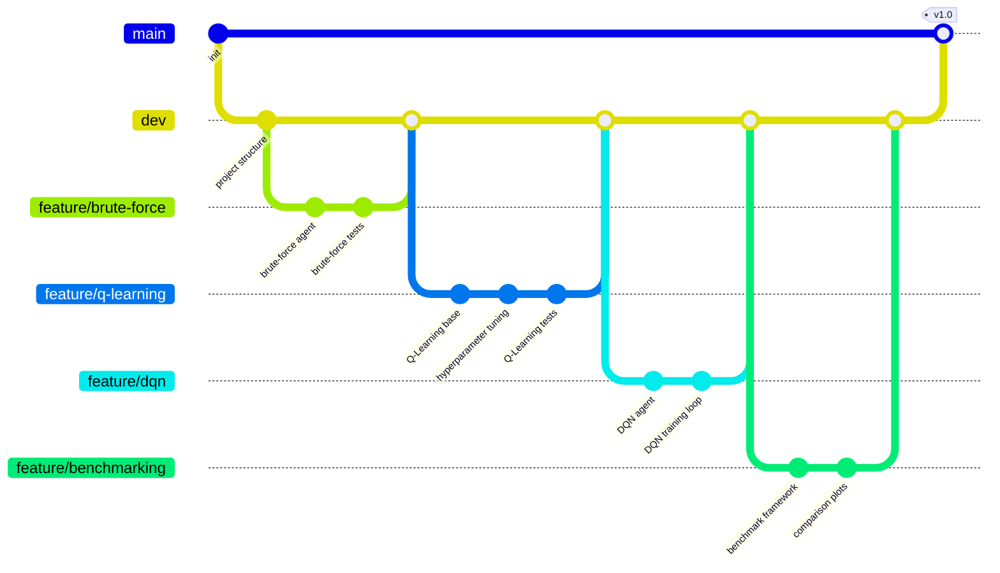
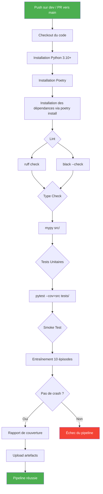

# Document de Cadrage — Taxi Driver (T-AIA-902)

> **Module** : T-AIA-902 — Intelligence Artificielle / Apprentissage par Renforcement
> **Organisation GitHub** : T-AIA-902-Taxi-Driver
> **Date de création** : Mars 2026
> **Version** : 1.0

---

## Table des matières

1. [Présentation du Projet](#1-présentation-du-projet)
2. [Organisation de l'Équipe](#2-organisation-de-léquipe)
3. [Processus de Développement](#3-processus-de-développement)
4. [CI/CD](#4-cicd)
5. [User Stories](#5-user-stories)
6. [Métriques et Benchmarks](#6-métriques-et-benchmarks)
7. [Fonctionnalités Bonus](#7-fonctionnalités-bonus)
8. [Stack Technique](#8-stack-technique)
9. [Gestion des Risques](#9-gestion-des-risques)
10. [Livrables et Definition of Done](#10-livrables-et-definition-of-done)

---

## 1. Présentation du Projet

### 1.1 Contexte

Ce projet s'inscrit dans le cadre du module **T-AIA-902** du cursus Epitech, dédié à l'apprentissage par renforcement (Reinforcement Learning). L'objectif pédagogique est de permettre aux étudiants de maîtriser les fondamentaux du RL en implémentant, entraînant et évaluant des agents capables de résoudre un problème classique de navigation et de transport : l'environnement **Taxi-v3** de la bibliothèque Gymnasium (anciennement OpenAI Gym).

L'apprentissage par renforcement est un paradigme d'apprentissage automatique dans lequel un agent interagit avec un environnement, reçoit des récompenses ou des pénalités en fonction de ses actions, et apprend progressivement une politique optimale maximisant le cumul de récompenses. Ce projet couvre l'ensemble du cycle de vie d'un projet RL : conception, implémentation, entraînement, évaluation, benchmarking et documentation.

### 1.2 Objectifs

Les objectifs principaux du projet sont les suivants :

- **Résoudre l'environnement Taxi-v3** à l'aide d'algorithmes de RL model-free épisodiques, en atteignant une performance optimale de **8 à 13 steps** par épisode en moyenne.
- **Implémenter plusieurs algorithmes** (au minimum Q-Learning tabulaire et SARSA (on-policy)) afin de comparer leurs performances respectives.
- **Comparer les résultats au brute-force** : un agent aléatoire nécessite en moyenne ~350 steps pour résoudre un épisode, tandis qu'un agent RL entraîné le résout en ~13 steps, soit une amélioration d'un facteur ~20.
- **Produire un rapport d'analyse complet** avec graphiques, tableaux de benchmarking et analyse des hyperparamètres.
- Utiliser le **reward shaping** comme boussole pour guider l'apprentissage de l'agent vers des stratégies optimales.
- **Proposer des extensions bonus**, notamment un environnement multi-passagers (2 passagers) avec optimisation de route et un agent DQN (Deep Q-Network) pour explorer le deep RL, et une extension **TrackMania** pour explorer le deep RL sur un espace d'états continu.

### 1.3 Environnement Taxi-v3

L'environnement Taxi-v3 de Gymnasium modélise un problème de transport dans une grille urbaine simplifiée.

**Description de la grille :**

- La grille mesure **5×5 cases**, soit 25 positions possibles pour le taxi.
- Quatre emplacements nommés sont disposés sur la grille : **R** (rouge, coin supérieur gauche), **G** (vert, coin supérieur droit), **Y** (jaune, coin inférieur gauche) et **B** (bleu, coin inférieur droit).
- Des murs séparent certaines cases et limitent les déplacements possibles du taxi.

**Espace d'états :**

L'état est encodé comme un entier unique parmi **500 états possibles**, résultant de la combinaison :

| Composante              | Valeurs possibles | Nombre |
|-------------------------|-------------------|--------|
| Position du taxi (ligne) | 0 à 4            | 5      |
| Position du taxi (colonne) | 0 à 4         | 5      |
| État du passager         | R, G, Y, B, dans le taxi | 5 |
| Destination              | R, G, Y, B       | 4      |

Soit **5 × 5 × 5 × 4 = 500 états** distincts.

**Espace d'actions :**

L'agent dispose de **6 actions** discrètes :

| Action | Code | Description                          |
|--------|------|--------------------------------------|
| Sud    | 0    | Déplacer le taxi vers le bas         |
| Nord   | 1    | Déplacer le taxi vers le haut        |
| Est    | 2    | Déplacer le taxi vers la droite      |
| Ouest  | 3    | Déplacer le taxi vers la gauche      |
| Pickup | 4    | Prendre le passager                  |
| Dropoff| 5    | Déposer le passager                  |

**Système de récompenses :**

| Événement                           | Récompense |
|-------------------------------------|------------|
| Déposer le passager à destination   | **+20**    |
| Chaque step (déplacement)           | **-1**     |
| Pickup ou Dropoff illégal           | **-10**    |

Un épisode se termine lorsque le passager est déposé à la bonne destination ou après un nombre maximal de steps (200 par défaut).

### 1.4 Contraintes

Le cahier des charges impose les contraintes suivantes :

- **Model-free** : les algorithmes ne doivent pas utiliser de modèle de transition de l'environnement. L'agent apprend uniquement à partir de l'expérience (états, actions, récompenses).
- **Épisodique** : l'apprentissage se fait par épisodes complets (du début jusqu'à la résolution ou le timeout).
- **Deux modes de fonctionnement** :
  - **Mode tuning** : l'utilisateur peut ajuster les hyperparamètres (learning rate, gamma, epsilon, etc.) et observer l'impact sur l'entraînement.
  - **Mode optimal** : utilise des hyperparamètres pré-optimisés pour fournir un agent performant sans configuration manuelle.
- **Entrées utilisateur** : l'utilisateur spécifie le nombre d'épisodes d'entraînement et le nombre d'épisodes de test.
- **Sorties attendues** : temps moyen, récompenses moyennes, affichage d'épisodes aléatoires résolus.

### 1.5 Philosophie et Démarche Scientifique

Le projet adopte une **démarche académique rigoureuse**, conformément aux attentes du module. L'approche ne se limite pas à produire un agent fonctionnel : il s'agit de comprendre les comportements observés, de les justifier théoriquement et de les valider expérimentalement.

#### 1.5.1 Cadre Théorique

Le projet s'appuie sur le formalisme des **Processus de Décision Markoviens (MDP)**, défini par le tuple (S, A, P, R, γ) :

- **S** : ensemble fini des états (500 pour Taxi-v3)
- **A** : ensemble fini des actions (6 pour Taxi-v3)
- **P(s'|s, a)** : probabilité de transition (déterministe dans Taxi-v3)
- **R(s, a, s')** : fonction de récompense
- **γ** : facteur de discount (0 ≤ γ ≤ 1)

L'objectif de l'agent est de trouver la politique optimale π* maximisant l'espérance de retour cumulé :

```
π* = argmax_π E[Σ γ^t · R(s_t, a_t, s_{t+1}) | π]
```

**Références fondamentales :**

- Sutton, R. S., & Barto, A. G. (2018). *Reinforcement Learning: An Introduction* (2nd ed.). MIT Press.
- Watkins, C. J. C. H. (1989). *Learning from Delayed Rewards*. PhD thesis, Cambridge University. (Q-Learning)
- Rummery, G. A., & Niranjan, M. (1994). *On-line Q-learning using connectionist systems*. (SARSA)

**Garanties de convergence :** Le Q-Learning tabulaire converge vers la Q-function optimale sous les conditions de Robbins-Monro : chaque paire (s, a) doit être visitée infiniment souvent, et le learning rate doit satisfaire Σα = ∞ et Σα² < ∞. En pratique, un epsilon-greedy avec décroissance et un nombre suffisant d'épisodes garantissent la convergence sur Taxi-v3.

#### 1.5.2 Cycle Expérimental

1. **Formuler des hypothèses** : avant chaque expérimentation, poser une question claire et formuler une prédiction. Exemple : *"Un discount factor γ élevé (0.99) devrait produire une convergence plus lente mais une meilleure politique finale qu'un γ faible (0.9)"*.
2. **Expérimenter** : exécuter les entraînements avec un protocole contrôlé (seed fixe, conditions identiques, **10 runs minimum** avec seeds différentes).
3. **Comparer** : analyser les résultats avec des métriques quantitatives (reward moyen, steps, taux de succès) et des **tests statistiques** (test t de Welch ou Mann-Whitney U, p < 0.05).
4. **Analyser** : interpréter les résultats, identifier les tendances, expliquer les écarts par rapport aux hypothèses. Reporter les résultats sous forme μ ± σ (n=10).
5. **Justifier** : conclure sur la validité des hypothèses et documenter les limites et pistes d'amélioration.

> **Principe directeur** : *"Un bon projet IA, c'est un bon rapport, pas juste un bon code."* La compréhension des comportements prime sur la performance brute.

#### 1.5.3 Structure du Rapport Académique

Le rapport final doit suivre une structure académique :

1. **Introduction** — Contexte, problématique, objectifs
2. **État de l'art** — Positionnement RL tabulaire vs deep RL, algorithmes existants
3. **Formalisation** — MDP Taxi-v3, espaces d'états/actions, récompenses
4. **Méthodologie** — Algorithmes implémentés, hyperparamètres, protocole expérimental
5. **Résultats expérimentaux** — Tableaux, graphiques, tests statistiques
6. **Discussion** — Analyse critique, confirmation/infirmation des hypothèses
7. **Limites et perspectives** — Ce qui n'a pas fonctionné, pistes d'amélioration
8. **Conclusion**
9. **Références bibliographiques** — ≥ 5 sources académiques

**Points clés :**

- Les résultats peuvent être **plus sensibles aux hyperparamètres qu'à l'algorithme** lui-même. Il est essentiel de documenter cette sensibilité.
- Le rapport final doit **raconter une histoire**, pas être un simple empilement d'expériences.
- Chaque choix de conception (algorithme, hyperparamètres, reward shaping) doit être **motivé et analysé**.

---

## 2. Organisation de l'Équipe

### 2.1 Rôles et Responsabilités

| Rôle                          | Membre       | Responsabilités principales                                      |
|-------------------------------|--------------|------------------------------------------------------------------|
| Chef de projet / Scrum Master | *À définir*  | Coordination, sprint planning, daily standups, suivi avancement  |
| Développeur RL principal      | *À définir*  | Implémentation Q-Learning, DQN, architecture agents              |
| Développeur benchmarking/viz  | *À définir*  | Framework d'évaluation, graphiques, comparatifs, reward shaping  |
| Rédacteur documentation       | *À définir*  | Rapport final, documentation technique, README, présentation     |

> **Note** : chaque membre participe au développement et aux revues de code. Les rôles indiquent la responsabilité principale, pas l'exclusivité.

### 2.2 Planning Prévisionnel

Le projet est organisé en **3 sprints** d'une à deux semaines chacun.

**Sprint 1 — Fondations (Semaines 1-2)**

| Tâche                                      | Priorité | Assignation          |
|--------------------------------------------|----------|----------------------|
| Initialisation du dépôt GitHub             | Must     | Chef de projet       |
| Mise en place CI/CD (GitHub Actions)       | Must     | Chef de projet       |
| Configuration pre-commit hooks             | Must     | Chef de projet       |
| Implémentation agent brute-force (random)  | Must     | Dev benchmarking     |
| Implémentation Q-Learning tabulaire de base| Must     | Dev RL               |
| Structure du projet et architecture        | Must     | Équipe               |
| Tests unitaires pour les agents de base    | Must     | Dev RL               |

**Sprint 2 — Optimisation et SARSA (Semaines 3-4)**

| Tâche                                          | Priorité | Assignation      |
|------------------------------------------------|----------|------------------|
| Optimisation des hyperparamètres Q-Learning    | Must     | Dev RL           |
| Implémentation de l'agent SARSA (on-policy)    | Must     | Dev RL           |
| Framework de benchmarking automatisé           | Must     | Dev benchmarking |
| Comparaison brute-force vs Q-Learning vs SARSA | Must     | Dev benchmarking |
| Mode utilisateur avec saisie des paramètres    | Must     | Dev RL           |
| Premières visualisations (courbes)             | Should   | Dev benchmarking |

**Sprint 3 — Finalisation et Bonus (Semaines 5-6)**

| Tâche                                          | Priorité | Assignation      |
|------------------------------------------------|----------|------------------|
| Mode time-limited avec paramètres optimisés    | Must     | Dev RL           |
| Visualisations finales et episode replay       | Must     | Dev benchmarking |
| Rapport d'analyse complet                      | Must     | Rédacteur        |
| Extension multi-passagers (bonus)              | Could    | Équipe           |
| Visualisations avancées (heatmap, GIF)         | Could    | Dev benchmarking |
| Algorithmes supplémentaires (MC, DQN)          | Could    | Dev RL           |
| Présentation finale                            | Must     | Équipe           |

### 2.3 Outils de Collaboration

- **Communication** : Discord (canal dédié au projet) ou Slack
- **Gestion de projet** : GitHub Projects (board Kanban avec colonnes : Backlog, En cours, En revue, Terminé)
- **Rituels Agile** :
  - Daily standup (15 min, asynchrone ou vocal)
  - Sprint planning en début de sprint
  - Sprint review et rétrospective en fin de sprint
- **Documentation partagée** : dépôt Git (dossier `docs/`)

---

## 3. Processus de Développement

### 3.1 Stratégie Git

Le projet utilise une stratégie **Git Flow simplifiée** avec les branches suivantes :

- **`main`** : branche de production, contient uniquement du code stable et validé. Protégée, seules les Pull Requests approuvées peuvent y être fusionnées.
- **`dev`** : branche d'intégration continue. Toutes les features sont mergées ici avant d'être promues vers `main`.
- **`feature/<nom>`** : branches de développement pour chaque nouvelle fonctionnalité (ex. `feature/q-learning`, `feature/dqn-agent`).
- **`fix/<nom>`** : branches pour les corrections de bugs (ex. `fix/epsilon-decay`, `fix/reward-calculation`).



### 3.2 Conventions de Commits

Les messages de commit suivent le format **Conventional Commits** :

```
type(scope): description courte
```

**Types autorisés :**

| Type        | Utilisation                                  |
|-------------|----------------------------------------------|
| `feat`      | Nouvelle fonctionnalité                      |
| `fix`       | Correction de bug                            |
| `docs`      | Documentation uniquement                     |
| `refactor`  | Refactorisation sans changement fonctionnel  |
| `test`      | Ajout ou modification de tests               |
| `ci`        | Configuration CI/CD                          |
| `benchmark` | Ajout ou modification de benchmarks          |
| `chore`     | Tâches de maintenance                        |

**Exemples :**

```
feat(agent): implement Q-Learning base
fix(training): correct epsilon decay formula
docs(readme): add installation instructions
benchmark(eval): add brute-force comparison
test(q-learning): add convergence tests
ci(actions): add mypy type checking step
refactor(agents): extract base agent interface
feat(viz): add learning curve plots
```

### 3.3 Pull Requests

Chaque Pull Request doit respecter le processus suivant :

**Template de PR :**

```markdown
## Description
<!-- Décrivez les changements apportés -->

## Type de changement
- [ ] Nouvelle fonctionnalité (feat)
- [ ] Correction de bug (fix)
- [ ] Refactorisation (refactor)
- [ ] Documentation (docs)
- [ ] Tests (test)

## Tests effectués
<!-- Décrivez les tests réalisés -->

## Métriques de performance (si applicable)
| Métrique       | Avant | Après |
|----------------|-------|-------|
| Reward moyen   |       |       |
| Steps moyen    |       |       |
| Taux de succès |       |       |

## Checklist
- [ ] Mon code suit les conventions du projet
- [ ] J'ai ajouté des tests pour mes changements
- [ ] Tous les tests existants passent
- [ ] Le linting (ruff) ne génère pas d'erreur
- [ ] Pas de régression de performance
- [ ] La documentation est à jour
```

**Règles :**

- Revue obligatoire par **au moins 1 membre** de l'équipe avant merge.
- La CI doit être **verte** (tous les checks passent).
- Les conflits doivent être résolus **avant** la demande de merge.
- Les branches sont supprimées après fusion.

### 3.4 Conventions de Code Python

Le projet suit les conventions suivantes :

- **Style** : PEP 8, appliqué automatiquement par `ruff` et `black`.
- **Type hints** : obligatoires pour toutes les fonctions publiques.
- **Docstrings** : format Google-style pour toutes les classes et fonctions publiques.
- **Nommage** :
  - Fichiers et fonctions : `snake_case` (ex. `q_learning_agent.py`, `compute_reward()`)
  - Classes : `PascalCase` (ex. `QLearningAgent`, `BenchmarkRunner`)
  - Constantes : `UPPER_SNAKE_CASE` (ex. `DEFAULT_LEARNING_RATE`)
- **Longueur de ligne** : maximum **100 caractères**.
- **Imports** : ordonnés par stdlib, third-party, local (appliqué par ruff/isort).

**Exemple de docstring Google-style :**

```python
def train(
    self,
    n_episodes: int,
    learning_rate: float = 0.1,
    gamma: float = 0.99,
) -> dict[str, list[float]]:
    """Entraîne l'agent sur un nombre donné d'épisodes.

    Args:
        n_episodes: Nombre d'épisodes d'entraînement.
        learning_rate: Taux d'apprentissage (alpha).
        gamma: Facteur de discount pour les récompenses futures.

    Returns:
        Dictionnaire contenant les métriques d'entraînement :
            - 'rewards': liste des récompenses par épisode
            - 'steps': liste du nombre de steps par épisode

    Raises:
        ValueError: Si n_episodes est négatif.
    """
```

### 3.5 Structure du Répertoire Projet

```
Taxi-Driver/
├── src/
│   ├── __init__.py
│   ├── main.py                      # Point d'entrée principal (modes user/time-limited)
│   ├── config.py                    # Chargement et gestion de la configuration
│   ├── agents/
│   │   ├── __init__.py
│   │   ├── base_agent.py            # Classe abstraite BaseAgent
│   │   ├── brute_force_agent.py     # Agent aléatoire (baseline)
│   │   ├── q_learning_agent.py      # Q-Learning tabulaire
│   │   ├── dqn_agent.py             # Deep Q-Network (PyTorch)
│   │   └── monte_carlo_agent.py     # Monte Carlo (bonus)
│   ├── environments/
│   │   ├── __init__.py
│   │   ├── taxi_wrapper.py          # Wrapper Gymnasium pour Taxi-v3
│   │   └── multi_passenger_env.py   # Environnement étendu 2 passagers (bonus)
│   ├── training/
│   │   ├── __init__.py
│   │   ├── trainer.py               # Boucle d'entraînement générique
│   │   └── callbacks.py             # Callbacks (logging, early stopping)
│   ├── evaluation/
│   │   ├── __init__.py
│   │   ├── evaluator.py             # Évaluation sur N épisodes
│   │   └── metrics.py               # Calcul des métriques (reward, steps, succès)
│   ├── benchmarking/
│   │   ├── __init__.py
│   │   ├── benchmarker.py           # Comparaison multi-algorithmes
│   │   └── reward_shaping.py        # Expérimentations reward shaping
│   └── visualization/
│       ├── __init__.py
│       ├── plots.py                 # Courbes d'apprentissage, boxplots, barplots
│       └── episode_replay.py        # Replay visuel d'épisodes dans le terminal
├── configs/
│   ├── default.yaml                 # Configuration par défaut (mode user)
│   ├── optimized.yaml               # Hyperparamètres optimisés (mode time-limited)
│   └── benchmark_sweep.yaml         # Configurations pour le sweep d'hyperparamètres
├── models/                          # Modèles entraînés sauvegardés (Q-tables, poids DQN)
├── results/                         # Résultats de benchmarking et graphiques générés
├── tests/                           # Tests unitaires et d'intégration (pytest)
├── docs/                            # Documentation du projet
├── .github/
│   └── workflows/                   # Pipelines CI/CD GitHub Actions
├── pyproject.toml                   # Configuration Poetry (dépendances, scripts, ruff, mypy, pytest)
├── poetry.lock                      # Lockfile Poetry (versions exactes des dépendances)
└── README.md                        # Documentation principale avec badge CI
```

---

## 4. CI/CD

### 4.1 Pipeline GitHub Actions

Le pipeline CI/CD est déclenché automatiquement lors de chaque push sur `dev` et pour chaque Pull Request vers `main`.



**Détail des étapes :**

1. **Checkout** : récupération du code source depuis le dépôt.
2. **Setup Python** : installation de Python 3.10+ via `actions/setup-python`.
3. **Installation des dépendances** : `poetry install` (installe les dépendances principales et de développement dans un virtualenv géré par Poetry).
4. **Lint** : vérification du formatage et du style avec `ruff check .` et `black --check .`.
5. **Type checking** : analyse statique des types avec `mypy src/`.
6. **Tests unitaires** : exécution de `pytest` avec mesure de la couverture de code.
7. **Smoke test** : entraînement rapide de 10 épisodes pour vérifier l'absence de crash ou de régression majeure.
8. **Rapport de couverture** : génération et publication du rapport de couverture.

### 4.2 Pre-commit Hooks

Des hooks pre-commit sont configurés pour garantir la qualité du code avant chaque commit local :

```yaml
repos:
  - repo: https://github.com/psf/black
    rev: 24.3.0
    hooks:
      - id: black
        args: [--line-length=100]
  - repo: https://github.com/astral-sh/ruff-pre-commit
    rev: v0.3.0
    hooks:
      - id: ruff
        args: [--fix]
  - repo: https://github.com/pre-commit/mirrors-mypy
    rev: v1.9.0
    hooks:
      - id: mypy
        additional_dependencies: [gymnasium, numpy, torch]
```

### 4.3 Qualité du Code

- **Couverture minimale** : le seuil de couverture est fixé à **70%**. Le pipeline échoue si la couverture descend en dessous de ce seuil.
- **Badge CI** : un badge GitHub Actions est affiché dans le README pour indiquer l'état de la CI en temps réel.
- **Score de lint** : zéro warning ruff et black autorisé sur la branche `main`.

### 4.4 Artefacts

Les artefacts suivants sont générés et conservés par la CI :

- **Modèles entraînés** : Q-tables sérialisées (pickle/numpy), poids DQN (PyTorch `.pt`).
- **Rapports de benchmark** : fichiers CSV et JSON contenant les métriques de chaque run.
- **Graphiques** : images PNG des courbes d'apprentissage et comparatifs exportées dans `results/`.
- **Rapport de couverture** : rapport HTML consultable via GitHub Pages ou en artefact de pipeline.

---

## 5. User Stories

### Epic 1 : Entraînement de l'Agent

---

**US-1.1 — Entraîner un agent Q-Learning**

| Champ      | Valeur                                                                 |
|------------|------------------------------------------------------------------------|
| ID         | US-1.1                                                                 |
| Titre      | Entraîner un agent Q-Learning tabulaire                                |
| Priorité   | **Must**                                                               |
| Description| En tant qu'utilisateur, je veux entraîner un agent Q-Learning sur Taxi-v3 afin qu'il apprenne une politique optimale de transport de passager. |

**Critères d'acceptation :**

- **Given** un environnement Taxi-v3 initialisé et un agent Q-Learning avec des hyperparamètres par défaut,
- **When** l'utilisateur lance l'entraînement pour N épisodes,
- **Then** l'agent met à jour sa Q-table à chaque step, le reward moyen augmente progressivement au fil des épisodes, et à la fin de l'entraînement la Q-table est sauvegardée sur disque.

---

**US-1.2 — Entraîner un agent SARSA**

| Champ      | Valeur                                                                 |
|------------|------------------------------------------------------------------------|
| ID         | US-1.2                                                                 |
| Titre      | Entraîner un agent SARSA                                               |
| Priorité   | **Must**                                                               |
| Description| En tant qu'utilisateur, je veux entraîner un agent SARSA (on-policy) sur Taxi-v3 afin de comparer son comportement et ses performances avec l'agent Q-Learning (off-policy). |

**Critères d'acceptation :**

- **Given** un environnement Taxi-v3 et un agent SARSA configuré,
- **When** l'utilisateur lance l'entraînement pour N épisodes,
- **Then** l'agent utilise Q(s',a') où a' est l'action effectivement choisie (et non le max), la Q-table est sauvegardée sur disque, et le comportement on-policy est observable.

---

**US-1.3 — Configurer les hyperparamètres en mode user**

| Champ      | Valeur                                                                 |
|------------|------------------------------------------------------------------------|
| ID         | US-1.3                                                                 |
| Titre      | Mode utilisateur pour le réglage des hyperparamètres                   |
| Priorité   | **Must**                                                               |
| Description| En tant qu'utilisateur, je veux pouvoir ajuster les hyperparamètres (learning rate, gamma, epsilon, decay) avant l'entraînement afin d'expérimenter leur impact sur la convergence. |

**Critères d'acceptation :**

- **Given** le programme lancé en mode utilisateur,
- **When** l'utilisateur saisit des valeurs pour le learning rate, gamma, epsilon initial et epsilon decay,
- **Then** l'entraînement utilise ces paramètres personnalisés, et les valeurs choisies sont affichées en récapitulatif avant le début de l'entraînement.

---

**US-1.4 — Utiliser des paramètres optimisés en mode time-limited**

| Champ      | Valeur                                                                 |
|------------|------------------------------------------------------------------------|
| ID         | US-1.4                                                                 |
| Titre      | Mode time-limited avec paramètres pré-optimisés                        |
| Priorité   | **Must**                                                               |
| Description| En tant qu'utilisateur, je veux pouvoir lancer un entraînement avec des paramètres pré-optimisés afin d'obtenir un agent performant rapidement, sans configuration manuelle. |

**Critères d'acceptation :**

- **Given** le programme lancé en mode time-limited,
- **When** l'entraînement démarre,
- **Then** les hyperparamètres sont chargés depuis le fichier `configs/optimized.yaml`, l'entraînement converge en moins de 5000 épisodes, et l'agent atteint un reward moyen supérieur à 7.0 sur 100 épisodes de test.

---

**US-1.5 — Spécifier le nombre d'épisodes d'entraînement**

| Champ      | Valeur                                                                 |
|------------|------------------------------------------------------------------------|
| ID         | US-1.5                                                                 |
| Titre      | Saisie du nombre d'épisodes d'entraînement                            |
| Priorité   | **Must**                                                               |
| Description| En tant qu'utilisateur, je veux spécifier le nombre d'épisodes d'entraînement afin de contrôler la durée et la profondeur de l'apprentissage. |

**Critères d'acceptation :**

- **Given** le programme en attente de la saisie utilisateur,
- **When** l'utilisateur entre un nombre d'épisodes d'entraînement (ex. 10000),
- **Then** l'entraînement s'exécute exactement pour ce nombre d'épisodes, une barre de progression est affichée, et le temps total d'entraînement est reporté à la fin.

---

### Epic 2 : Évaluation et Benchmarking

---

**US-2.1 — Évaluer l'agent sur N épisodes de test**

| Champ      | Valeur                                                                 |
|------------|------------------------------------------------------------------------|
| ID         | US-2.1                                                                 |
| Titre      | Évaluation de l'agent entraîné                                        |
| Priorité   | **Must**                                                               |
| Description| En tant qu'utilisateur, je veux évaluer l'agent entraîné sur un ensemble d'épisodes de test afin de mesurer sa performance réelle (reward moyen, steps moyen, taux de succès). |

**Critères d'acceptation :**

- **Given** un agent entraîné et chargé en mémoire,
- **When** l'utilisateur lance l'évaluation sur N épisodes de test,
- **Then** le programme exécute N épisodes sans mise à jour de la politique, calcule et affiche le reward moyen, le nombre de steps moyen, le taux de succès et le nombre de pénalités moyennes.

---

**US-2.2 — Comparer brute-force vs agent RL**

| Champ      | Valeur                                                                 |
|------------|------------------------------------------------------------------------|
| ID         | US-2.2                                                                 |
| Titre      | Comparaison brute-force contre agent RL                                |
| Priorité   | **Must**                                                               |
| Description| En tant qu'utilisateur, je veux comparer les performances de l'agent brute-force (aléatoire) avec l'agent RL entraîné afin de quantifier l'amélioration apportée par l'apprentissage. |

**Critères d'acceptation :**

- **Given** un agent brute-force et un agent RL entraîné,
- **When** les deux agents sont évalués sur le même ensemble de 100 épisodes de test (même seed),
- **Then** un tableau comparatif est affiché avec steps moyen, reward moyen et taux de succès pour chaque agent, ainsi que le ratio d'amélioration.

---

**US-2.3 — Comparer plusieurs algorithmes entre eux**

| Champ      | Valeur                                                                 |
|------------|------------------------------------------------------------------------|
| ID         | US-2.3                                                                 |
| Titre      | Comparaison multi-algorithmes                                          |
| Priorité   | **Should**                                                             |
| Description| En tant qu'utilisateur, je veux comparer les performances de plusieurs algorithmes (Q-Learning, SARSA, éventuellement Monte Carlo et DQN) afin d'identifier le plus adapté à Taxi-v3. |

**Critères d'acceptation :**

- **Given** au moins deux agents entraînés avec des algorithmes différents,
- **When** le benchmarking multi-algorithmes est lancé,
- **Then** un tableau et des graphiques comparatifs sont générés, incluant pour chaque algorithme : le reward moyen, le steps moyen, le temps d'entraînement et la mémoire utilisée.

---

**US-2.4 — Visualiser des épisodes aléatoires résolus**

| Champ      | Valeur                                                                 |
|------------|------------------------------------------------------------------------|
| ID         | US-2.4                                                                 |
| Titre      | Affichage d'épisodes résolus                                          |
| Priorité   | **Must**                                                               |
| Description| En tant qu'utilisateur, je veux visualiser le déroulement d'épisodes aléatoires résolus par l'agent afin de vérifier visuellement son comportement. |

**Critères d'acceptation :**

- **Given** un agent entraîné et évalué,
- **When** l'utilisateur demande la visualisation d'épisodes,
- **Then** le programme sélectionne aléatoirement des épisodes résolus avec succès et les affiche step par step dans le terminal (rendu Gymnasium), en indiquant l'action choisie et la récompense à chaque step.

---

**US-2.5 — Spécifier le nombre d'épisodes de test**

| Champ      | Valeur                                                                 |
|------------|------------------------------------------------------------------------|
| ID         | US-2.5                                                                 |
| Titre      | Saisie du nombre d'épisodes de test                                   |
| Priorité   | **Must**                                                               |
| Description| En tant qu'utilisateur, je veux spécifier le nombre d'épisodes de test afin d'adapter la précision statistique de l'évaluation. |

**Critères d'acceptation :**

- **Given** le programme en attente de la saisie utilisateur après l'entraînement,
- **When** l'utilisateur entre un nombre d'épisodes de test (ex. 100),
- **Then** l'évaluation s'exécute exactement pour ce nombre d'épisodes et les métriques sont calculées sur cet échantillon.

---

### Epic 3 : Visualisations et Rapport

---

**US-3.1 — Générer des courbes d'apprentissage**

| Champ      | Valeur                                                                 |
|------------|------------------------------------------------------------------------|
| ID         | US-3.1                                                                 |
| Titre      | Courbes d'apprentissage                                                |
| Priorité   | **Must**                                                               |
| Description| En tant qu'utilisateur, je veux visualiser les courbes d'apprentissage (reward et steps en fonction des épisodes) afin de comprendre la dynamique de convergence de l'agent. |

**Critères d'acceptation :**

- **Given** un entraînement terminé avec les métriques enregistrées,
- **When** l'utilisateur demande la génération des graphiques,
- **Then** des courbes de reward moyen et de steps moyen par épisode sont générées avec Matplotlib, incluant une moyenne glissante pour lisser le bruit, et sauvegardées en PNG dans `results/`.

---

**US-3.2 — Produire des tableaux de benchmarking comparatifs**

| Champ      | Valeur                                                                 |
|------------|------------------------------------------------------------------------|
| ID         | US-3.2                                                                 |
| Titre      | Tableaux de benchmarking                                               |
| Priorité   | **Must**                                                               |
| Description| En tant qu'utilisateur, je veux disposer de tableaux comparatifs synthétiques afin de présenter clairement les performances de chaque algorithme dans le rapport. |

**Critères d'acceptation :**

- **Given** les résultats d'évaluation de tous les algorithmes disponibles,
- **When** la génération des benchmarks est demandée,
- **Then** un tableau formaté est produit (console et CSV) avec les colonnes : algorithme, épisodes d'entraînement, steps moyen, reward moyen, taux de succès, temps d'entraînement et mémoire.

---

**US-3.3 — Exporter les résultats pour le rapport**

| Champ      | Valeur                                                                 |
|------------|------------------------------------------------------------------------|
| ID         | US-3.3                                                                 |
| Titre      | Export des résultats                                                   |
| Priorité   | **Should**                                                             |
| Description| En tant que rédacteur du rapport, je veux exporter les résultats (métriques, graphiques, tableaux) dans un format exploitable afin de les intégrer directement dans le rapport PDF/Markdown. |

**Critères d'acceptation :**

- **Given** des résultats de benchmarking et des graphiques générés,
- **When** l'export est déclenché,
- **Then** les métriques sont exportées en CSV et JSON, les graphiques en PNG haute résolution (300 DPI), et un résumé Markdown est généré dans `results/summary.md`.

---

### Epic 4 : Bonus — Extension Multi-Passagers

---

**US-4.1 — Jouer dans un environnement étendu 2 passagers**

| Champ      | Valeur                                                                 |
|------------|------------------------------------------------------------------------|
| ID         | US-4.1                                                                 |
| Titre      | Environnement multi-passagers                                         |
| Priorité   | **Could**                                                              |
| Description| En tant qu'utilisateur, je veux entraîner un agent dans un environnement Taxi étendu à 2 passagers afin d'explorer un problème de complexité accrue. |

**Critères d'acceptation :**

- **Given** un environnement custom `MultiPassengerEnv` compatible avec l'API Gymnasium,
- **When** l'utilisateur sélectionne le mode multi-passagers,
- **Then** l'environnement gère 2 passagers avec chacun un lieu de départ et une destination parmi R, G, Y, B, l'espace d'états est correctement étendu, et l'épisode se termine quand les deux passagers sont déposés à leurs destinations respectives.

---

**US-4.2 — Optimiser la route multi-passagers**

| Champ      | Valeur                                                                 |
|------------|------------------------------------------------------------------------|
| ID         | US-4.2                                                                 |
| Titre      | Optimisation de route multi-passagers                                  |
| Priorité   | **Could**                                                              |
| Description| En tant qu'utilisateur, je veux que l'agent apprenne à optimiser l'ordre de prise en charge et de dépôt des 2 passagers afin de minimiser le nombre total de steps. |

**Critères d'acceptation :**

- **Given** un agent entraîné sur l'environnement multi-passagers,
- **When** l'agent est évalué sur 100 épisodes,
- **Then** l'agent choisit de manière optimale l'ordre de prise en charge des passagers (celui le plus proche d'abord dans la majorité des cas), et le steps moyen est significativement inférieur à un agent suivant un ordre fixe.

---

**US-4.3 — Visualisations avancées**

| Champ      | Valeur                                                                 |
|------------|------------------------------------------------------------------------|
| ID         | US-4.3                                                                 |
| Titre      | Visualisations avancées (heatmap, animations)                          |
| Priorité   | **Could**                                                              |
| Description| En tant qu'utilisateur, je veux disposer de visualisations avancées (heatmap de la Q-table, animations GIF des épisodes) afin d'enrichir l'analyse et le rapport. |

**Critères d'acceptation :**

- **Given** un agent Q-Learning entraîné avec une Q-table complète,
- **When** l'utilisateur demande les visualisations avancées,
- **Then** une heatmap 5×5 est générée pour chaque action montrant les valeurs Q moyennes par position, et une animation GIF d'un épisode résolu est exportée dans `results/`.

---

**US-4.4 — Extension Deep Q-Network (bonus)**

| Champ      | Valeur                                                                 |
|------------|------------------------------------------------------------------------|
| ID         | US-4.4                                                                 |
| Titre      | Extension Deep Q-Network (bonus)                                       |
| Priorité   | **Could**                                                              |
| Description| En tant qu'utilisateur, je veux implémenter un agent DQN pour démontrer le passage au deep RL et comparer ses performances avec les approches tabulaires. |

**Critères d'acceptation :**

- **Given** un environnement Taxi-v3 et un agent DQN avec un réseau de neurones configuré (PyTorch),
- **When** l'utilisateur lance l'entraînement pour N épisodes,
- **Then** l'agent utilise un replay buffer et un target network, le loss diminue progressivement, et les poids du modèle sont sauvegardés au format `.pt`.

---

## 6. Métriques et Benchmarks

### 6.1 KPIs de Performance

Les indicateurs de performance clés mesurent la qualité de la politique apprise par l'agent :

| KPI                        | Description                                         | Cible           |
|----------------------------|-----------------------------------------------------|-----------------|
| Reward moyen par épisode   | Moyenne des récompenses cumulées sur les épisodes de test | **> 7.0**       |
| Steps moyen par épisode    | Nombre moyen de steps pour terminer un épisode      | **< 15** (optimal : 8-13) |
| Taux de succès             | Pourcentage d'épisodes terminés avec succès (dépôt correct) | **> 95%**       |
| Pénalités moyennes         | Nombre moyen de pickup/dropoff illégaux par épisode | **0**           |

### 6.2 KPIs de Convergence

Ces indicateurs caractérisent la vitesse et la stabilité de l'apprentissage :

| KPI                            | Description                                              | Cible                    |
|--------------------------------|----------------------------------------------------------|--------------------------|
| Épisodes pour convergence      | Nombre d'épisodes nécessaires pour atteindre 90% du reward optimal (seuil principal du protocole ; le seuil 95 % est rapporté en annexe) | **< 5000** (Q-Learning)  |
| Stabilité (écart-type rewards) | Écart-type des rewards sur les 100 derniers épisodes     | **< 2.0** après convergence |
| First success episode          | Numéro du premier épisode résolu avec succès             | **< 500**                |

### 6.3 KPIs de Comparaison

Ces indicateurs permettent de situer les algorithmes les uns par rapport aux autres :

| KPI                                | Description                                              | Cible attendue       |
|------------------------------------|----------------------------------------------------------|----------------------|
| Ratio amélioration vs brute-force  | Steps brute-force / Steps agent RL                       | **~20×** (~350/~15)  |
| Temps d'entraînement               | Durée totale de l'entraînement par algorithme            | Documenté par algo   |
| Complexité mémoire                 | Taille de la Q-table ou du modèle en mémoire            | Documenté par algo   |
| Ratio performance/temps            | Reward moyen atteint par seconde d'entraînement          | Comparatif           |

### 6.4 Benchmarks à Produire

**Tableau comparatif principal :**

| Algorithme    | Épisodes entraînement | Steps moyen | Reward moyen | Taux succès | Temps entraînement | Mémoire   |
|---------------|----------------------|-------------|--------------|-------------|-------------------|-----------|
| Brute-force   | 0                    | ~350        | ~ -700       | < 1%        | 0s                | ~0 MB     |
| Q-Learning    | 10 000               | ~13         | ~8.0         | > 95%       | ~Xs               | ~0.1 MB   |
| SARSA         | 10 000               | ~15         | ~7.5         | > 90%       | ~Xs               | ~0.1 MB   |
| Monte Carlo   | 10 000               | ~20         | ~5.0         | > 80%       | ~Xs               | ~Z MB     |
| DQN (bonus)   | 10 000               | ~15         | ~7.0         | > 90%       | ~Xs               | ~Y MB     |

> Les valeurs exactes seront remplies lors de l'exécution des benchmarks.

**Graphiques à générer :**

- **Courbes d'apprentissage superposées** : reward moyen en fonction des épisodes pour chaque algorithme, sur un même graphique avec légende.
- **Boxplots des rewards** : distribution des rewards sur les épisodes de test pour chaque algorithme.
- **Barplot des steps moyens** : comparaison directe du nombre de steps par algorithme.
- **Analyse de sensibilité** : graphiques montrant l'impact de chaque hyperparamètre (learning rate, gamma, epsilon) sur la convergence.

### 6.5 Protocole de Benchmarking

Pour garantir la reproductibilité et la fiabilité des résultats, le protocole suivant est appliqué :

- **Seed fixe** : un seed aléatoire fixe (ex. `seed=42`) est utilisé pour l'initialisation de l'environnement et des agents. Le même seed est réutilisé pour tous les algorithmes afin de garantir des conditions identiques.
- **Minimum 100 épisodes de test** : chaque évaluation est réalisée sur au moins 100 épisodes pour obtenir des statistiques significatives.
- **10 runs par configuration** : chaque configuration (algorithme + hyperparamètres) est exécutée 10 fois avec des seeds différents. Les résultats reportés incluent la moyenne et l'écart-type.
- **Tests statistiques** : les différences entre algorithmes doivent être validées par un test statistique (test t de Welch pour les distributions normales, Mann-Whitney U sinon). Un résultat est considéré significatif si p < 0.05. Les résultats sont reportés sous la forme μ ± σ avec intervalles de confiance à 95%.
- **Spécifications machine documentées** : le CPU, la RAM, le GPU (si utilisé pour DQN) et la version de Python/PyTorch sont documentés dans le rapport de benchmark.
- **Pas de parallélisation** : les benchmarks sont exécutés séquentiellement pour des mesures de temps fiables.
- **Temps de convergence** : pour chaque algorithme, mesurer le nombre d'épisodes nécessaire pour atteindre 90% du reward optimal de manière stable (sur 100 épisodes consécutifs).

---

## 7. Fonctionnalités Bonus

### 7.1 Extension Multi-Passagers

L'extension multi-passagers augmente la complexité du problème en introduisant **2 passagers** à transporter simultanément. Chaque passager possède un lieu de départ et une destination parmi les 4 emplacements (R, G, Y, B). L'espace d'états est considérablement étendu : au lieu de 500 états, on passe à 25 (positions taxi) × 6² (états de 2 passagers : R, G, Y, B, à bord, **livré**) × 4² (2 destinations) = **14 400 états**. Le statut « livré » est indispensable : contrairement à Taxi-v3 où la dépose termine l'épisode, la livraison du premier passager doit rester représentable pendant que le second est encore en course (le décompte initial de 10 000 états, fondé sur 5 statuts, omettait ce cas).

L'implémentation repose sur un **wrapper custom Gymnasium** (`MultiPassengerEnv`) qui étend l'environnement Taxi-v3 standard. Le système de récompenses est adapté : +20 pour chaque passager déposé à destination, -1 par step, -10 pour les actions illégales. L'épisode se termine quand les deux passagers sont déposés correctement.

### 7.2 Visualisations Avancées

Au-delà des graphiques de base, les visualisations avancées comprennent :

- **Heatmap de la Q-table** : pour chaque action, une grille 5×5 colorée représente la valeur Q moyenne pour chaque position du taxi. Cela permet de visualiser les zones de la grille les plus valorisées par l'agent.
- **Animation GIF** : un épisode résolu est rendu frame par frame et exporté en GIF animé, permettant une visualisation dynamique intégrable dans le rapport ou une présentation.
- **Dashboard interactif (GUI secondaire, focus IA)** : un dashboard optionnel pourrait être développé si le temps le permet, mais le focus reste sur les algorithmes et l'analyse.

### 7.3 Algorithmes Supplémentaires

En plus de Q-Learning et SARSA, les algorithmes bonus suivants peuvent être implémentés :

- **Monte Carlo** : estimation des valeurs Q à partir de retours complets d'épisodes (first-visit ou every-visit).
- **DQN (Deep Q-Network)** : extension du Q-Learning utilisant un réseau de neurones pour approximer la fonction Q. Permet de passer à des espaces d'états plus grands, mais surdimensionné pour Taxi-v3.
- **Double Q-Learning** : correction du biais de surestimation du Q-Learning classique, utilisant deux Q-tables.

### 7.4 Optimisation Avancée

Plusieurs stratégies d'optimisation avancée sont envisagées :

- **Grid search / Random search** : exploration systématique de l'espace des hyperparamètres (learning rate, gamma, epsilon initial, decay rate).
- **Stratégies d'exploration** :
  - **Epsilon-greedy** (baseline) : exploration aléatoire avec probabilité epsilon, décroissante au fil du temps.
  - **Boltzmann (softmax)** : sélection d'action proportionnelle à l'exponentielle des valeurs Q, contrôlée par un paramètre de température.
  - **UCB (Upper Confidence Bound)** : exploration basée sur l'incertitude, favorisant les actions peu explorées.

### 7.5 Extension TrackMania (Deep RL)

En tant qu'extension avancée, le projet explore l'application du deep RL à un environnement radicalement différent : **TrackMania**, un jeu de course automobile. Cette extension démontre la capacité de généralisation des concepts RL appris sur Taxi-v3 à un problème à espace d'états continu.

**Caractéristiques de l'environnement :**

| Propriété | Taxi-v3 | TrackMania |
|-----------|---------|------------|
| Espace d'états | Discret (500) | Continu (images / LIDAR) |
| Espace d'actions | Discret (6) | Continu (accélération, direction) |
| Méthode RL | Tabulaire (Q-table) | Deep RL (réseau de neurones) |
| Complexité | Simple | Élevée |

**Approche envisagée :**

- Utilisation de la bibliothèque `tmrl` pour l'interface Gymnasium avec TrackMania
- Algorithme : **PPO** (Proximal Policy Optimization) ou **SAC** (Soft Actor-Critic) via **Stable-Baselines3**
- Observations : vecteurs LIDAR (distances aux murs) plutôt que pixels bruts (plus accessible)
- Objectif : compléter un tour de circuit en minimisant le temps

**Intérêt pédagogique :**

- Transition concrète du RL tabulaire au deep RL
- Gestion des espaces d'états et d'actions continus
- Analyse comparative : complexité d'entraînement, stabilité, reward shaping entre environnement discret et continu
- Démonstration que les concepts fondamentaux (exploration/exploitation, discount, policy) s'appliquent universellement

---

## 8. Stack Technique

### 8.1 Python

Le projet utilise **Python 3.10+**, bénéficiant des fonctionnalités modernes du langage (match/case, type unions avec `|`, paramspec pour les types génériques). La gestion des dépendances est assurée par **Poetry**, qui fournit un environnement virtuel isolé, un lockfile (`poetry.lock`) pour la reproductibilité, et une configuration centralisée dans `pyproject.toml`.

### 8.2 Dépendances Principales

| Bibliothèque    | Version   | Utilisation                                           |
|-----------------|-----------|-------------------------------------------------------|
| `gymnasium`     | >= 0.29   | Environnement Taxi-v3 et API RL standardisée          |
| `numpy`         | >= 1.24   | Calcul numérique, Q-tables, opérations matricielles   |
| `matplotlib`    | >= 3.7    | Génération de graphiques (courbes, boxplots, heatmaps)|
| `seaborn`       | >= 0.12   | Graphiques statistiques avancés                       |
| `pytest`        | >= 7.0    | Framework de tests unitaires et d'intégration         |
| `ruff`          | >= 0.3    | Linter Python ultra-rapide                            |
| `black`         | >= 24.0   | Formateur de code automatique                         |
| `mypy`          | >= 1.9    | Vérification statique des types                       |
| `pyyaml`        | >= 6.0    | Chargement des fichiers de configuration YAML         |

### 8.3 Dépendances Optionnelles

| Bibliothèque    | Utilisation                                            |
|-----------------|--------------------------------------------------------|
| `streamlit`     | Dashboard interactif (bonus)                           |
| `gradio`        | Interface utilisateur web alternative (bonus)          |
| `imageio`       | Génération d'animations GIF (bonus)                    |
| `pandas`        | Manipulation de données tabulaires pour les benchmarks |
| `tqdm`          | Barres de progression pour l'entraînement              |
| `pytest-cov`    | Mesure de la couverture de code                        |
| `torch`         | Implémentation du DQN (extension bonus)                |
| `stable-baselines3` | Algorithmes deep RL pré-implémentés (PPO, SAC) pour l'extension TrackMania |
| `tmrl`              | Interface Gymnasium pour l'environnement TrackMania                        |

---

## 9. Gestion des Risques

| Risque                            | Probabilité | Impact   | Mitigation                                                                                      |
|-----------------------------------|-------------|----------|-------------------------------------------------------------------------------------------------|
| Non-convergence de l'algorithme   | Moyenne     | **Élevé**| Le Q-Learning tabulaire est mathématiquement garanti de converger sous certaines conditions (exploration suffisante, learning rate décroissant). Il sert de baseline fiable. Monitorer les courbes d'apprentissage pour détecter les plateaux. |
| Temps de calcul DQN excessif      | Moyenne     | Moyen    | Limiter le nombre d'épisodes d'entraînement pour le DQN. Utiliser un GPU si disponible. Prévoir un timeout pour le mode time-limited. Le Q-Learning tabulaire reste le backup rapide. |
| Complexité du bonus multi-passagers| Faible     | Faible   | Le bonus est traité uniquement après la livraison du core fonctionnel. Appliquer un timeboxing strict (max 1 sprint). Si non terminé, documenter l'approche et les résultats partiels. |
| Régression de performance         | Moyenne     | **Élevé**| Tests CI automatisés incluant un smoke test de performance. Benchmarks de référence sauvegardés et comparés à chaque PR. Alertes si le reward moyen chute en dessous du seuil. |
| Conflits Git et perte de code     | Faible      | Moyen    | Stratégie Git Flow avec branches protégées. PR obligatoires avec revue de code. Commits fréquents et atomiques. |
| Indisponibilité d'un membre       | Moyenne     | Moyen    | Documentation à jour permettant à tout membre de reprendre une tâche. Pair programming pour le partage de connaissances. |
| Incompatibilité de versions       | Faible      | Faible   | Fichier `poetry.lock` garantissant des versions exactes et reproductibles. Environnement virtuel géré par Poetry. CI testant sur la version Python cible. |

---

## 10. Livrables et Definition of Done

### 10.1 Livrables

Le projet doit produire les livrables suivants :

| Livrable                          | Format           | Description                                                      |
|-----------------------------------|------------------|------------------------------------------------------------------|
| Code source                       | GitHub (dépôt)   | Code complet, documenté, testé, avec historique Git propre       |
| Rapport d'analyse                 | PDF / Markdown   | Rapport d'analyse scientifique racontant une histoire : hypothèses, protocole expérimental, résultats, analyse critique, limites et pistes d'amélioration. C'est un livrable clé du projet. |
| Présentation                      | Slides           | Support de présentation pour la soutenance du projet             |
| Modèles entraînés                 | `.npy` / `.pt`   | Q-tables et poids DQN sauvegardés et reproductibles              |
| Résultats de benchmarking         | CSV / JSON / PNG  | Données brutes et graphiques des benchmarks                      |
| Références bibliographiques     | BibTeX / Markdown | Liste des publications et ouvrages cités (Sutton & Barto 2018, Watkins 1989, Rummery & Niranjan 1994, etc.) |

### 10.2 Definition of Done (DoD)

Une fonctionnalité est considérée comme terminée lorsque **tous** les critères suivants sont remplis :

- **Lint OK** : le code passe `ruff check` et `black --check` sans erreur.
- **Type check OK** : `mypy` ne remonte aucune erreur sur le code modifié.
- **Tests passent** : tous les tests unitaires existants passent, et de nouveaux tests couvrent la fonctionnalité ajoutée.
- **CI verte** : le pipeline GitHub Actions est entièrement vert sur la branche.
- **Code review** : au moins un membre de l'équipe a relu et approuvé la Pull Request.
- **Documentation à jour** : les docstrings, le README et la documentation technique reflètent les changements.
- **Métriques documentées** : si la fonctionnalité impacte les performances de l'agent, les nouvelles métriques sont mesurées et documentées.
- **Pas de régression** : les benchmarks ne montrent pas de dégradation par rapport aux résultats précédents.
- **Analyse scientifique** : les résultats incluent des hypothèses formulées, des comparaisons rigoureuses et une discussion critique.
