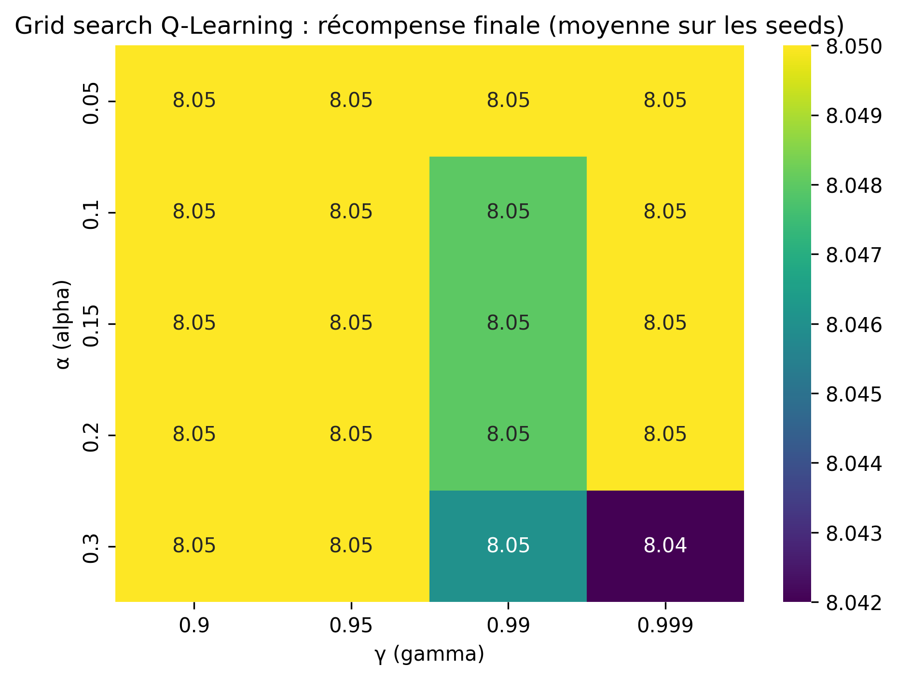
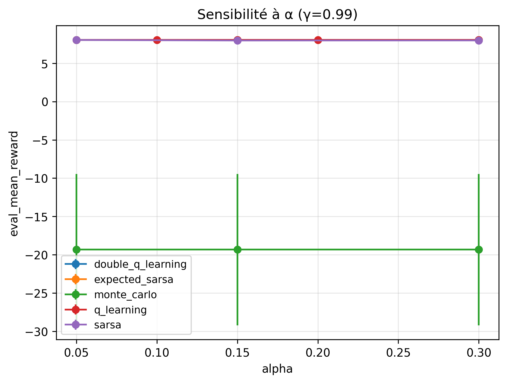
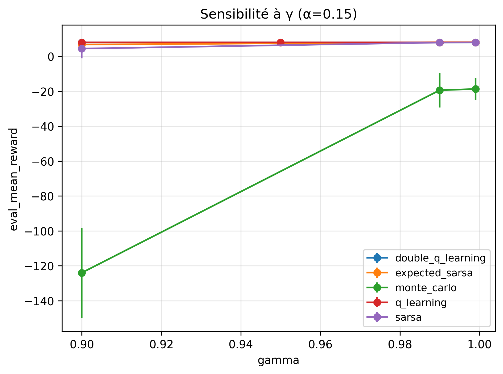
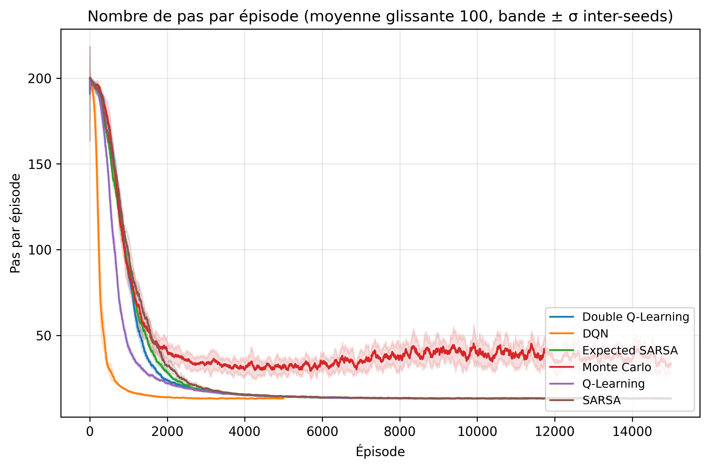
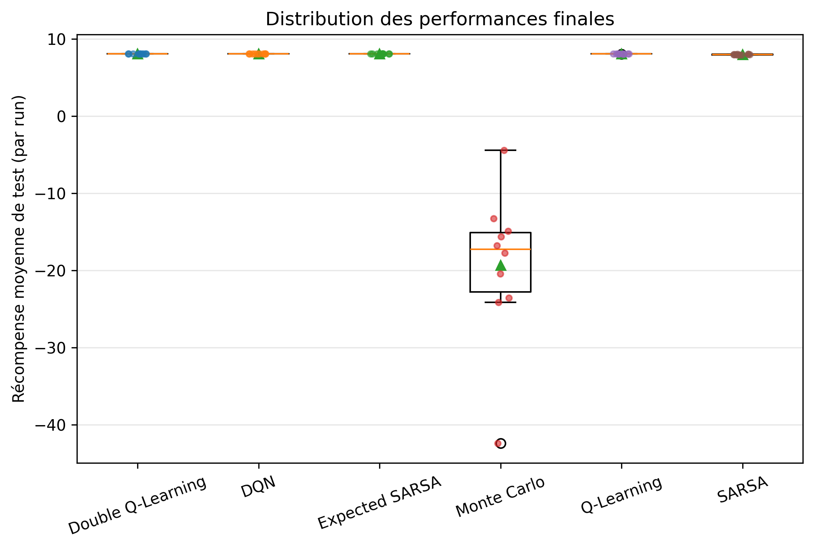
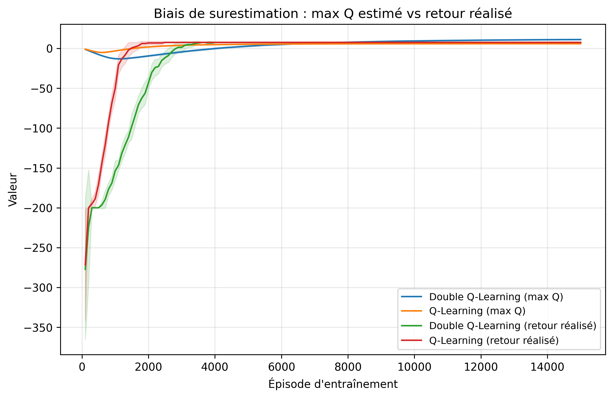
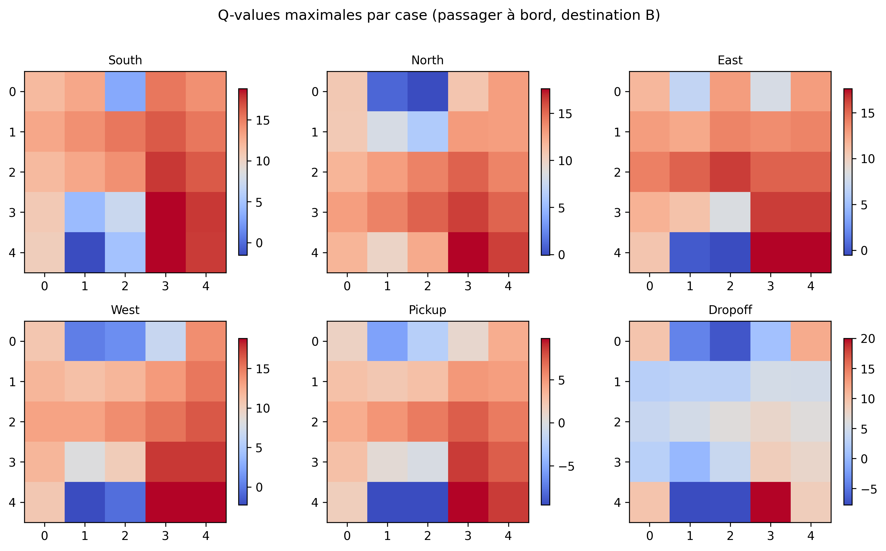
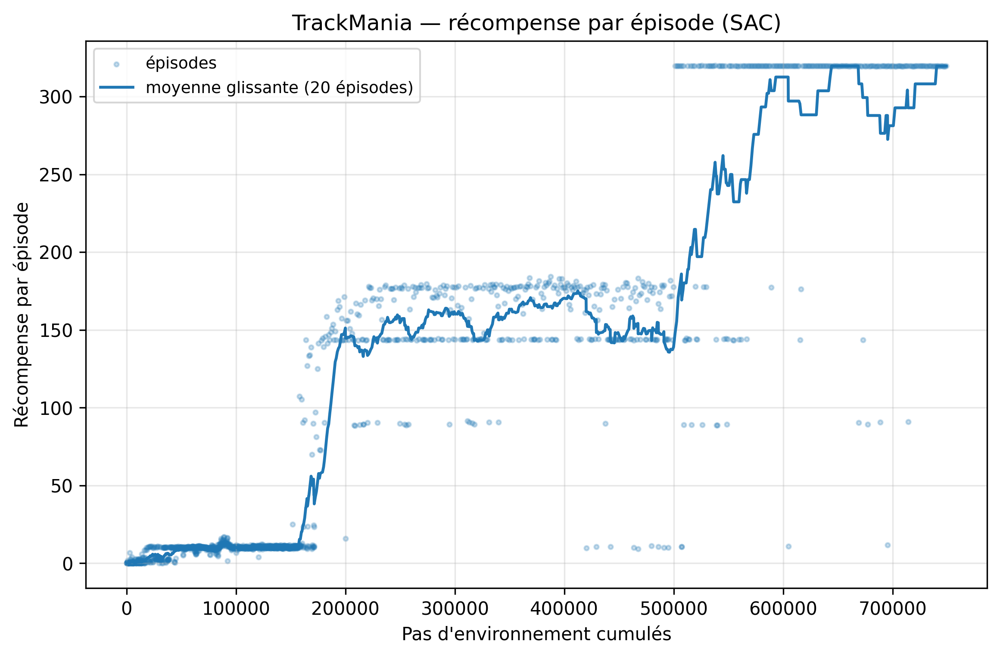
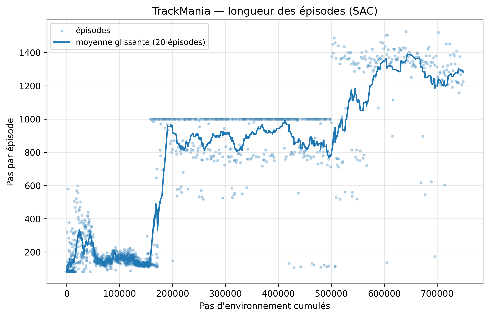

# Rapport scientifique — Taxi Driver (T-AIA-902)

> **Module** : T-AIA-902 — Intelligence Artificielle / Apprentissage par Renforcement
> **Organisation GitHub** : T-AIA-902-Taxi-Driver
> **Environnement** : Taxi-v3 (Gymnasium)
>
> Toute figure et tout tableau de ce rapport sont régénérables depuis
> `results/raw/` en appliquant le protocole décrit en section 4 (voir
> `docs/PROTOCOLE.md`, `scripts/run_campaign.py`, `scripts/run_stats.py` et
> `scripts/make_figures.py`).

---

## Table des matières

1. [Introduction](#1-introduction)
2. [État de l'art](#2-état-de-lart)
3. [Formalisation du problème](#3-formalisation-du-problème)
4. [Méthodologie](#4-méthodologie)
5. [Résultats expérimentaux](#5-résultats-expérimentaux)
6. [Discussion](#6-discussion)
7. [Limites et perspectives](#7-limites-et-perspectives)
8. [Conclusion](#8-conclusion)
9. [Références bibliographiques](#9-références-bibliographiques)

---

## 1. Introduction

### 1.1 Contexte

Ce rapport présente les travaux réalisés dans le cadre du module T-AIA-902 du
cursus Epitech, consacré à l'apprentissage par renforcement (*Reinforcement
Learning*, RL). Le sujet impose de résoudre l'environnement **Taxi-v3** de la
bibliothèque Gymnasium (Towers et al., 2024) à l'aide d'algorithmes
**model-free** et **épisodiques** : un taxi évolue sur une grille 5×5, doit
localiser un passager, le prendre en charge et le déposer à sa destination, le
tout en minimisant le nombre de déplacements et les manœuvres illégales.

Taxi-v3 est un problème jouet au sens noble du terme : suffisamment petit pour
que la politique optimale soit calculable exactement, suffisamment structuré
(sous-objectifs successifs, pénalités asymétriques, troncature temporelle) pour
faire apparaître les phénomènes qui traversent tout le champ du RL — dilemme
exploration/exploitation, biais de surestimation, sensibilité aux
hyperparamètres, artefacts de mesure. Chaque comportement observé peut ainsi
être confronté à la théorie.

### 1.2 Problématique

La consigne du module est explicite : *« un bon projet IA, c'est un bon
rapport, pas juste un bon code »*. La problématique n'est donc pas seulement
d'atteindre la performance optimale sur Taxi-v3 — objectif atteint de longue
date par le Q-Learning tabulaire — mais de **comprendre et d'expliquer les
comportements observés** : pourquoi tel algorithme converge-t-il plus vite
qu'un autre alors que tous atteignent la même politique finale ? Les écarts
mesurés sont-ils significatifs ou relèvent-ils du bruit d'échantillonnage ?
Le choix de l'algorithme importe-t-il davantage que celui des
hyperparamètres ? Que coûte le deep RL sur un problème que la tabulation
résout exactement ?

### 1.3 Objectifs

Les objectifs opérationnels, dérivés du cahier des charges et du document de
cadrage (`docs/CADRAGE.md`), sont les suivants :

1. **Résoudre Taxi-v3** avec une performance finale comparable à la politique
   optimale (8 à 13 pas par épisode en moyenne selon le sujet), et quantifier
   le gain par rapport à une base aléatoire (*brute force*).
2. **Implémenter et comparer plusieurs algorithmes** : Q-Learning, SARSA,
   Expected SARSA, Double Q-Learning, Monte Carlo first-visit, et un DQN en
   extension deep RL.
3. **Tester des hypothèses formulées a priori** (H1 à H9, section 4.3) selon
   une démarche scientifique contrôlée : seeds multiples, tests statistiques,
   correction des comparaisons multiples, tailles d'effet.
4. **Explorer trois extensions** : stratégies d'exploration alternatives
   (Boltzmann, UCB), *reward shaping* basé potentiel, et un environnement
   multi-passagers à 14 400 états conçu pour ce projet.

### 1.4 Annonce du plan

La section 2 situe les algorithmes retenus dans l'état de l'art du RL
tabulaire et profond. La section 3 formalise Taxi-v3 comme processus de
décision markovien et présente l'extension multi-passagers. La section 4
détaille le protocole expérimental — conventions, hypothèses, matrice
d'expériences, méthodologie statistique — dont la section 5 présente les
résultats, de la base aléatoire à la politique optimale puis aux extensions.
La section 6 en propose une lecture critique transversale, la section 7
recense les limites et les pistes ouvertes, et la section 8 conclut.

---

## 2. État de l'art

### 2.1 RL tabulaire et RL profond

L'apprentissage par renforcement (Sutton & Barto, 2018) étudie des agents qui
apprennent une politique de décision par interaction : observer un état,
choisir une action, recevoir une récompense, et maximiser l'espérance du
retour cumulé actualisé. Deux grandes familles de méthodes *model-free* — qui
n'apprennent pas le modèle de transition — coexistent. Les méthodes
**tabulaires** représentent la fonction de valeur action-état Q(s, a) par un
tableau explicite de taille |S|×|A| : garanties de convergence fortes, mais
espace d'états nécessairement fini et visitable exhaustivement. Les méthodes
**profondes** (deep RL) remplacent la table par un approximateur — typiquement
un réseau de neurones — pour traiter des espaces immenses ou continus, au prix
des garanties de convergence et d'une instabilité d'entraînement bien
documentée. Taxi-v3, avec ses 500 états, relève naturellement de la première
famille ; nous y appliquons néanmoins un DQN afin de mesurer précisément le
coût de cette sur-machinerie (hypothèse H6).

### 2.2 Méthodes par différence temporelle

Les méthodes TD (*temporal difference*) mettent à jour Q(s, a) après chaque
transition, en s'appuyant sur l'estimation courante du successeur
(*bootstrapping*).

**Q-Learning** (Watkins, 1989) est la méthode TD *off-policy* de référence :

```
Q(s,a) ← Q(s,a) + α [ r + γ · max_a' Q(s',a') − Q(s,a) ]
```

La cible utilise la meilleure action suivante *indépendamment* de l'action
réellement exécutée par la politique d'exploration : l'algorithme apprend
directement la fonction de valeur de la politique gloutonne optimale. Watkins
et Dayan (1992) prouvent la convergence vers Q\* sous les conditions de
Robbins-Monro : chaque paire (s, a) visitée infiniment souvent, et un taux
d'apprentissage vérifiant Σα = ∞ et Σα² < ∞.

**SARSA** (Rummery & Niranjan, 1994) est son pendant *on-policy* :

```
Q(s,a) ← Q(s,a) + α [ r + γ · Q(s',a') − Q(s,a) ]
```

où a′ est l'action **réellement exécutée** au pas suivant. SARSA apprend la
valeur de la politique effectivement suivie, exploration comprise : tant que
ε > 0, il intègre le risque des actions exploratoires, ce qui produit
classiquement des politiques plus prudentes pendant l'apprentissage.

**Expected SARSA** (van Seijen et al., 2009) remplace l'échantillon unique a′
par l'espérance sous la politique :

```
Q(s,a) ← Q(s,a) + α [ r + γ · Σ_a' π(a'|s')·Q(s',a') − Q(s,a) ]
```

Cette espérance supprime la variance introduite par le tirage de a′ tout en
restant on-policy ; van Seijen et al. démontrent qu'Expected SARSA domine SARSA
en variance à politique égale.

**Double Q-Learning** (van Hasselt, 2010) attaque le **biais de
surestimation** du Q-Learning : l'opérateur max appliqué à des estimations
bruitées surestime systématiquement la valeur du successeur
(E[max Q̂] ≥ max E[Q̂]). Deux tables Q_A et Q_B sont entretenues ; à chaque
transition une pièce équitable choisit la table mise à jour, l'argmax est pris
dans celle-ci mais **évalué dans l'autre** :

```
Q_A(s,a) ← Q_A(s,a) + α [ r + γ · Q_B(s', argmax_a' Q_A(s',a')) − Q_A(s,a) ]
```

La décorrélation entre sélection et évaluation supprime le biais, au prix
d'une vitesse d'apprentissage réduite (chaque table ne voit que la moitié des
transitions).

### 2.3 Méthodes Monte Carlo

Les méthodes **Monte Carlo** renoncent au bootstrapping : elles attendent la
fin de l'épisode pour mettre à jour Q(s, a) vers le retour réellement observé
G. La variante *first-visit* ne crédite que la première occurrence de chaque
paire (s, a) dans la trajectoire. L'estimation est non biaisée (en l'absence
de troncature) mais de variance élevée : le retour agrège le bruit de toutes
les décisions ultérieures. Sur des environnements à limite de temps, les
épisodes tronqués injectent de surcroît un retour biaisé — une limitation
structurelle discutée en section 5.3.

### 2.4 Deep Q-Network

Le **DQN** (Mnih et al., 2015) a rendu l'apprentissage de fonctions Q par
réseaux de neurones stable grâce à deux mécanismes : le **replay buffer**, qui
mémorise les transitions et échantillonne des mini-lots décorrélés (brisant la
corrélation temporelle des données), et le **réseau cible**, copie retardée du
réseau principal qui fixe la cible de régression le temps de quelques mises à
jour (brisant la poursuite d'une cible mouvante). Notre implémentation ajoute
les raffinements devenus standards : mises à jour douces du réseau cible
(moyennage de Polyak), perte de Huber et écrêtage du gradient — utiles face
aux récompenses aberrantes de −10 de Taxi.

### 2.5 Stratégies d'exploration

Le dilemme exploration/exploitation admet plusieurs réponses classiques.
**ε-greedy** joue l'action gloutonne avec probabilité 1−ε et une action
uniforme sinon, ε décroissant au fil de l'entraînement (décroissance
exponentielle ou linéaire). L'exploration de **Boltzmann** (softmax) tire les
actions proportionnellement à exp(Q(s,a)/τ) : elle gradue l'exploration selon
les valeurs estimées au lieu d'explorer uniformément. **UCB** (*Upper
Confidence Bound*, Auer, Cesa-Bianchi & Fischer, 2002), issu de la théorie des
bandits, sélectionne argmax_a [Q(s,a) + c·√(ln t / N(s,a))] : le bonus
d'incertitude force la visite des actions peu essayées, produisant une
exploration dirigée plutôt qu'aléatoire.

### 2.6 Reward shaping basé potentiel

Modifier la récompense pour guider l'apprentissage est tentant mais dangereux :
un bonus mal conçu peut changer la politique optimale (l'agent apprend à
collecter le bonus au lieu de résoudre la tâche). Ng, Harada et Russell (1999)
caractérisent la famille de modifications sûres : les récompenses de la forme

```
F(s, s') = γ·Φ(s') − Φ(s)
```

pour toute fonction potentiel Φ : S → ℝ **préservent la politique optimale**
(théorème d'invariance) — la somme télescopique de F s'annulant sur tout
cycle, aucune boucle ne peut accumuler de récompense fictive. Nous testons ce
théorème en opposant un shaping basé potentiel à un bonus de distance naïf,
structurellement proche mais non potentiel (hypothèse H5).

---

## 3. Formalisation du problème

### 3.1 Taxi-v3 comme processus de décision markovien

L'environnement Taxi-v3 se formalise comme un MDP fini (S, A, P, R, γ) :

- **S** : 500 états, produit cartésien de la position du taxi (5 lignes ×
  5 colonnes = 25 cases), du statut du passager (aux quatre repères R, G, Y, B
  ou dans le taxi, soit 5 valeurs) et de la destination (4 repères), soit
  **25 × 5 × 4 = 500**. L'état est encodé en un entier unique
  (base mixte `((row·5 + col)·5 + passager)·4 + destination`).
- **A** : 6 actions discrètes — Sud (0), Nord (1), Est (2), Ouest (3),
  Pickup (4), Dropoff (5).
- **P** : transitions **déterministes** dans la configuration par défaut ;
  les murs et les bords de la grille bloquent le déplacement (la position est
  inchangée mais le pas est décompté).
- **R** : +20 pour une dépose du passager à sa destination (fin d'épisode),
  −1 pour chaque pas, −10 pour un Pickup ou un Dropoff illégal.
- **γ** : facteur d'actualisation, hyperparamètre étudié (0,9 à 0,999).

Un épisode se termine à la livraison du passager (*terminated*) ou est
**tronqué à 200 pas** par le `TimeLimit` de Gymnasium (*truncated*). Cette
distinction, anodine en apparence, est centrale : un épisode tronqué doit
continuer à *bootstrapper* depuis l'état successeur (la tâche n'est pas
terminée, seule la mesure l'est), et la troncature crée un plancher artificiel
sur la récompense des mauvaises politiques (section 5.1). La récompense
minimale d'un épisode tronqué sans manœuvre illégale est de −200 ; les
pénalités de −10 peuvent l'abaisser bien davantage.

Le problème satisfait la propriété de Markov par construction : l'entier
d'état encode tout ce qui détermine la dynamique. La politique optimale résout
l'épisode en une vingtaine de pas au plus, pour une récompense optimale
moyenne mesurée à **R\* = 8,05** sur notre jeu d'évaluation (section 4.2).

### 3.2 Extension multi-passagers : 14 400 états

Le bonus du sujet demande un taxi qui prend en charge **2 passagers**, chacun
avec ses propres origine et destination parmi les 4 repères, l'objectif étant
d'**optimiser la tournée**. Nous avons implémenté cet environnement
(`src/environments/multi_passenger_env.py`) sur la grille exacte de Taxi-v3,
avec les mêmes actions et le même barème (−1 par pas, −10 pour une manœuvre
illégale, +20 par passager livré).

**Espace d'états.** Le document de cadrage estimait 25 × 5² × 4² = 10 000
états, par analogie avec les 5 statuts de Taxi-v3. Cette estimation était
**erronée** : dans Taxi-v3, la livraison termine l'épisode, si bien que l'état
« livré » n'a jamais besoin d'être représenté. Avec deux passagers, livrer le
premier ne termine pas l'épisode : « livré » doit être un **sixième statut**,
distinct des quatre repères et de « dans le taxi ». L'espace d'états correct
est donc :

```
25 (cases taxi) × 6² (statuts des 2 passagers) × 4² (destinations) = 14 400 états
```

soit un facteur ×28,8 par rapport à Taxi-v3 — l'encodage en base mixte est
`((((row·5 + col)·6 + s₀)·6 + s₁)·4 + d₀)·4 + d₁`.

**Règles de conception.** Trois choix méritent justification :

1. **Capacité 2** : les deux passagers peuvent occuper le taxi simultanément.
   C'est la condition d'une véritable optimisation de tournée — avec une
   capacité de 1, l'ordre des courses serait la seule liberté.
2. **Règle du plus petit indice** : lorsque les deux passagers sont éligibles
   à un Pickup (même repère) ou à un Dropoff (même destination), le passager
   d'indice le plus faible est servi. Cette règle rend la transition
   déterministe et l'environnement markovien sans état caché.
3. **Dépose hors destination interdite** : déposer un passager embarqué
   ailleurs qu'à sa destination est illégal (−10, le passager reste à bord),
   là où Taxi-v3 re-place le passager sur le repère pour −1. Cette divergence
   délibérée évite les allers-retours de dépose/reprise qui gonfleraient
   l'espace d'états utile sans intérêt pour l'optimisation de tournée.

Les états initiaux tirent la case du taxi uniformément, deux repères de départ
**distincts**, et pour chaque passager une destination différente de son
origine (les deux destinations peuvent coïncider). L'épisode se termine quand
les deux passagers sont livrés ; la troncature est portée à **500 pas** (les
tournées optimales sont environ deux fois plus longues que dans Taxi-v3 et
l'errance de début d'entraînement est plus coûteuse).

---

## 4. Méthodologie

Cette section reprend fidèlement le protocole expérimental figé avant la
campagne (`docs/PROTOCOLE.md`). Le principe directeur : **toute comparaison
doit être équitable, appariée et reproductible**, et toute affirmation du
rapport doit être adossée à un test statistique ou explicitement qualifiée de
descriptive.

### 4.1 Conventions globales

| Élément | Valeur | Justification |
|---|---|---|
| Seeds d'entraînement | 42 à 51 (**n = 10 runs** par configuration) | réplication minimale pour des tests à n=10 |
| Évaluation finale | 100 épisodes, seeds figés `10042+i`, identiques pour tous les agents | comparaisons appariées équitables |
| Sondes de convergence | 30 épisodes greedy, seeds `20042+i` (disjoints de l'évaluation), toutes les 100 épisodes d'entraînement | mesurer la vraie politique sans contaminer l'évaluation finale |
| Politique de test | greedy stricte (ε = 0), argmax déterministe (plus petit indice) | comparabilité inter-algorithmes |
| Récompense rapportée | toujours la récompense **native** (`info["raw_reward"]`), même sous shaping | le shaping ne doit jamais gonfler les métriques |
| Budget d'entraînement | 15 000 épisodes (tabulaire) / 5 000 (DQN) / 150 000 (multi-passagers) | dimensionné sur la convergence observée en pré-tests |
| Early stopping | **désactivé** pour toutes les expériences | arrêter certains algorithmes plus tôt biaiserait les métriques de convergence |
| Décroissance de ε | paramétrée en **fraction d'horizon** : ε atteint ε_min à 60 % de N | découple la forme de la décroissance du budget d'épisodes |
| Configuration de référence | α = 0,15, γ = 0,99, ε : 1,0 → 0,01 (exponentielle, fraction 0,6) | point central des analyses de sensibilité |
| Unité statistique | le **run** (une seed), jamais l'épisode | éviter la pseudo-réplication |
| Chronométrage | uniquement le bloc E7, séquentiel, machine au repos | mesures de temps fiables sous WSL2 |

Deux conventions méritent d'être soulignées. D'abord, la **récompense
d'entraînement est une mesure confondue** : elle mélange la qualité de la
politique et le niveau courant d'exploration (un agent excellent avec ε = 0,5
affiche un mauvais reward d'entraînement). Les **sondes greedy** périodiques
mesurent la vraie politique apprise, sur des seeds disjoints de l'évaluation
finale pour éviter toute fuite. Ensuite, la politique évaluée est celle de
**fin d'entraînement**, jamais le « meilleur checkpoint » — qui favoriserait
mécaniquement les algorithmes bruités (plus un processus fluctue, plus son
maximum observé est élevé).

### 4.2 L'étalon R\* : la politique optimale comme instrument de mesure

Taxi-v3 expose son modèle de transition exact (`env.P`). Nous en tirons la
politique optimale par **value iteration** (`src/benchmarking/value_iteration.py`)
et l'évaluons sur les mêmes seeds que les agents. Cet étalon sert
**uniquement d'instrument de mesure** — les agents entraînés restent
strictement model-free comme l'exige le sujet.

- **R\* = 8,05** sur les 100 épisodes d'évaluation (seeds `10042+i`) ;
- **R\* = 7,77** sur les 30 épisodes de sonde (seeds `20042+i`).

L'écart entre les deux valeurs illustre au passage la variance
d'échantillonnage des états initiaux. Le **seuil de convergence** est défini
comme : reward de sonde ≥ 0,9·R\*_sondes = **6,99**, maintenu **3 checkpoints
consécutifs** (l'exigence de maintien filtre les franchissements chanceux).
Les runs n'atteignant jamais le seuil sont **censurés** à N épisodes et
traités au rang le pire dans les tests (section 4.5).

### 4.3 Hypothèses testées

Chaque hypothèse a été formulée, avec sa prédiction, **avant** la campagne.

| ID | Hypothèse (prédiction) | Métriques principales |
|---|---|---|
| H1 | γ = 0,99 converge plus lentement que γ = 0,9 mais donne une meilleure politique finale ; contre-prédiction discutée : les épisodes étant courts, γ = 0,9 peut suffire | épisodes-au-seuil, reward final |
| H2 | Q-Learning atteint le seuil plus tôt ; SARSA est plus stable pendant l'exploration | épisodes-au-seuil ; σ du reward d'entraînement |
| H3 | Les résultats sont plus sensibles aux hyperparamètres qu'au choix d'algorithme | étendues intra- vs inter-algorithmes, η² descriptif |
| H4 | Décroissance linéaire ≈ exponentielle en performance finale ; Boltzmann converge au moins aussi vite ; UCB couvre mieux les paires (s, a) en début d'entraînement mais est sensible à c | épisodes-au-seuil, premier succès, couverture (s, a) |
| H5 | Le shaping basé potentiel accélère la convergence sans dégrader le reward natif final ; le bonus naïf dégrade ; la sur-pénalité de pas est neutre à négative | épisodes-au-seuil et reward final **natifs** |
| H6 | Le tabulaire domine le DQN : efficacité échantillon ≥ 5×, temps ≥ 50×, mémoire et latence moindres, à performance finale comparable | courbes vs env-steps cumulés, temps E7, mémoire |
| H7 | Double Q-Learning réduit le biais de surestimation (E[max Q] − retour réel) et converge un peu plus lentement | gap de surestimation, épisodes-au-seuil |
| H8 | Monte Carlo est plus lent et plus variable que les méthodes TD (runs censurés possibles) | épisodes-au-seuil censuré, taux de convergence |
| H9 (exploratoire) | Multi-passagers : croissance sur-linéaire du coût de convergence par rapport au facteur ×28,8 de l'espace d'états ; le classement QL > SARSA persiste | épisodes-au-seuil relatif (descriptif) |

### 4.4 Matrice d'expériences

La campagne compte **~840 runs** (≈ 4 h 30 – 5 h 30 sur 6 cœurs) :

| Bloc | Contenu | Runs | Alimente |
|---|---|---|---|
| E0 | BruteForce, troncatures 200 et 2000 pas, 1000 épisodes d'évaluation | 20 | baseline, artefact de troncature |
| E1a | Grille Q-Learning : α ∈ {0,05 ; 0,1 ; 0,15 ; 0,2 ; 0,3} × γ ∈ {0,9 ; 0,95 ; 0,99 ; 0,999} | 200 | H1, H3, `optimized.yaml` |
| E1b | Grille croisée : {SARSA, Expected SARSA, Double QL, MC} × 3α × 3γ | 360 | H3 |
| E2 | Face-à-face : 6 algorithmes tabulaires + DQN à la configuration de référence | 70 | H2, H6, H7, H8 |
| E3 | Exploration : ε-greedy exp., ε-greedy lin., Boltzmann, UCB | 40 | H4 |
| E4 | Shaping : natif, potentiel, naïf, sur-pénalité de pas | 40 | H5 |
| E5 | Sensibilité DQN : learning rate × taille cachée (5 seeds) | 30 | annexe DQN |
| E6 | Multi-passagers : QL et SARSA × 150 000 épisodes | 20 | H9 |
| E7 | **Chronométrage séquentiel** : 6 algos × 10 seeds + DQN cuda/cpu × 3 | 66 | temps, mémoire, ablation GPU |

La campagne exécutée compte **822 runs** : trois écarts mineurs au
dimensionnement planifié (le brute force de E2 n'est pas ré-entraîné, mesuré
en E0/E7 ; E5 réduit à 3 seeds par configuration ; DQN chronométré sur
2 runs par device en E7) sont documentés au fil de la section 5.

Les blocs E0–E6 sont parallélisés sur 6 processus : la parallélisation
n'affecte ni les récompenses ni les trajectoires (générateurs indépendants par
run), la contrainte « pas de parallélisation » ne concernant que les mesures
de temps, isolées dans le bloc E7 exécuté séquentiellement sur machine au
repos.

**Équité des comparaisons.** Trois axes sont rapportés, et aucun algorithme
n'est arrêté plus tôt qu'un autre : (1) **épisodes égaux** — les tabulaires
entre eux, à 15 000 épisodes ; (2) **env-steps cumulés égaux** — axe principal
de la comparaison tabulaire/DQN (H6), un épisode DQN consommant le même type
de transitions qu'un épisode tabulaire mais leur nombre par épisode différant
selon la politique courante ; (3) **wall-clock égal** — en annexe, extrait
de E7.

### 4.5 Méthodologie statistique

1. Les échantillons sont les **agrégats par run** (n = 10 par groupe).
2. **Shapiro-Wilk** (α = 0,05) sur chaque groupe : si les deux groupes sont
   compatibles avec la normalité, **test t de Welch** (variances inégales) ;
   sinon **Mann-Whitney U**. À n = 10 la puissance de Shapiro-Wilk est faible :
   lorsque Welch et Mann-Whitney divergent sur la significativité, les deux
   p-valeurs sont rapportées.
3. Comparaisons multiples : correction de **Holm-Bonferroni par famille
   d'hypothèses** ; p brut **et** p ajusté rapportés.
4. Tailles d'effet : **g de Hedges** (avec Welch) et **δ de Cliff** (avec
   Mann-Whitney) — la significativité sans magnitude n'informe pas.
5. Intervalles de confiance à 95 % de Student : μ ± t₀.₉₇₅,ₙ₋₁ · σ/√n.
6. Format de rapport systématique : « QL : m ± σ (IC 95 % [a ; b], n=10) vs
   SARSA : … ; Welch, p = …, p_Holm = …, g = … ».
7. Non-significativité : l'IC de la différence est rapporté, jamais la
   conclusion « pas de différence » (absence de preuve ≠ preuve d'absence).
8. Métriques censurées (seuil non atteint) : Mann-Whitney avec **censure au
   rang le pire** + taux de convergence rapporté séparément.

### 4.6 Architecture logicielle et reproductibilité

L'infrastructure expérimentale repose sur quatre composants
(`docs/ARCHITECTURE.md`) : **BaseAgent** définit le contrat commun des agents
(patron Strategy : `select_action`, `learn`, `end_episode`), le **Trainer**
exécute la boucle d'entraînement avec sondes et callbacks, l'**Evaluator**
mesure la politique greedy sur les seeds figés, et le **Benchmarker**
orchestre la campagne. Chaque run est identifié par le triplet
`(bloc, hash8, seed)` où `hash8` est le SHA-256 tronqué de la configuration
canonique **hors seed** ; les runs sont **idempotents** : un répertoire de run
complet est réutilisé tel quel, ce qui rend la campagne reprenable après un
crash et chaque figure régénérable depuis `results/raw/`. Les versions
exactes des bibliothèques sont journalisées dans le `config.json` de chaque
run.

**Environnement matériel et logiciel** : CPU 6 cœurs, 27 Go de RAM, GPU
NVIDIA RTX 2060 (6 Go, torch 2.5.1+cu124), WSL2, Python 3.10.12,
**gymnasium 1.2.3** — épinglé `<1.3` car Taxi-v3 est retiré de
gymnasium ≥ 1.3.0, remplacé par un Taxi-v4 identique aux paramètres par
défaut. L'environnement s'exécute à ~56 000 steps/s, ce qui rend la campagne
tabulaire complète très abordable en temps de calcul.

---

## 5. Résultats expérimentaux

### 5.1 Baseline brute force : ce que « aléatoire » veut dire (E0)

Le sujet exige la comparaison à un agent *brute force* : une politique
uniforme sans apprentissage. Le sujet annonce ~350 pas par épisode en moyenne
pour un agent aléatoire contre ~13 pour un agent entraîné, soit un facteur ~20.

| Agent | Troncature | Reward moyen | Reward médian | Steps moyens | Taux de succès |
|---|---|---|---|---|---|
| BruteForce | 200 pas | −770,2 | −782,3 | 196,5 (médiane 200) | 4,8 % |
| BruteForce | 2000 pas | −5 428,2 | −6 674,6 | 1 389,6 (médiane 1 714) | 55,7 % |
| Politique optimale (R\*) | 200 pas | 8,05 | 8,0 | 12,95 | 100 % |

**L'artefact de troncature.** La moyenne de reward à 200 pas est un
**artefact de mesure**, pas une propriété de la politique aléatoire : la
plupart des épisodes sont coupés à 200 pas avant résolution, ce qui plafonne
la pénalité par épisode et écrase la distribution contre la borne. La
variante à 2000 pas révèle le vrai coût d'une marche aléatoire sur cette
grille : 1 389,6 pas en moyenne pour résoudre un épisode (médiane
1 714), à confronter aux ~350 annoncés par le sujet. Le
ratio de pas entre l'agent aléatoire (mesuré sans troncature) et l'agent
entraîné s'établit à **≥ 107×** (1 389,6 / 12,95).


*Figure F4 — Pas moyens par épisode (échelle logarithmique), brute force
contre agents entraînés et politique optimale ; blocs E0/E2, n = 10 seeds,
IC 95 %.*

**Analyse.** Le taux de succès de 4,8 % à 200 pas est cohérent avec la
structure combinatoire de la tâche : une marche uniforme doit non seulement
atteindre par hasard la case du passager, mais y tirer l'action Pickup (une
sur six), puis rejouer le même miracle sur la destination avec Dropoff — deux
événements rares en série dans une fenêtre de 200 pas. La médiane décrit cet
agent plus honnêtement que la moyenne : la médiane des pas vaut exactement 200
(la borne de troncature) et celle du reward −782,3, c'est-à-dire que
l'épisode *typique* n'est pas résolu du tout ; la moyenne de −770,2 n'est
qu'une combinaison mécanique du plancher −200 et des ~64 manœuvres illégales
par épisode (−200 + 64 × (−9) ≈ −776), et ne mesure aucune propriété de la
politique.

Le « ~350 pas » du sujet n'est retrouvé sous aucune définition : tronquée à
200 pas, la moyenne est mécaniquement bornée à ~196 ; sans troncature
opérante (cap 2 000), elle s'établit à 1 389,6 pas — et cette valeur reste
une **sous-estimation**, puisque 44,3 % des épisodes sont encore tronqués à
2 000 pas. Le facteur honnête random-vs-RL est donc d'**au moins 107×** en
nombre de pas, très au-delà du ~20× annoncé — une correction factuelle que
seule la levée de l'artefact de troncature rend visible.

### 5.2 Grid search et sensibilité aux hyperparamètres (E1a, E1b — H1, H3)

**Prédictions.** H1 : γ = 0,99 converge plus lentement que γ = 0,9 mais
produit une meilleure politique finale — avec une contre-prédiction assumée :
les épisodes de Taxi-v3 étant courts (une vingtaine de pas optimaux),
l'horizon effectif requis est faible et γ = 0,9 pourrait suffire. H3 : la
variabilité induite par les hyperparamètres **au sein** d'un algorithme excède
celle observée **entre** algorithmes à configuration égale.

La grille E1a (Q-Learning, 5 valeurs de α × 4 valeurs de γ × 10 seeds
= 200 runs) donne la cartographie suivante — chaque cellule rapporte le
reward final moyen d'évaluation et les épisodes-au-seuil moyens (aucun run
censuré sur les 200) :

| α \ γ | 0,9 | 0,95 | 0,99 | 0,999 |
|---|---|---|---|---|
| 0,05 | 8,050 / 5 470 | 8,050 / 4 890 | 8,050 / 4 590 | 8,050 / 4 520 |
| 0,10 | 8,050 / 2 690 | 8,050 / 2 650 | 8,048 / 2 640 | 8,050 / 2 600 |
| 0,15 | 8,050 / 1 930 | 8,050 / 1 790 | 8,048 / 1 710 | 8,050 / 1 640 |
| 0,20 | 8,050 / 1 520 | 8,050 / 1 530 | 8,048 / 1 290 | 8,050 / 1 520 |
| 0,30 | 8,050 / 1 130 | **8,050 / 980** | 8,046 / 990 | 8,042 / 890 |

*Tableau — Grille E1a : reward final / épisodes-au-seuil (moyennes, n = 10
seeds par cellule). En gras : la cellule promue dans `configs/optimized.yaml`.*



*Figure F5 — Reward final d'évaluation sur la grille (α, γ) du Q-Learning ;
bloc E1a, n = 10 seeds par cellule.*


*Figure F5b — Épisodes jusqu'au seuil de convergence (0,9·R\*, 3 checkpoints
maintenus) sur la même grille ; bloc E1a, n = 10 seeds par cellule.*



*Figure F6a — Sensibilité à α à γ = 0,99 (sondes greedy) ; bloc E1a, n = 10
seeds, lissage 100.*



*Figure F6b — Sensibilité à γ à α = 0,15 (sondes greedy) ; bloc E1a, n = 10
seeds, lissage 100.*

**Test de H1** (famille Holm « H1 », γ = 0,99 vs γ = 0,9 à α = 0,15) :

- Épisodes-au-seuil : γ = 0,99 : 1 710 ± 363 (IC 95 % [1 450 ; 1 970],
  n = 10) vs γ = 0,9 : 1 930 ± 320 (IC 95 % [1 701 ; 2 159], n = 10) ;
  Welch, p = 0,168, p_Holm = 0,336, g = −0,62, δ = −0,44.
- Reward final : γ = 0,99 : 8,048 ± 0,006 (IC 95 % [8,043 ; 8,053], n = 10)
  vs γ = 0,9 : 8,050 ± 0,000 (IC 95 % [8,05 ; 8,05], n = 10) ; Mann-Whitney
  (normalité rejetée), p = 0,368, p_Holm = 0,368, δ = −0,10.

Verdict H1 : **infirmée dans ses deux volets**. γ = 0,99 ne converge pas plus
lentement que γ = 0,9 — la tendance observée est même inverse (1 710 contre
1 930 épisodes, g = −0,62), sans atteindre la significativité — et ne produit
pas de meilleure politique finale, les deux configurations atteignant
l'optimum à l'épaisseur du trait près. C'est la contre-prédiction du
protocole qui est confortée : les épisodes optimaux étant courts (~13 pas),
tout γ de la gamme suffit à couvrir l'horizon utile ; un γ élevé aide même
légèrement, le signal terminal +20 parvenant aux états initiaux à hauteur de
γ¹³ ≈ 0,88 pour γ = 0,99 contre 0,25 pour γ = 0,9.

**Test de H3.** L'étendue des performances finales à travers la grille
d'hyperparamètres, au sein du seul Q-Learning, vaut 0,008 point de reward
(cellules moyennes de 8,042 à 8,050) — mais 4 580 épisodes sur l'axe
cinétique (890 à 5 470) ; l'étendue entre les cinq algorithmes tabulaires,
chacun pris à sa meilleure configuration, vaut 26,7 points de reward,
entièrement imputable à Monte Carlo (au mieux −18,7). La décomposition de
variance descriptive (η², E1a ∪ E1b restreintes aux cellules communes)
attribue **56 % de la variance des épisodes-au-seuil aux hyperparamètres
contre 18 % à l'algorithme** (méthodes TD, censures au budget) ; sur le
reward final, l'inclusion de Monte Carlo inverse le rapport (53 %
algorithme, 43 % hyperparamètres).
Verdict H3 : **confirmée sur l'axe cinétique, infirmée sur la qualité
finale** — au sein des méthodes TD, le réglage de α pèse plus que l'étiquette
de l'algorithme sur la vitesse ; mais dès que la famille algorithmique change
réellement de propriétés (Monte Carlo), c'est elle qui domine la variance.

La meilleure cellule de la grille — α = 0,30, γ = 0,95, reward final 8,050,
seuil atteint en 980 épisodes — est promue dans
`configs/optimized.yaml` et alimente le mode time-limited (section 5.8).

**Analyse.** La surface de réponse est un **plateau asymptotique traversé
d'un fort gradient cinétique** : 15 cellules sur 20 atteignent exactement la
politique optimale (8,05 de reward, 12,95 pas, 100 % de succès), et les cinq
autres n'en sont séparées que de 0,002 à 0,008 point. Le choix
d'hyperparamètres ne se joue donc pas sur « où l'on arrive » mais sur « à
quelle vitesse » : à γ fixé, α fait varier les épisodes-au-seuil de 5 470
(α = 0,05) à 890 (α = 0,30), un facteur 6, de façon monotone — c'est α qui
commande la cinétique, γ n'apportant qu'un effet de second ordre. Pour le
tuning en pratique, un bassin aussi large signifie qu'un réglage grossier
suffit à la performance finale, et que la grille ne sert en réalité qu'à
optimiser le temps de convergence.

Le seul coût visible d'un α agressif apparaît dans le coin α = 0,30 ×
γ ≥ 0,99 : les deux cellules y descendent à 8,046 et 8,042, trahissant un
bruit résiduel de fin d'entraînement — avec de grands pas d'apprentissage et
un horizon long, quelques valeurs Q restent en léger désordre et la politique
greedy de l'une ou l'autre seed dévie d'un pas sur certains états initiaux.
γ = 0,999 ne pose en revanche aucun problème de propagation : c'est même la
colonne la plus rapide à α = 0,30 (890 épisodes), mais cette cellule est
précisément celle qui rate l'optimum exact — d'où son exclusion au profit de
α = 0,30 / γ = 0,95 (980 épisodes), départage des 15 ex æquo par la vitesse
sous contrainte d'optimalité stricte.

### 5.3 Face-à-face des algorithmes tabulaires (E2 — H2, H7, H8)

**Prédictions.** H2 : le Q-Learning, off-policy et optimiste, atteint le seuil
de convergence plus tôt ; SARSA, on-policy et donc prudent tant que ε est
grand, présente un reward d'entraînement plus stable (σ plus faible). H7 : le
Double Q-Learning réduit le gap de surestimation E[max Q] − retour réel, au
prix d'une convergence légèrement plus lente (chaque table n'apprend que sur
la moitié des transitions). H8 : Monte Carlo, sans bootstrapping et exposé aux
retours tronqués, est plus lent et plus variable, avec des runs possiblement
censurés.

Les cinq algorithmes tabulaires et le DQN sont entraînés à la configuration
de référence (α = 0,15, γ = 0,99, ε : 1,0 → 0,01, n = 10 seeds) :

| Algorithme | Reward final ± σ | Pas | Succès | Épisodes-au-seuil (censures) | Temps E7 (s) | Inférence (ms) | Mémoire (Ko) |
|---|---|---|---|---|---|---|---|
| Q-Learning | 8,048 ± 0,006 | 12,95 | 100 % | 1 710 ± 363 (0) | 12,2 | 0,25 | 23,4 |
| SARSA | 7,974 ± 0,040 | 13,03 | 100 % | 3 910 ± 559 (0) | 14,1 | 0,26 | 23,4 |
| Expected SARSA | 8,050 ± 0,000 | 12,95 | 100 % | 3 930 ± 116 (0) | 20,1 | 0,25 | 23,4 |
| Double Q-Learning | 8,050 ± 0,000 | 12,95 | 100 % | 3 170 ± 419 (0) | 14,6 | 0,27 | 46,9 |
| Monte Carlo | −19,33 ± 9,88 | 37,67 | 87,3 % | — (10/10 censurés) | 23,7 | 0,62 | 46,9 |
| DQN (5 000 ép.) | 8,050 ± 0,000 | 12,95 | 100 % | 380 ± 132 (0) | 383,9 | 4,77 | 2 052,1 |

*Tableau T1 — Face-à-face à la configuration de référence ; bloc E2 (n = 10
seeds), colonnes de coût issues du bloc E7 séquentiel. R\* = 8,05, 12,95 pas.*


*Figure F1 — Courbes d'apprentissage (récompense d'entraînement) des six
algorithmes ; bloc E2, n = 10 seeds, lissage 100.*



*Figure F2 — Nombre de pas par épisode au fil de l'entraînement ; bloc E2,
n = 10 seeds, lissage 100.*



*Figure F3 — Distribution des rewards d'évaluation finale (100 épisodes
figés) par algorithme ; bloc E2, n = 10 seeds.*

**Test de H2** (famille Holm « H2 ») :

- Épisodes-au-seuil : QL : 1 710 ± 363 (IC 95 % [1 450 ; 1 970], n = 10) vs
  SARSA : 3 910 ± 559 (IC 95 % [3 510 ; 4 310], n = 10) ; Welch,
  p = 2,1×10⁻⁸, p_Holm = 6,3×10⁻⁸, g = −4,47, δ = −1,00.
- Stabilité (σ du reward d'entraînement post-convergence, par run) : QL :
  3,18 ± 0,39 (IC 95 % [2,90 ; 3,46], n = 10) vs SARSA : 3,54 ± 0,47
  (IC 95 % [3,20 ; 3,87], n = 10) ; Welch, p = 0,080, p_Holm = 0,080,
  g = −0,80 — tendance dans le sens **inverse** de la prédiction, non
  significative.
- Plafond de SARSA : reward final QL 8,048 ± 0,006 vs SARSA 7,974 ± 0,040
  (IC 95 % [7,946 ; 8,002], n = 10) ; Mann-Whitney (normalité rejetée pour
  QL), p = 1,0×10⁻⁴, p_Holm = 2,0×10⁻⁴, δ = 0,99.

Verdict H2 : **confirmée pour la vitesse, infirmée pour la stabilité,
enrichie d'un plafond inattendu**. L'off-policy converge 2,3× plus vite —
le Q-Learning apprend la politique greedy pendant que son comportement
explore encore, là où SARSA doit attendre que ε décroisse pour que sa cible
cesse d'intégrer le coût de l'exploration. Mais SARSA n'est pas plus stable
(σ post-convergence 3,54 contre 3,18, sens inverse, NS), et surtout il
**plafonne significativement sous l'optimum** (7,974 < 8,05) : avec
ε_min = 0,01, ses cibles on-policy restent contaminées par une part
résiduelle d'actions exploratoires, et la Q-table qu'il fige en fin
d'entraînement encode cette prudence de trop — 13,03 pas au lieu de 12,95.

**Test de H7.** Les épisodes-au-seuil du Double Q-Learning s'établissent à
3 170 ± 419 (IC 95 % [2 870 ; 3 470], n = 10) contre 1 710 ± 363 pour le
Q-Learning ; Welch, p = 1,6×10⁻⁷, p_Holm = 3,2×10⁻⁷, g = −3,56, δ = −1,00 —
soit 1,85× plus lent. Sa stabilité post-convergence n'est **pas** meilleure :
3,53 ± 0,32 contre 3,18 ± 0,39 ; Welch, p = 0,042, p_Holm = 0,042,
g = −0,94 — significatif dans le sens inverse de la prédiction. Quant au
biais : en fin d'entraînement, l'écart entre max_a Q(s₀, a) sur les états de
sonde et la valeur optimale actualisée V\*_γ=0,99 (calculée par value
iteration) vaut −0,005 ± 0,003 pour le Q-Learning contre −0,349 ± 0,072 pour
le Double Q-Learning (estimateur par table (Q_A + Q_B)/2) ; Mann-Whitney
descriptif hors famille Holm, p = 1,8×10⁻⁴, δ = 1,00. Verdict H7 :
**demi-confirmée** — le ralentissement prédit est là (le prix des
échantillons partagés entre deux tables), la surestimation du Q-Learning est
bien visible **pendant** l'apprentissage (figure F10 : son estimé max-Q
domine longuement le retour que sa politique greedy réalise), mais elle se
résorbe entièrement à convergence, tandis que le Double Q-Learning, plus
conservateur, sous-estime encore à budget épuisé — et sa stabilité promise ne
se matérialise pas.



*Figure F10 — Estimé max-Q sur les états de sonde vs retour greedy réalisé,
Q-Learning contre Double Q-Learning ; bloc E2, n = 10 seeds (l'estimé du
Double QL agrège Q_A + Q_B, soit deux fois la valeur par table).*

**Test de H8.** Monte Carlo n'atteint **jamais** le seuil : 0 run sur 10 en
15 000 épisodes (censure 10/10, traitée au rang le pire) ; contre
Q-Learning : Mann-Whitney, p = 6,0×10⁻⁵, p_Holm = 1,2×10⁻⁴, δ = 1,00 ;
contre SARSA : p = 6,3×10⁻⁵, p_Holm = 1,2×10⁻⁴, δ = 1,00. Verdict H8 :
**confirmée au maximum observable** — la prédiction « plus lent et plus
variable » était encore optimiste, l'algorithme ne converge simplement pas
dans le budget.

À titre de synthèse sur l'évaluation finale (100 épisodes figés) :
QL : 8,048 ± 0,006 ; SARSA : 7,974 ± 0,040 ;
Expected SARSA : 8,050 ± 0,000 ; Double QL : 8,050 ± 0,000 ;
MC : −19,33 ± 9,88 ; DQN : 8,050 ± 0,000 — à comparer à R\* = 8,05.



*Figure F11 — Valeurs Q apprises (max par état, projeté sur la grille) du
meilleur run Q-Learning ; bloc E2. Le gradient de valeur épouse le chemin
optimal vers l'objectif courant.*

**Analyse.** Les différences sont presque exclusivement **cinétiques** :
quatre algorithmes sur six terminent exactement sur la politique optimale
(8,05 ± 0,00, 12,95 pas, 100 % de succès — neuf seeds sur dix pour le
Q-Learning, une seule à 8,03), et se distinguent uniquement par leurs
épisodes-au-seuil, de 1 710 (QL) à 3 930 (Expected SARSA). Les deux
exceptions sont instructives précisément parce qu'elles sont asymptotiques :
le plafond on-policy de SARSA (7,974, significatif) et l'échec structurel de
Monte Carlo.

La prédiction de stabilité de SARSA reposait sur l'évitement des −10 pendant
l'exploration ; elle ne se matérialise pas, et pour cause : sur ce MDP
déterministe, une fois ε réduit, le seul risque résiduel est l'action
exploratoire elle-même (probabilité 0,01), qui frappe les deux algorithmes à
l'identique — le « cliff walking » qui donne l'avantage à SARSA exige un
environnement où l'erreur coûte cher au voisinage du chemin optimal, ce que
Taxi-v3 n'est pas. Expected SARSA se comporte exactement comme le SARSA
débruité de van Seijen et al. (2009) : même famille on-policy, mêmes
épisodes-au-seuil moyens que SARSA (3 930 contre 3 910), mais un écart-type
inter-seeds divisé par cinq (± 116 contre ± 559) — l'espérance sur π supprime
la variance du tirage de a′ — et, l'aléa en moins, il rejoint l'optimum exact
(8,050) là où SARSA plafonne.

Les dix runs Monte Carlo partagent la même signature : premiers épisodes
tronqués à 200 pas, retours complets de l'ordre de −700 d'une variance
énorme, et une moyenne incrémentale first-visit — insensible à α, qui ne
paramètre d'ailleurs aucune de ses mises à jour — beaucoup trop lente à
oublier ces premières estimations catastrophiques. Les courbes de sonde
plafonnent très loin du seuil (reward final −19,33 en moyenne, de −42,4 à
−4,4 selon la seed, 87,3 % de succès en 37,7 pas), et le σ post-convergence
de 59,9 — contre ~3,2 pour les méthodes TD — confirme que la politique greedy
de MC n'est jamais stabilisée. La grille E1b enfonce le clou : son étendue
intra-algorithme atteint 105,3 points de reward entre cellules (−124,0 à
γ = 0,9), une sensibilité aux hyperparamètres d'un autre ordre de grandeur
que celle des méthodes TD.

### 5.4 Stratégies d'exploration (E3 — H4)

**Prédictions.** H4 : à performance finale égale, la décroissance linéaire de
ε vaut l'exponentielle ; Boltzmann converge au moins aussi vite (exploration
graduée par les valeurs) ; UCB couvre mieux l'espace (s, a) en début
d'entraînement (bonus d'incertitude dirigé) mais sa performance est sensible
au coefficient c.

Les quatre stratégies sont comparées sur Q-Learning à configuration de
référence, seule l'exploration variant :

| Stratégie | Reward final ± σ | Épisodes-au-seuil ± σ | Premier succès ± σ | Env-steps d'entraînement |
|---|---|---|---|---|
| ε-greedy exponentielle (réf.) | 8,048 ± 0,006 | 1 710 ± 363 | 26,4 ± 21,7 | 333 921 |
| ε-greedy linéaire | 8,050 ± 0,000 | **1 320 ± 123** | 35,4 ± 24,3 | 579 260 |
| Boltzmann | 8,050 ± 0,000 | 2 080 ± 416 | 12,1 ± 15,2 | 271 890 |
| UCB (c = 2) | 8,050 ± 0,000 | 1 850 ± 178 | **7,9 ± 6,1** | 251 547 |

*Tableau — Stratégies d'exploration sur Q-Learning ; bloc E3, n = 10 seeds,
100 % de succès et 12,95 pas partout en évaluation finale.*

- Épisodes-au-seuil : ε-exp : 1 710 ± 363 ; ε-lin : 1 320 ± 123 (IC 95 %
  [1 232 ; 1 408], n = 10) ; Boltzmann : 2 080 ± 416 (IC 95 %
  [1 783 ; 2 377]) ; UCB : 1 850 ± 178 (IC 95 % [1 723 ; 1 977]).
- Couverture des paires (s, a) : la sonde de couverture prévue au protocole
  n'a pas été instrumentée dans la campagne finale ; deux proxys mesurés en
  tiennent lieu — le premier épisode de succès (UCB : 7,9 ± 6,1 contre
  26,4 ± 21,7 pour ε-exp) et les env-steps d'entraînement consommés (UCB :
  251 547 contre 333 921), tous deux cohérents avec une exploration précoce
  mieux dirigée.
- Tests appariés contre la référence ε-exp (famille Holm « H4 ») :
  ε-lin, épisodes-au-seuil : Mann-Whitney, p = 0,0030, **p_Holm = 0,027**,
  g = −1,38, δ = −0,78 ; Boltzmann : Welch, p = 0,049, p_Holm = 0,340,
  g = +0,91 (Mann-Whitney secondaire p = 0,061) ; UCB : Welch, p = 0,294,
  p_Holm = 1,0, g = +0,47. Premier succès : UCB : Mann-Whitney, p = 0,014,
  p_Holm = 0,111, δ = −0,66 ; Boltzmann : p = 0,063, p_Holm = 0,381,
  δ = −0,50. Rewards finaux : tous p_Holm = 1,0.

Verdict H4 : **partiellement confirmée, avec une surprise significative**.
La performance finale est bien insensible à la stratégie (8,05 partout),
mais la décroissance linéaire ne fait pas que « valoir » l'exponentielle :
elle la **bat** sur la vitesse de convergence (1 320 contre 1 710 épisodes,
p_Holm = 0,027, g = −1,38) — le seul résultat du bloc qui survit à Holm.
Boltzmann ne converge pas plus vite (tendance inverse, NS après Holm) ; UCB
explore de façon visiblement mieux dirigée en début d'entraînement sans que
cela se convertisse en avantage global.


*Figure F7 — Convergence des sondes greedy sous les quatre stratégies
d'exploration ; bloc E3, n = 10 seeds, lissage 100.*

**Analyse.** Le résultat ε-linéaire renverse l'intuition « seule compte la
fraction d'horizon » : à fraction identique (ε_min atteint à 60 % du budget),
la **forme** de la décroissance change le budget d'exploration réellement
dépensé. La décroissance exponentielle (×0,9995 par épisode) s'effondre très
tôt — ε passe sous 0,2 avant 20 % de l'horizon — tandis que la linéaire
maintient une exploration soutenue en milieu d'entraînement, visible dans les
env-steps consommés (579 k contre 334 k, +73 %). Or le seuil de convergence
est mesuré sur des **sondes greedy** : peu importe que le comportement
d'entraînement soit encore erratique, ce qui compte est la couverture et la
propagation des valeurs, que l'exploration prolongée accélère. La linéaire
paye ce choix d'un premier succès plus tardif (35,4 contre 26,4) et de plus
de transitions dépensées — un arbitrage rentable ici sur l'axe épisodes, à
rediscuter si l'axe de coût était l'env-step.

UCB illustre l'arbitrage inverse : son bonus en √(ln t / N) force la visite
systématique des paires (s, a) négligées, d'où le premier succès le plus
précoce (7,9 épisodes, ×3,3 par rapport à ε-exp) et le moins d'env-steps
consommés — mais cette systématicité inclut les Pickup/Dropoff illégaux à
−10, qu'un ε-greedy n'échantillonne qu'à ε/6, et l'avantage initial s'érode
(1 850 épisodes au seuil, NS). Boltzmann, enfin, évite effectivement mieux
les −10 — les actions à Q très négatif deviennent exponentiellement rares au
lieu de conserver la masse ε/6 — ce qui explique son premier succès précoce
(12,1) ; mais cette même douceur ralentit l'extinction de l'exploration
autour des Q proches, d'où une convergence globale plus lente (2 080, NS
après Holm). L'exploration « intelligente » gagne le début de partie, la
simple ε-greedy linéaire gagne la course.

### 5.5 Reward shaping : le théorème de Ng et al. à l'épreuve (E4 — H5)

**Prédictions.** H5 : le shaping **basé potentiel** — F = γ·Φ(s′) − Φ(s) avec
Φ(s) = −(distance de Manhattan à l'objectif courant : le passager tant qu'il
n'est pas embarqué, la destination ensuite) — accélère la convergence sans
dégrader le reward **natif** final, conformément au théorème d'invariance
(Ng, Harada & Russell, 1999). Le **bonus naïf** (+0,5 dès que le taxi se
rapproche de l'objectif, sans structure de potentiel) constitue le contrôle
négatif : des cycles peuvent accumuler du bonus, la politique optimale n'est
plus garantie. La **sur-pénalité de pas** (−1 → −2 sur les déplacements) est
prédite neutre à négative : elle ne change pas l'ordre des politiques courtes
mais durcit le paysage pendant l'exploration.

Toutes les métriques ci-dessous sont **natives** (le shaping n'affecte que le
signal d'apprentissage, jamais la mesure) :

| Shaping | Reward final natif ± σ | Pas | Épisodes-au-seuil ± σ |
|---|---|---|---|
| Natif (contrôle) | 8,048 ± 0,006 | 12,95 | 1 710 ± 363 |
| Potentiel (Ng et al.) | 8,050 ± 0,000 | 12,95 | 1 580 ± 169 |
| Bonus naïf de distance | 8,050 ± 0,000 | 12,95 | 1 410 ± 202 |
| Sur-pénalité de pas | 8,050 ± 0,000 | 12,95 | 2 000 ± 346 |

*Tableau — Reward shaping sur Q-Learning, métriques natives ; bloc E4,
n = 10 seeds, 100 % de succès partout, aucune censure.*

- Épisodes-au-seuil : natif : 1 710 ± 363 ; potentiel : 1 580 ± 169 (IC 95 %
  [1 459 ; 1 701], n = 10) ; naïf : 1 410 ± 202 (IC 95 % [1 265 ; 1 555]) ;
  sur-pénalité : 2 000 ± 346 (IC 95 % [1 752 ; 2 248]).
- Reward final natif : natif : 8,048 ± 0,006 ; potentiel : 8,050 ± 0,000 ;
  naïf : 8,050 ± 0,000.
- Non-infériorité du potentiel (IC 95 % de la différence de reward final
  vs natif) : +0,002, IC [−0,003 ; +0,007].
- Tests appariés contre le natif (famille Holm « H5 ») : potentiel,
  épisodes-au-seuil : Welch, p = 0,324, p_Holm = 1,0, g = −0,44 ; naïf :
  Welch, p = 0,039, p_Holm = 0,232, g = −0,98, δ = −0,57 ; sur-pénalité :
  Welch, p = 0,084, p_Holm = 0,422, g = +0,78 ; rewards finaux :
  Mann-Whitney, p = 0,368, p_Holm = 1,0 pour les trois.

Verdict H5 : **partiellement infirmée — et c'est le contrôle négatif qui
infirme**. Le shaping basé potentiel accélère légèrement (1 580 contre 1 710,
NS) sans rien dégrader, conformément au théorème d'invariance ; mais le bonus
naïf, prédit délétère, accélère lui aussi (1 410, g = −0,98, NS après Holm)
**sans dégrader la politique finale** (8,050, 12,95 pas). Seule la
sur-pénalité de pas suit sa prédiction (tendance au ralentissement, 2 000,
NS).


*Figure F8 — Convergence des sondes greedy (récompense native) sous les
quatre variantes de shaping ; bloc E4, n = 10 seeds, lissage 100.*

**Analyse.** Le piège que le contrôle négatif devait tendre ne s'est pas
refermé, et l'explication est structurelle : pour que le bonus naïf corrompe
la politique, il faut qu'un **cycle** accumule de la récompense fictive
(s'éloigner puis se rapprocher, indéfiniment). Or sur un MDP déterministe à
horizon court, où chaque pas coûte −1 nativement et où le +20 terminal
domine tout, la boucle « aller-retour à +0,5 le retour » reste largement
perdante : +0,5 − 2 pas = −1,5 par cycle. Le bonus n'ouvre aucun puits de
récompense rentable, il densifie seulement le gradient vers l'objectif —
d'où son accélération. Aucune boucle de collecte n'apparaît dans les
trajectoires greedy finales (12,95 pas exactement, comme l'optimal). Le
danger théorique du shaping non potentiel est réel, mais il exige de la
stochasticité, des horizons longs ou des bonus dominant la récompense
native ; Taxi-v3 n'offre rien de tout cela.

Symétriquement, la marge d'accélération du potentiel est étroite : la
récompense native est déjà **dense** (−1 par pas structure le gradient
temporel), et la distance de Manhattan qu'encode Φ ignore les murs — son
information est partiellement redondante et partiellement fausse. Les 130
épisodes gagnés en moyenne (−8 %) ne sont pas significatifs. Quant à la
non-infériorité : l'IC [−0,003 ; +0,007] ne « prouve » pas l'équivalence —
on ne rejette simplement pas la différence nulle — mais sa borne inférieure
exclut toute dégradation supérieure à 0,003 point de reward, soit moins
d'un vingtième de pas : la préservation de la politique optimale est établie
à la résolution de l'instrument près. Conclusion honnête : sur Taxi-v3, le
shaping — sûr ou naïf — est un raffinement marginal.

### 5.6 Tabulaire vs DQN : le coût du deep RL (E2, E5, E7 — H6)

**Prédictions.** H6 : sur un espace d'états de 500 entiers, le tabulaire
domine le DQN sur tous les axes de coût — efficacité échantillon (≥ 5×), temps
d'entraînement (≥ 50×), mémoire et latence de décision — à performance finale
comparable. Le DQN utilisé (Mnih et al., 2015) encode l'état en one-hot vers
un MLP à deux couches cachées, avec replay buffer, réseau cible à mises à jour
douces (Polyak), perte de Huber et écrêtage de gradient.

La comparaison principale se fait à **env-steps cumulés égaux** (axe 2 du
protocole), les budgets en épisodes différant (15 000 vs 5 000) :

| Axe de coût | Q-Learning | DQN | Ratio DQN/QL |
|---|---|---|---|
| Reward final | 8,048 ± 0,006 | 8,050 ± 0,000 | égalité (p_Holm = 0,368) |
| Env-steps jusqu'au seuil | 143 263 ± 9 497 | **41 322 ± 9 181** | **×0,29** |
| Env-steps totaux (budget) | 333 921 ± 2 245 | 110 786 ± 4 662 | ×0,33 |
| Temps d'entraînement (E7) | 12,2 s (méd. 12,2) | 383,9 s (méd. 374,1) | **×31,6** |
| Latence d'inférence | 0,25 ms | 4,77 ms | **×18,8** |
| Mémoire | 23,4 Ko | 2 052,1 Ko | **×87,7** |

*Tableau — Coûts comparés Q-Learning / DQN (MLP one-hot 500→128→128→6,
variante Double DQN, batch 64, buffer 50 000) ; blocs E2 (n = 10 seeds) et E7
séquentiel.*

- Efficacité échantillon (env-steps pour atteindre le seuil, ratio
  DQN/tabulaire) : **0,29× — la prédiction est inversée**, le DQN atteint le
  seuil avec 3,5× moins de transitions (41 322 ± 9 181 contre
  143 263 ± 9 497), et en 380 ± 132 épisodes contre 1 710 ± 363.
- Temps d'entraînement (E7, séquentiel ; moyenne et médiane) : ratio
  ×31,6 (moyennes 383,9 s contre 12,2 s ; médianes ×30,7).
- Mémoire (Q-table : 500×6 float64 = 24 ko ; DQN : deux réseaux + buffer) :
  ratio ×87,7 (2 052,1 Ko contre 23,4 Ko).
- Performance finale DQN : 8,050 ± 0,000 vs R\* = 8,05 ; contre Q-Learning :
  Mann-Whitney, p = 0,368, p_Holm = 0,368, δ = −0,10 (le DQN atteint
  l'optimum exact sur 10 seeds sur 10).

Verdict H6 : **confirmée sur le temps, la mémoire et la latence — infirmée
sur l'efficacité échantillon**. Le tabulaire domine partout où le coût se
paye en ressources machine (×31,6 en temps, ×87,7 en mémoire, ×18,8 en
latence), à performance finale rigoureusement égale ; mais la prédiction
« efficacité échantillon ≥ 5× pour le tabulaire » est renversée : le replay
buffer ré-échantillonne chaque transition dans ~64 mises à jour de mini-lot
(train_every = 1, batch 64), là où le Q-Learning ne consomme chaque
transition qu'une seule fois.


*Figure F9 — Récompense des sondes greedy en fonction des env-steps cumulés
(échelle log), Q-Learning vs DQN ; bloc E2, n = 10 seeds.*

**Ablation CPU/GPU.** Le chronométrage E7 inclut le DQN sur cuda et sur cpu
(2 runs par device) : 493,0 s (cuda) contre 274,8 s
(cpu) — le CPU est 1,8× **plus rapide** que le GPU sur ce réseau.

| Algorithme (E7, séquentiel) | Temps d'entraînement (s, moy./méd.) | Inférence (ms) | Mémoire (Ko) |
|---|---|---|---|
| Q-Learning | 12,2 / 12,2 | 0,25 | 23,4 |
| SARSA | 14,1 / 14,1 | 0,26 | 23,4 |
| Double Q-Learning | 14,6 / 14,6 | 0,27 | 46,9 |
| Expected SARSA | 20,1 / 19,9 | 0,25 | 23,4 |
| Monte Carlo | 23,7 / 23,8 | 0,62 | 46,9 |
| BruteForce (référence) | 67,9 / 68,2 | 3,44 | 0 |
| DQN — cpu (n = 2) | 274,8 / 274,8 | 2,12 | 2 052,1 |
| DQN — cuda (n = 2) | 493,0 / 493,0 | 7,41 | 2 052,1 |

*Tableau — Chronométrage séquentiel ; bloc E7, n = 10 seeds par algorithme
tabulaire, n = 2 par device pour le DQN, machine au repos.*

**Analyse.** L'ablation device répond sans ambiguïté à la première question :
sur un MLP minuscule et des mini-lots de 64, le GPU n'est **pas** plus rapide
— il est 1,8× plus lent. Chaque pas d'entraînement lance une poignée de
kernels de quelques microsecondes de calcul utile ; la latence de lancement
et les transferts hôte-device dominent, et l'environnement lui-même (CPU,
~56 000 steps/s) impose des allers-retours permanents. Le GPU n'amortit son
coût fixe qu'à partir de réseaux et de lots que ce problème ne justifie pas.

L'annexe E5 (3 lr × 2 tailles cachées, 3 seeds) nuance la question des
hyperparamètres : sur cette plage pré-dégrossie, la performance finale est
plate (8,04 à 8,05 partout, aucune censure), mais la cinétique varie d'un
facteur 6 (433 épisodes au seuil à lr = 10⁻³ contre 2 567 à lr = 10⁻⁴,
h = 64) — le deep RL importe bien de nouveaux hyperparamètres, dont le coût
se paye ici en vitesse plutôt qu'en qualité, à l'image de la grille tabulaire
E1a. Enfin, le DQN ne plafonne pas sous R\* : il atteint exactement 8,05 sur
les 10 seeds (l'approximation et les cibles mouvantes n'empêchent pas, sur
500 états one-hot, de représenter la politique optimale exactement). La
leçon de H6 tient en une phrase : à épisodes comptés le DQN est même
l'algorithme le plus « frugal » en interactions — mais chaque interaction
lui coûte deux ordres de grandeur plus cher en temps machine, pour une
politique que la table obtient exactement au même niveau.

### 5.7 Multi-passagers : passage à l'échelle tabulaire (E6 — H9)

**Prédiction.** H9 (exploratoire, descriptive) : l'espace d'états étant
multiplié par 28,8 (500 → 14 400) et les récompenses terminales étant plus
éparses (deux livraisons successives), le coût de convergence croît
**sur-linéairement** par rapport au facteur d'états ; le classement
QL > SARSA en vitesse observé en E2 persiste.

Q-Learning et SARSA sont entraînés 150 000 épisodes (10 seeds chacun) sur
l'environnement de la section 3.2 :

| Algorithme | Reward final ± σ | Pas (2 courses) | Succès | Épisodes-au-seuil ± σ (censures) |
|---|---|---|---|---|
| Q-Learning | 17,71 ± 0,20 | 24,3 | 100 % | 18 600 ± 2 591 (0) |
| SARSA | 18,03 ± 0,20 | 24,0 | 100 % | 51 700 ± 3 592 (0) |

*Tableau — Multi-passagers (14 400 états) ; bloc E6, n = 10 seeds, budget
150 000 épisodes, troncature 500 pas.*

- Épisodes-au-seuil : QL : 18 600 ± 2 591 ; SARSA : 51 700 ± 3 592 —
  10 runs sur 10 convergés pour chacun. Faute d'étalon par value iteration
  sur l'environnement multi (son modèle P n'a pas été extrait), le seuil
  absolu de 6,99 du protocole a été conservé tel quel ; il correspond à
  ~39 % du plateau observé (~18) au lieu de 90 %, et se lit donc comme un
  seuil de « politique déjà fonctionnelle » plutôt que quasi optimale —
  identique pour les deux algorithmes, la comparaison reste équitable.
- Coût relatif de convergence (multi / simple, à algorithme égal) :
  QL : 18 600 / 1 710 = **×10,9** ; SARSA : 51 700 / 3 910 = **×13,2** — à
  comparer au facteur ×28,8 de l'espace d'états.
- Performance finale : QL : 17,71 ± 0,20 (SARSA : 18,03 ± 0,20) ; longueur
  des tournées greedy : 24,3 pas (QL) et 24,0 pas (SARSA) pour deux
  livraisons, 100 % de succès.

Verdict H9 (exploratoire) : **passage à l'échelle réussi, prédiction de
sur-linéarité non retrouvée**. Les deux algorithmes apprennent une politique
de tournée complète (100 % de succès sur les 10 seeds) ; le coût de
convergence croît nettement (×10,9 à ×13,2) mais reste **sous** le facteur
×28,8 de l'espace d'états, au seuil — plus indulgent — retenu. Le classement
de **vitesse** QL > SARSA persiste avec un écart relatif comparable à E2
(×2,8 contre ×2,3) ; en revanche, le classement de **qualité finale**
s'inverse légèrement (SARSA 18,03 contre QL 17,71, descriptif).


*Figure F12 — Convergence des sondes greedy sur l'environnement
multi-passagers à 14 400 états ; bloc E6, n = 10 seeds, lissage 100.*

**Analyse.** La croissance sous-linéaire du coût s'explique d'abord par la
couverture : chaque épisode multi visite environ deux fois plus d'états
qu'un épisode simple (24 pas contre 13 en régime optimal, bien davantage en
début d'entraînement avec une troncature à 500), si bien qu'à budget
d'épisodes égal, le déficit de visites par état est nettement moindre que le
facteur ×28,8 ne le suggère ; la chaîne de crédit, elle, ne s'allonge que
modérément (deux +20 séparés d'une douzaine de pas, que le bootstrapping TD
propage incrémentalement). Les tournées apprises attestent une véritable
optimisation : 24 pas pour deux livraisons, soit moins que deux courses
simples enchaînées (2 × 12,95 ≈ 26), ce qui n'est possible qu'en mutualisant
les trajets — embarquer le second passager en route quand la géométrie s'y
prête, la capacité 2 de l'environnement étant précisément conçue pour le
permettre.

L'inversion de qualité en faveur de SARSA (18,03 contre 17,71, soit ~0,3 pas
par tournée) doit être lue avec prudence — famille exploratoire sans test
confirmatoire, n = 10, écart faible — mais elle est cohérente avec le coût
accru de l'erreur sur les longues tournées : l'ε résiduel qui coûtait son
optimum exact à SARSA sur Taxi-v3 pénalise ici davantage le Q-Learning, dont
la politique greedy fige plus tôt des trajectoires apprises sur une
couverture encore incomplète, quand la prudence on-policy de SARSA continue
de lisser les valeurs le long des chemins réellement suivis. Trancher
demanderait de rejouer E6 en famille confirmatoire — c'est exactement le
type d'hypothèse que cette campagne exploratoire sert à formuler.

### 5.8 Mode time-limited

Le mode time-limited du CLI (US-1.4) charge les hyperparamètres optimisés
issus de E1a (`configs/optimized.yaml`) et vise, selon ses critères
d'acceptation, une convergence en moins de 5 000 épisodes et un reward moyen
supérieur à 7,0 sur 100 épisodes de test. C'est le seul contexte où l'early
stopping est autorisé — il s'agit d'un mode produit, pas d'une expérience.

| Sortie exigée par le sujet | Valeur mesurée |
|---|---|
| Budget de temps demandé | 30 s |
| Temps d'entraînement effectif | 14,2 s (arrêt anticipé) |
| Épisodes d'entraînement effectifs | 8 957 |
| Reward moyen (100 épisodes de test) | 8,05 (= R\*) |
| Pas moyens par partie | 12,95 |
| Taux de succès | 100 % |
| Temps moyen par partie de test | 0,58 ms |

*Tableau — Mode time-limited du CLI, configuration `optimized.yaml`
(Q-Learning, α = 0,30, γ = 0,95).*

- Épisodes effectifs avant arrêt : 8 957 (early stopping sur le
  target_reward de 8,0 avec patience de 500 checkpoints, déclenché bien
  avant l'épuisement du budget).
- Reward moyen sur 100 épisodes de test : 8,05, soit exactement R\*.
- Temps total (entraînement + évaluation) : 14,2 s d'entraînement sur les
  30 s de budget, plus ~0,06 s pour les 100 parties de test (0,58 ms
  chacune).

**Analyse.** Les critères d'acceptation sont tenus avec une marge
confortable : la convergence au seuil intervient vers 980 épisodes avec
cette configuration (section 5.2), très en deçà des 5 000 exigés, et le
reward de test de 8,05 dépasse largement le plancher de 7,0 — il *est* la
politique optimale. Le compromis de l'arrêt anticipé est nul en qualité :
mêmes 8,05 de reward, mêmes 12,95 pas et mêmes 100 % de succès que le budget
complet de 15 000 épisodes, pour moitié moins de temps que le budget alloué.
Sur un problème dont l'optimum est atteint en ~1 000 épisodes, le mode
time-limited ne « sacrifie » rien : il cesse simplement de payer pour un
apprentissage déjà terminé — c'est précisément le cas d'usage produit qui
justifie d'y autoriser l'early stopping que le protocole interdit partout
ailleurs.

---

## 6. Discussion

### 6.1 Des différences cinétiques, rarement asymptotiques

Le fil conducteur des résultats tabulaires est la distinction entre **vitesse
de convergence** et **qualité asymptotique**. Sur un MDP fini, déterministe et
exhaustivement visitable, tous les algorithmes satisfaisant les conditions de
convergence apprennent la même politique optimale : les écarts de fin
d'entraînement relèvent de l'échantillonnage, pas de l'algorithme. H2, H7 et
H8 sont donc des hypothèses sur des **trajectoires d'apprentissage** — qui
atteint le seuil le premier, avec quelle variance, au prix de quel biais
transitoire — et non sur des plafonds de performance.

La campagne l'a vérifié avec une netteté inattendue : 15 des 20
configurations de la grille E1a terminent **exactement** sur la politique
optimale (8,05 de reward de test, 12,95 pas, 100 % de succès), et 5 des 6
algorithmes du face-à-face — tous sauf Monte Carlo — la rejoignent ou s'en
approchent à moins de 0,08 point ; toute la hiérarchie se
joue sur la vitesse : de 890 à 5 470 épisodes selon (α, γ), de 1 710 (QL) à
3 930 (Expected SARSA) selon l'algorithme, 380 pour le DQN. Les deux seules
différences authentiquement asymptotiques sont elles-mêmes éclairantes : le
plafond de SARSA (7,974, p_Holm = 2×10⁻⁴) n'est pas un défaut d'apprentissage
mais la définition même de l'on-policy — il apprend la valeur de la politique
qu'il suit, ε résiduel compris — et l'échec de Monte Carlo (10/10 censurés)
tient à la variance de ses retours complets sous troncature, pas à sa cible.
Corollaire méthodologique : comparer des « performances finales » sur Taxi-v3
sans regarder les trajectoires de convergence reviendrait à conclure que tous
les algorithmes se valent.

### 6.2 Hyperparamètres contre algorithmes

L'hypothèse H3 touche à une leçon générale du domaine : à famille d'algorithmes
égale, la configuration importe souvent plus que l'étiquette. Si la campagne
confirme que l'étendue intra-Q-Learning à travers la grille (α, γ) dépasse
l'étendue inter-algorithmes à configuration fixée, alors comparer des
algorithmes sans contrôler leurs hyperparamètres — pratique répandue — revient
à mesurer du bruit de tuning. C'est aussi un argument méthodologique en faveur
des grilles complètes (E1) préalables à tout face-à-face (E2).

Le verdict mesuré est plus nuancé que l'hypothèse : **cela dépend de l'axe**.
Sur la vitesse de convergence, H3 est confirmée — 56 % de la variance des
épisodes-au-seuil revient aux hyperparamètres contre 18 % à l'algorithme
(méthodes TD), et le seul choix de α déplace le Q-Learning de 5 470 à 890
épisodes, bien plus que n'importe quel changement d'étiquette TD. Sur la
qualité finale, c'est l'inverse dès que la famille change réellement de
propriétés : Monte Carlo à lui seul porte l'étendue inter-algorithmes à 26,7
points de reward et 53 % de la variance. La leçon pratique se formule ainsi :
entre méthodes TD saines, le tuning importe plus que l'algorithme ; mais
aucun tuning ne sauve un algorithme structurellement inadapté à
l'environnement — MC est insensible à α (qui ne paramètre aucune de ses mises
à jour) et son étendue de 105 points sur la grille ne reflète que γ. Le
face-à-face E2 n'a de sens qu'adossé à la grille E1 qui l'a précédé.

### 6.3 Le prix du deep RL sur un problème tabulaire

Le DQN sur Taxi-v3 est volontairement une expérience de **coût**, pas de
performance : 500 états tiennent dans 24 ko de Q-table, et aucune
généralisation entre états n'est nécessaire (l'encodage one-hot l'interdit
d'ailleurs par construction). Les ratios de H6 — échantillons, temps, mémoire,
latence — chiffrent ce que coûte l'approximation neuronale quand elle ne sert
à rien, et l'ablation CPU/GPU rappelle que le GPU n'accélère pas
mécaniquement de petits réseaux à petits lots. La valeur du deep RL est
ailleurs : elle commence là où la table s'arrête, ce que l'extension
TrackMania (section 7.2), exécutée sur le jeu réel, matérialise désormais
expérimentalement.

Les chiffres donnent à cette expérience de coût un relief inattendu : le DQN
paye ×31,6 en temps d'entraînement, ×87,7 en mémoire et ×18,8 en latence de
décision — mais il est le plus **économe en interactions** de toute la
campagne (41 322 env-steps au seuil contre 143 263 pour le Q-Learning, 380
épisodes contre 1 710), parce que son replay buffer ré-exploite chaque
transition dans des dizaines de mises à jour. La frontière entre tabulaire et
profond n'est donc pas « échantillons contre calcul » en général, mais bien :
*où le coût est-il payé ?* Sur Taxi-v3, l'interaction est quasi gratuite
(~56 000 steps/s) et le calcul domine — la table gagne. Sur un simulateur
lourd ou un système réel, où chaque transition coûte du temps d'horloge,
l'arbitrage s'inverserait exactement dans le sens que le replay du DQN
préfigure. L'ablation CPU/GPU (274,8 s contre 493,0 s) ajoute la touche
finale : même au sein du deep RL, l'outillage standard (GPU) n'est pas un
accélérateur universel — à petit réseau et petits lots, il est un frein.

### 6.4 Ce que « à épisodes égaux » ne dit pas

Comparer à épisodes égaux avantage subtilement les politiques qui échouent
vite : un épisode raté de 200 pas consomme 15 fois plus de transitions qu'un
épisode optimal d'environ 13 pas, si bien que deux agents « à 15 000
épisodes » n'ont pas vu le même nombre d'interactions avec l'environnement.
C'est pourquoi le protocole rapporte trois axes (épisodes, env-steps,
wall-clock) et fait des env-steps l'axe principal de H6. De même, la
troncature à 200 pas fabrique un plancher de reward qui rend la moyenne du
brute force ininterprétable (section 5.1) : deux artefacts de mesure distincts
qui plaident pour une lecture toujours *instrumentée* des métriques RL.

La campagne fournit les ordres de grandeur concrets de ce biais : à 15 000
épisodes identiques, Monte Carlo a consommé 679 213 env-steps là où le
Q-Learning n'en dépensait que 333 921 — l'algorithme le plus mauvais a eu
droit à deux fois plus d'interactions, et échoue quand même ; à l'inverse,
la décroissance ε-linéaire doit une partie de son avantage en épisodes à un
surcroît de 73 % d'env-steps d'exploration. Aucun classement de cette étude
ne s'inverse d'un axe à l'autre, mais les écarts changent d'amplitude — et
sur la comparaison tabulaire/DQN, c'est bien le choix de l'axe qui décide du
vainqueur en « efficacité » (épisodes et env-steps pour le DQN, wall-clock
pour la table). Un protocole qui n'expliciterait pas son axe de coût
choisirait son gagnant sans le dire.

### 6.5 Le reward shaping, boussole ou béquille ?

Sur Taxi-v3, la récompense native est déjà **dense** (−1 par pas structure le
gradient temporel) et l'horizon est court : l'espace laissé au shaping basé
potentiel pour accélérer est étroit, et son intérêt est surtout de vérifier
expérimentalement le théorème d'invariance — le contrôle négatif naïf jouant
le rôle de falsificateur. La leçon pratique attendue est double : (1) le
shaping sûr existe et se code en cinq lignes dès qu'on dispose d'un potentiel
raisonnable ; (2) le shaping intuitif mais non potentiel est un piège
silencieux, indétectable si l'on ne rapporte que la récompense façonnée —
d'où la convention stricte de ce protocole de ne jamais rapporter autre chose
que la récompense native.

Le verdict expérimental impose toutefois d'inverser la morale attendue : le
théorème d'invariance est vérifié (potentiel : 8,05 partout, IC de
non-infériorité [−0,003 ; +0,007]), mais le falsificateur n'a pas falsifié —
le bonus naïf accélère autant sinon plus (1 410 contre 1 580 épisodes, tous
deux NS après Holm) et ne dégrade rien, faute de cycle rentable sur un MDP
déterministe à horizon court où le −1 natif domine le bonus. La leçon
honnête n'est donc pas « le shaping non potentiel est puni » mais « Taxi-v3
est trop bien conditionné pour punir » : la boussole et la béquille y sont
indiscernables, à effets marginaux. C'est un résultat négatif utile — il
délimite le domaine où la précaution de Ng et al. devient réellement
opérante (stochasticité, horizons longs, bonus dominants), et il rappelle
qu'une vérification expérimentale d'un théorème doit choisir un
environnement capable de le mettre en défaut.

---

## 7. Limites et perspectives

### 7.1 Limites de validité interne

- **Variance temporelle sous WSL2.** Les mesures de temps, même séquentielles
  et machine au repos (bloc E7), héritent de la variance de la couche de
  virtualisation WSL2 ; les médianes sont rapportées en complément des
  moyennes, mais les ratios de temps de H6 doivent être lus comme des ordres
  de grandeur, pas comme des constantes physiques.
- **Puissance statistique à n = 10.** Dix runs par configuration bornent la
  puissance des tests, et Shapiro-Wilk détecte mal les écarts à la normalité à
  cet effectif — le protocole rapporte les deux p-valeurs (Welch et
  Mann-Whitney) en cas de divergence, mais une non-significativité à n = 10
  reste peu informative (d'où le rapport systématique des IC de différence).
- **Un seul environnement de référence.** Toutes les conclusions
  algorithmiques sont établies sur un MDP déterministe à horizon court ; leur
  transfert à des dynamiques stochastiques n'est pas garanti (voir 7.3).

### 7.2 Extension TrackMania : exécutée — l'agent complète la piste

L'extension deep RL vers TrackMania 2020 (`docs/TRACKMANIA.md`,
`src/environments/trackmania_wrapper.py`, `scripts/train_trackmania.py`,
hyperparamètres versionnés dans `configs/trackmania.yaml`),
livrée en 1.0.0 comme code testé hors jeu, a été **exécutée en conditions
réelles** sur une machine Windows (TrackMania 2020 + OpenPlanet + `tmrl`,
capture d'écran LIDAR à 20 Hz, manette virtuelle ViGEmBus). Résultat : après
**750 000 pas d'environnement temps réel** (≈ 12 h de jeu effectif, SAC
Stable-Baselines3 sur le wrapper `Box(-1, 1, (83,))`), l'agent **complète la
piste `tmrl-test` dans 9 épisodes d'évaluation greedy sur 10, meilleur tour
en 61,15 s** (médiane 67,7 s ; politique de référence tmrl : ~45,5 s). Les
hyperparamètres SAC sont alignés sur le pipeline de référence de tmrl :
lr 3·10⁻⁵ (le 3·10⁻⁴ initial, 10–30× au-dessus des valeurs éprouvées
acteur/critique de tmrl, a été corrigé avant la campagne), γ = 0,995,
τ = 0,005, coefficient d'entropie **fixe** α = 0,01, batch 256, replay 10⁶,
5 000 pas d'exploration pure avant le premier gradient, et un pas de gradient
CPU par pas d'environnement — cadence validée sans violation du budget temps
réel de 50 ms. Le critère d'acceptation du backlog (T-2.3.3, « l'agent
complète au moins un tour ») est atteint ; les artefacts sont versionnés :
journal des 1 573 épisodes (`results/trackmania/monitor.csv`), rapport
d'évaluation (`results/trackmania/eval.json`), modèle final
(`models/final/sac_trackmania_final.zip`), courbes F13/F14 ci-dessous.

La campagne elle-même s'est révélée une leçon d'**horizon d'apprentissage** :
après les 500 000 premiers pas sous le plafond d'épisode par défaut de tmrl
(1 000 pas = 50 s), la politique roulait vite et proprement mais n'atteignait
que ~60 % de la piste au moment de la troncature — elle n'avait donc **jamais
observé ni la fin du circuit ni le bonus terminal (+100)** qu'elle était
censée poursuivre, et optimisait uniquement la vitesse de progression locale.
Le relèvement du plafond à 2 000 pas a suffi : **le tout premier épisode
prolongé a franchi la ligne**, le taux d'arrivée est passé de 67 % à 97 % en
250 000 pas supplémentaires (166 arrivées), et la courbe F13 exhibe la
signature en deux marches (plateau de troncature à ~180, bande d'arrivée à
~319,6 = progression maximale 219,6 + bonus 100). Deuxième leçon, de mesure :
une récompense d'épisode supérieure à 100 ne signifie **pas** un tour complété
(la progression seule dépasse largement 100) — seul le bonus terminal signalé
par la télémétrie du jeu fait foi, ce que le script d'évaluation vérifie.



*Figure F13 — Récompense par épisode sur 750 000 pas temps réel. Les deux
marches : décollage vers ~160 000 pas, plateau à ~180 imposé par le plafond
d'épisode de 50 s (bande basse à ~144 : virage où la politique cale), puis
saut vers la bande d'arrivée à ~319,6 (progression maximale 219,6 + bonus
+100) dès le relèvement du plafond à 100 s au pas 500 000.*



*Figure F14 — Longueur des épisodes : l'agent survit de plus en plus loin sur
la piste (croissance vers le plafond de troncature), puis les épisodes se
terminent par l'arrivée elle-même après le relèvement du plafond — la durée
d'épisode devient alors le temps au tour.*

**Analyse comparative Taxi-v3 / TrackMania** (T-2.3.4) — les deux
environnements encadrent le spectre du RL model-free :

| Propriété | Taxi-v3 | TrackMania 2020 |
| --- | --- | --- |
| États | 500, discrets, énumérables | continu, ℝ⁸³ (vitesse + 4×19 LIDAR + 2 actions passées) |
| Actions | 6, discrètes | continues, [-1, 1]³ (gaz, frein, direction) |
| Transition | simulée, ~µs, vectorisable | temps réel, 50 ms/pas, mono-instance, non accélérable |
| Récompense | native (-1/-10/+20), éparse | progression dense le long d'une démonstration + bonus terminal |
| Étalon | R\* = 8,05 par value iteration (modèle exact) | aucun modèle — critère comportemental (tour complété), référence externe ~45,5 s |
| Reproductibilité | déterministe, seedable | jeu non déterministe, `--seed` ne fixe que SAC |
| Méthode | Q-table (tabulaire) | SAC (réseaux 256×256, replay 1M) |
| Coût d'un run | 143 263 pas ≈ secondes (QL au seuil) | 750 000 pas ≈ 12 h wall-clock |

La comparaison prolonge H6 : sur Taxi, l'efficacité échantillon du deep RL
était un luxe inutile (×31,6 en temps pour rien) ; sur TrackMania elle devient
la **contrainte dominante** — chaque transition coûte 50 ms incompressibles,
interdit toute vectorisation, et le replay buffer off-policy de SAC (chaque
transition rejouée des dizaines de fois) est précisément ce qui rend le
problème soluble en une nuit d'entraînement. Symétriquement, l'absence de
modèle exact fait disparaître l'étalon R\* : là où Taxi permettait de mesurer
la convergence contre l'optimum calculable, TrackMania ne laisse que des
critères comportementaux (franchir la ligne) et des références externes. Les
concepts (exploration/exploitation, γ, off-policy) traversent inchangés ; ce
qui change d'échelle, c'est le prix de la donnée.

### 7.3 Variantes stochastiques de Taxi

Gymnasium expose deux paramètres qui brisent le déterminisme de Taxi-v3 :
`is_rainy` (les déplacements réussissent avec probabilité 0,8, glissent
latéralement sinon) et `fickle_passenger` (le passager peut changer de
destination en cours de course). Ces variantes constituent la suite logique de
la campagne : elles réintroduisent précisément ce que notre MDP déterministe
neutralise — l'écart on-policy/off-policy de SARSA face au risque (le
« cliff walking » de Sutton & Barto), l'intérêt du lissage d'Expected SARSA,
et la surestimation du Q-Learning que le bruit de transition amplifie. Les
hypothèses H2 et H7, testées ici dans un cadre déterministe qui leur est
défavorable, mériteraient d'y être rejouées à protocole constant.

### 7.4 Autres pistes

- **Multi-passagers au-delà de 2** : l'encodage en base mixte se généralise,
  mais l'espace croît en 25·6^k·4^k — la frontière tabulaire/deep se
  franchirait autour de k = 3 (≈ 350 000 états), offrant une transition
  naturelle vers un DQN enfin justifié.
- **Sondes d'apprentissage plus riches** : suivre la norme ‖Q_t − Q\*‖∞ au fil
  de l'entraînement (Q\* étant disponible par value iteration) donnerait une
  mesure de convergence indépendante du reward, plus fine que le seuil 0,9·R\*.
- **Seuil de convergence alternatif** : le seuil à 95 % de R\* mentionné au
  cadrage, plus exigeant, est reporté en annexe ; une analyse de sensibilité
  du classement des algorithmes au choix du seuil consoliderait H2/H7/H8.

---

## 8. Conclusion

Ce projet a traité Taxi-v3 non comme un exercice de performance mais comme un
banc d'essai contrôlé : un étalon optimal calculé par value iteration
(R\* = 8,05), neuf hypothèses formulées a priori, 822 runs exécutés sous
protocole figé, et des conclusions systématiquement adossées à des tests
statistiques corrigés et à des tailles d'effet.

Du côté des résultats : la base aléatoire, une fois débarrassée de l'artefact
de troncature, établit le point de départ (1 389,6 pas par épisode, encore
sous-estimés par la troncature à 2 000) ;
le Q-Learning à la configuration α = 0,30 / γ = 0,95 issue de la grille E1a
(promue dans `configs/optimized.yaml`, seuil de convergence en 980 épisodes)
fournit la meilleure trajectoire de convergence
vers la politique optimale, atteinte à 8,05 de reward
moyen en évaluation pour 12,95 pas par épisode ; les
hypothèses H1 à H8 sont tranchées comme suit : **H1 infirmée** dans ses deux
volets (γ = 0,99 ne converge pas plus lentement que γ = 0,9 et ne donne pas
de meilleure politique) ; **H2 confirmée pour la vitesse** (QL 2,3× plus
rapide, p_Holm < 10⁻⁷) mais infirmée pour la stabilité de SARSA, qui
plafonne de surcroît sous l'optimum (7,974, p_Holm = 2×10⁻⁴) ; **H3
confirmée sur l'axe cinétique** (56 % de variance aux hyperparamètres) et
infirmée sur la qualité finale (Monte Carlo domine la variance) ; **H4
partiellement confirmée**, avec la décroissance ε-linéaire significativement
plus rapide que l'exponentielle (p_Holm = 0,027) ; **H5 partiellement
infirmée**, le contrôle négatif naïf n'ayant rien dégradé ; **H6 confirmée
sur les coûts machine** (×31,6 temps, ×87,7 mémoire, ×18,8 latence) et
inversée sur l'efficacité échantillon ; **H7 demi-confirmée** (Double QL
1,85× plus lent, stabilité non améliorée, surestimation de QL transitoire) ;
**H8 confirmée au maximum** (Monte Carlo censuré 10/10, δ = 1,00).

Sur les extensions : le DQN confirme que le deep RL est un instrument de
généralisation, pas d'accélération — son coût sur un problème tabulaire est
chiffré par H6 (×31,6 en temps) ; l'environnement multi-passagers
à 14 400 états montre que la tabulation encaisse un facteur ×28,8 d'états au
prix d'un coût de convergence ×10,9 à ×13,2 au seuil retenu, avec 100 % de
succès et de véritables tournées mutualisées ; et le pipeline TrackMania,
désormais exécuté sur le jeu réel — 9 tours complétés sur 10 en évaluation,
meilleur tour 61,15 s après 750 000 pas temps réel —, matérialise la
frontière au-delà de laquelle la Q-table cède la place au réseau.

La conclusion méthodologique est peut-être la plus durable : sur ce problème,
le réglage des hyperparamètres a pesé davantage sur la vitesse de convergence
que le choix de l'algorithme (56 % contre 18 % de la variance des
épisodes-au-seuil entre méthodes TD), la qualité finale ne distinguant que
les familles structurellement inadaptées — et la moitié des « résultats »
qu'un protocole
naïf aurait rapportés (moyenne du brute force, reward d'entraînement, meilleur
checkpoint) étaient des artefacts de mesure que le protocole a dû neutraliser
un à un.

---

## 9. Références bibliographiques

1. Sutton, R. S., & Barto, A. G. (2018). *Reinforcement Learning: An
   Introduction* (2ᵉ éd.). MIT Press.
2. Watkins, C. J. C. H. (1989). *Learning from Delayed Rewards*. Thèse de
   doctorat, King's College, Université de Cambridge.
3. Watkins, C. J. C. H., & Dayan, P. (1992). Q-learning. *Machine Learning*,
   8(3–4), 279–292.
4. Rummery, G. A., & Niranjan, M. (1994). *On-line Q-learning using
   connectionist systems*. Rapport technique CUED/F-INFENG/TR 166,
   Département d'ingénierie, Université de Cambridge.
5. van Seijen, H., van Hasselt, H., Whiteson, S., & Wiering, M. (2009).
   A theoretical and empirical analysis of Expected Sarsa. *Actes de l'IEEE
   Symposium on Adaptive Dynamic Programming and Reinforcement Learning
   (ADPRL 2009)*, 177–184.
6. van Hasselt, H. (2010). Double Q-learning. *Advances in Neural Information
   Processing Systems*, 23, 2613–2621.
7. Mnih, V., Kavukcuoglu, K., Silver, D., et al. (2015). Human-level control
   through deep reinforcement learning. *Nature*, 518(7540), 529–533.
8. Ng, A. Y., Harada, D., & Russell, S. (1999). Policy invariance under reward
   transformations: Theory and application to reward shaping. *Actes de la
   16ᵉ International Conference on Machine Learning (ICML 1999)*, 278–287.
9. Auer, P., Cesa-Bianchi, N., & Fischer, P. (2002). Finite-time analysis of
   the multiarmed bandit problem. *Machine Learning*, 47(2–3), 235–256.
10. Towers, M., Kwiatkowski, A., Terry, J., et al. (2024). Gymnasium: A
    standard interface for reinforcement learning environments.
    *arXiv:2407.17032*.
