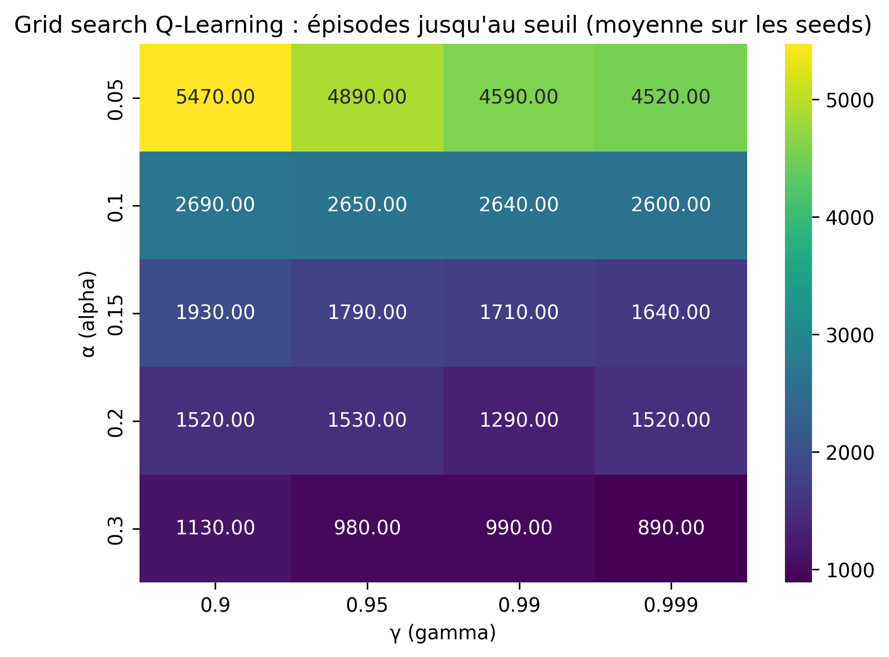
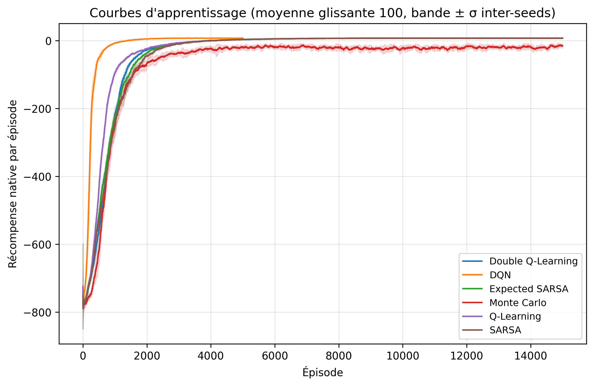
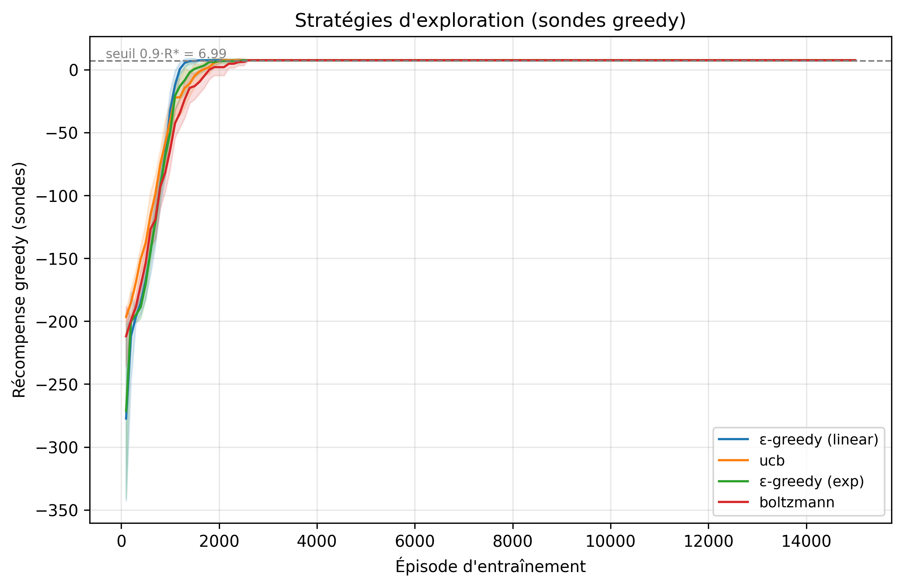
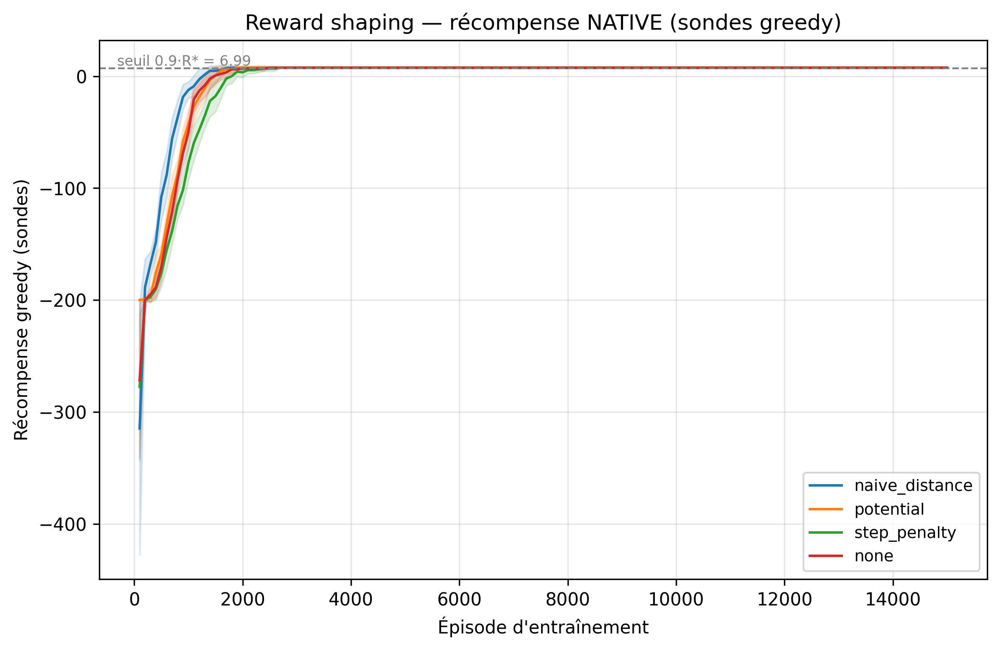
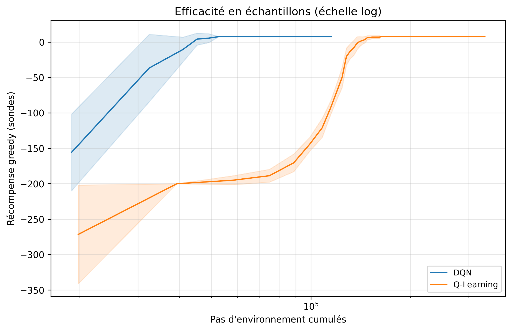
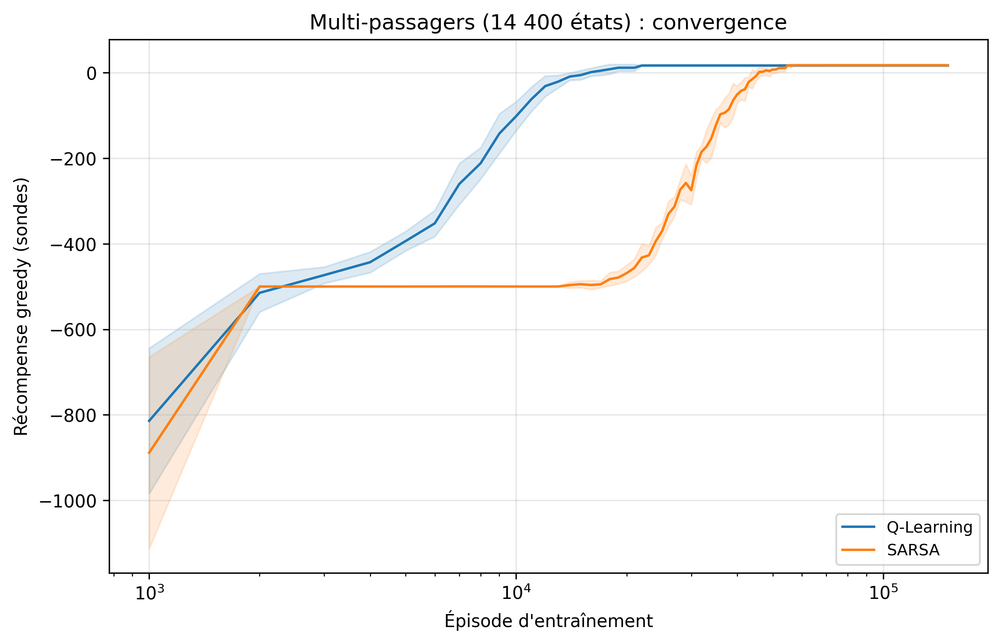

<!-- _class: lead -->

# Taxi Driver

## Apprentissage par renforcement sur Taxi-v3
### T-AIA-902 — Soutenance

**Q-Learning · SARSA · Expected SARSA · Double QL · Monte Carlo · DQN**
Organisation GitHub : T-AIA-902-Taxi-Driver

---

# Problème & environnement

- **Taxi-v3** (Gymnasium 1.2.3) : grille 5×5, prendre un passager, le déposer
- **500 états** (25 cases × 5 statuts × 4 destinations), 6 actions
- Récompenses : **+20** dépose, **−1** par pas, **−10** manœuvre illégale
- Troncature `TimeLimit` à 200 pas — source d'artefacts de mesure
- Étalon par **value iteration** : **R\* = 8,05** (12,95 pas, 100 % succès)
  - sert uniquement d'instrument de mesure, agents 100 % model-free
- Seuil de convergence : sonde greedy ≥ 0,9·R\* tenue 3 checkpoints

---

# Démarche scientifique

- Protocole **figé avant la campagne** (`docs/PROTOCOLE.md`) : 9 hypothèses H1–H9 avec prédictions a priori
- **822 runs** exécutés, **n = 10 seeds** par configuration (blocs E0–E7)
- Évaluation : 100 épisodes figés, politique greedy stricte, reward **natif**
- Statistiques : Shapiro-Wilk → Welch ou Mann-Whitney, correction **Holm** par famille, tailles d'effet (g de Hedges, δ de Cliff), IC 95 %
- Unité statistique : le **run**, jamais l'épisode (pas de pseudo-réplication)
- Censure au rang le pire pour les runs qui n'atteignent jamais le seuil

---

# Architecture logicielle

- **BaseAgent** (patron Strategy) : `select_action` / `learn` / `end_episode`
- **Trainer** : boucle d'entraînement + sondes greedy (seeds disjoints)
- **Evaluator** : 100 épisodes figés, identiques pour tous les agents
- **Benchmarker** : campagne idempotente, run = `(bloc, hash8, seed)`
  - reprenable après crash, chaque figure régénérable depuis `results/raw/`
- Parallélisation 6 processus (sauf E7 : chronométrage séquentiel)
- WSL2, Python 3.10, RTX 2060 ; env ~56 000 steps/s

---

# Baseline brute force (E0)

| | cap 200 | cap 2000 |
|---|---|---|
| Reward moyen / médian | −770,2 / −782,3 | −5 428,2 / −6 674,6 |
| Pas moyens / médians | 196,5 / 200 | 1 389,6 / 1 714 |
| Succès | 4,8 % | 55,7 % |

- À 200 pas : la moyenne mesure la **troncature**, pas la politique
- Le « ~350 pas » du sujet n'est retrouvé sous aucune définition
- Ratio honnête random vs RL : **≥ 107×** (1 389,6 / 12,95 pas)

---

# Grid search Q-Learning (E1a — H1, H3)

- **15/20 cellules exactement à l'optimum** → les écarts sont **cinétiques**
- α domine : seuil de 5 470 (α=0,05) à **890** épisodes (α=0,30)
- H1 **infirmée** : γ=0,99 pas plus lent que γ=0,9 (1 710 vs 1 930, p_Holm=0,34), même politique finale

---

# Face-à-face des algorithmes (E2)

- Même plateau pour tous… sauf Monte Carlo — la course se joue sur la **vitesse**

---

# Tableau de synthèse (E2 + E7)

| Algo | Reward ± σ | Seuil (ép.) | Temps (s) | Inf. (ms) | Mém. (Ko) |
|---|---|---|---|---|---|
| Q-Learning | 8,048 ± 0,006 | **1 710** | **12,2** | 0,25 | 23,4 |
| SARSA | 7,974 ± 0,040 | 3 910 | 14,1 | 0,26 | 23,4 |
| Exp. SARSA | 8,050 ± 0,000 | 3 930 | 20,1 | 0,25 | 23,4 |
| Double QL | 8,050 ± 0,000 | 3 170 | 14,6 | 0,27 | 46,9 |
| Monte Carlo | −19,33 ± 9,88 | censuré 10/10 | 23,7 | 0,62 | 46,9 |
| DQN | 8,050 ± 0,000 | 380 | 383,9 | 4,77 | 2 052,1 |

R\* = 8,05 · 12,95 pas · 100 % succès (MC : 87,3 %, 37,7 pas)

---

# Exploration (E3 — H4)

- **ε-linéaire bat ε-exponentielle** : 1 320 vs 1 710 ép., **p_Holm = 0,027, g = −1,38** — seul résultat significatif du bloc
- UCB / Boltzmann : premier succès très tôt (7,9 / 12,1 vs 26,4 ép.) mais pas d'avantage global (1 850 / 2 080, NS)

---

# Reward shaping (E4 — H5)

- Potentiel (Ng et al.) : accélère un peu (1 580, NS), **ne dégrade rien** — théorème vérifié
- **Surprise** : le bonus naïf accélère aussi (1 410, NS après Holm) et ne dégrade pas — pas de cycle rentable sur un MDP déterministe court
- Verdict honnête : sur Taxi-v3, le shaping est **marginal**

---

# QL vs SARSA vs Double QL (H2, H7)

- **H2 vitesse confirmée** : QL 1 710 vs SARSA 3 910 ép. (p_Holm < 10⁻⁷, g = −4,47)
- **Nuance** : SARSA plafonne à **7,974 < 8,05** (p_Holm = 2×10⁻⁴) — l'ε résiduel (0,01) contamine ses cibles on-policy
- Stabilité de SARSA : **infirmée** (σ 3,54 vs 3,18, sens inverse, NS)
- **H7 demi-confirmée** : Double QL **1,85× plus lent** (3 170 ép., p_Holm < 10⁻⁶) ; stabilité non améliorée (p = 0,042 en sens inverse)
- F10 : max-Q de QL au-dessus du retour réalisé pendant l'apprentissage ; Double QL sous-estime encore à la fin (−0,35 vs −0,005 par rapport à V\*)

---

# Monte Carlo : l'échec instructif (H8)

- **0/10 runs au seuil** en 15 000 épisodes (p_Holm = 1,2×10⁻⁴, **δ = 1,00**)
- Reward final **−19,3 ± 9,9**, succès 87,3 %, σ post-convergence 59,9 (vs ~3,2 en TD)
- Mécanisme : épisodes tronqués à 200 pas → retours ≈ −700, variance énorme, moyenne first-visit trop lente à corriger
- Grille E1b : étendue intra-MC de **105 points** de reward, insensible à α
- Leçon : sans bootstrapping, la troncature devient un poison structurel

---

# Tabulaire vs DQN (H6) + ablation device

- Qualité **égale** (8,05) ; coûts : **×31,6** temps, **×87,7** mémoire, **×18,8** latence
- Efficacité échantillon **inversée** : DQN au seuil en 41 322 env-steps vs 143 263 (replay buffer)
- Ablation E7 : **CPU 274,8 s < CUDA 493,0 s** — petits lots, le GPU n'est pas toujours plus rapide

---

# Extensions : multi-passagers (H9) & TrackMania

- **14 400 états** (facteur ×28,8) : QL **et** SARSA à 100 % de succès — 17,71 / 18,03 de reward, ~24 pas pour 2 courses (tournées mutualisées)
- Coût de convergence ×10,9 à ×13,2 : croissance **sous-linéaire** ; SARSA légèrement meilleur en qualité (prudence : n = 10, exploratoire)
- **TrackMania** : pipeline SAC + wrapper livré et testé hors jeu (non exécuté : requiert Windows + OpenPlanet)

---

# Mode time-limited (CLI)

| Sortie exigée | Mesuré |
|---|---|
| Budget de temps | 30 s |
| Entraînement effectif | **14,2 s** (early-stop) |
| Épisodes | 8 957 |
| Reward test (100 ép.) | **8,05 = R\*** |
| Pas par partie | 12,95 |
| Succès | 100 % |
| Temps par partie | 0,58 ms |

Configuration `optimized.yaml` (α = 0,30, γ = 0,95, seuil en 980 ép.) — tous les critères tenus, à l'optimum

---

# Conclusions & limites

- **Fil conducteur** : différences **cinétiques**, pas asymptotiques — 15/20 configs et 5/6 algos à l'optimum ou à 0,08 pt près
- Hyperparamètres > algorithme pour la **vitesse** (η² : 56 % vs 18 %) ; l'algorithme ne compte que quand la famille est inadaptée (MC)
- Verdicts : H1 ✗ · H2 vitesse ✓ / stabilité ✗ · H4 ε-lin ✓ · H5 ~✗ · H6 coûts ✓ / échantillons inversé · H7 ½ · H8 ✓ max
- Le protocole a neutralisé les artefacts : troncature, reward d'entraînement, meilleur checkpoint
- **Limites** : n = 10, MDP déterministe unique, temps sous WSL2
- **Suites** : variantes stochastiques (`is_rainy`, `fickle_passenger`), ‖Q − Q\*‖∞, k ≥ 3 passagers → frontière du deep RL
